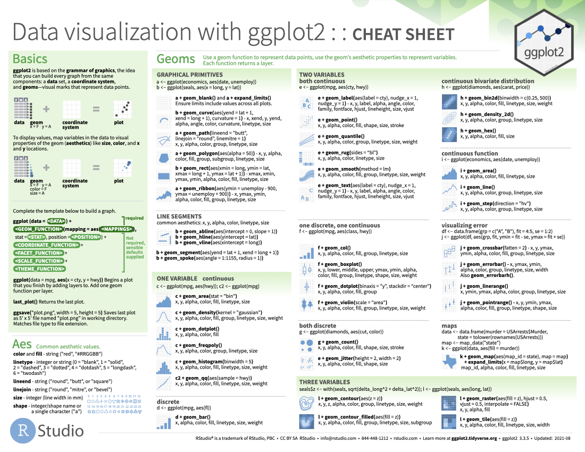
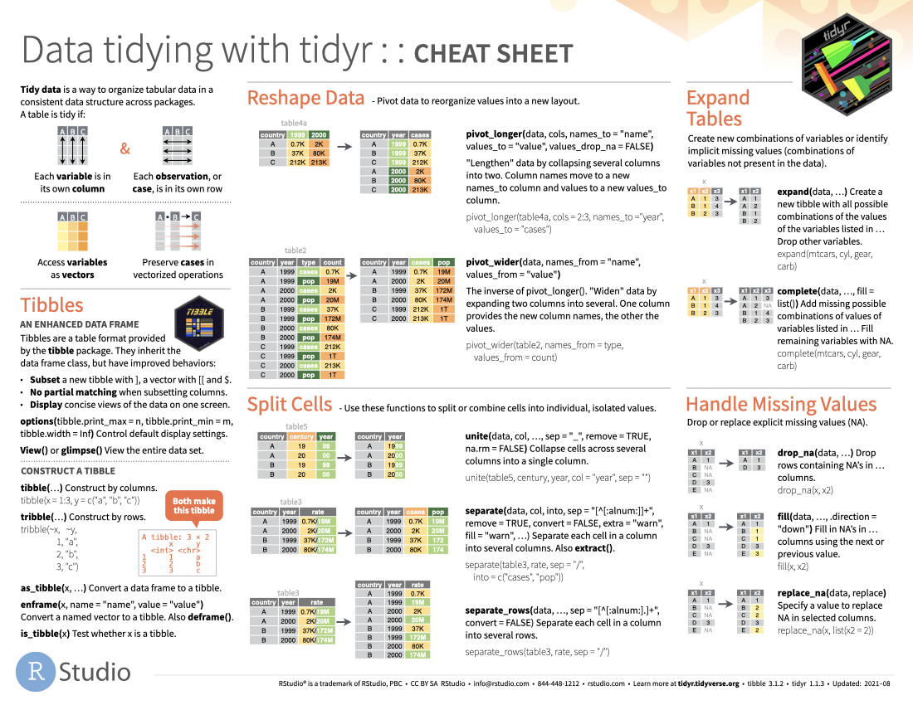
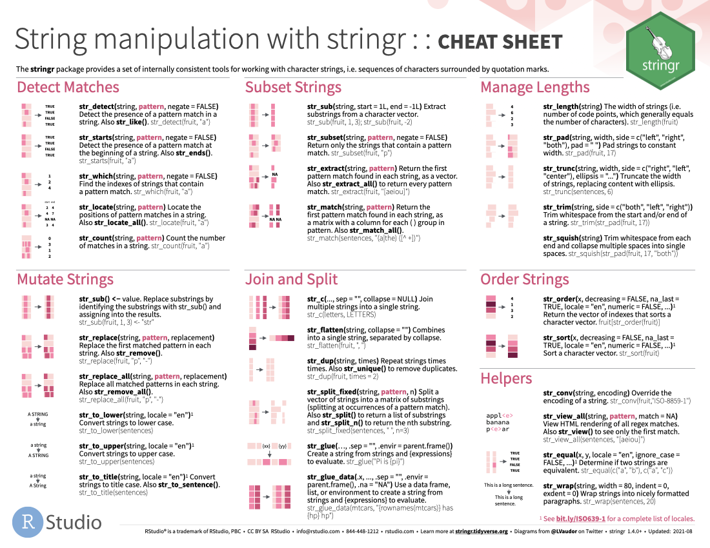
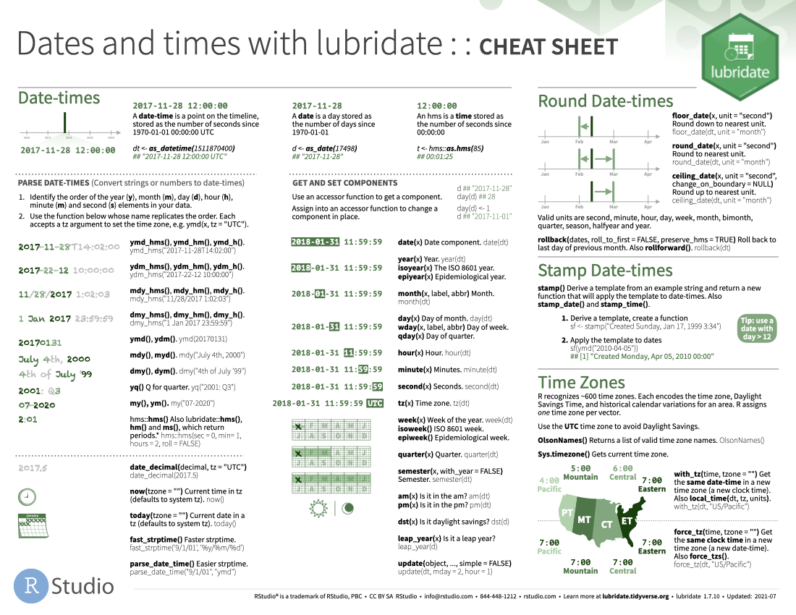
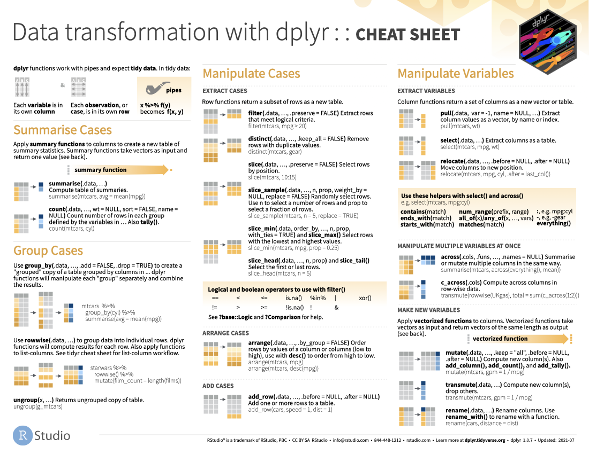
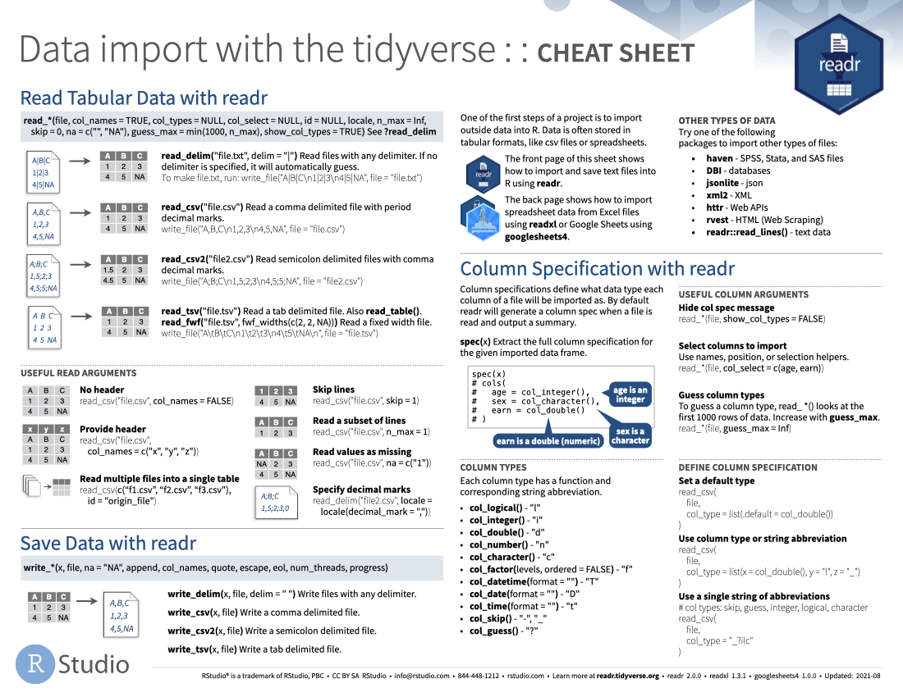
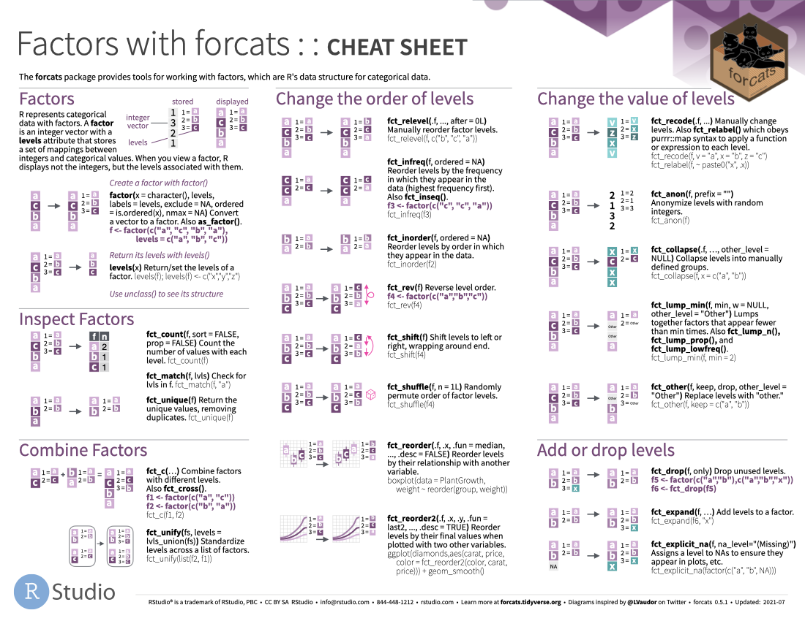
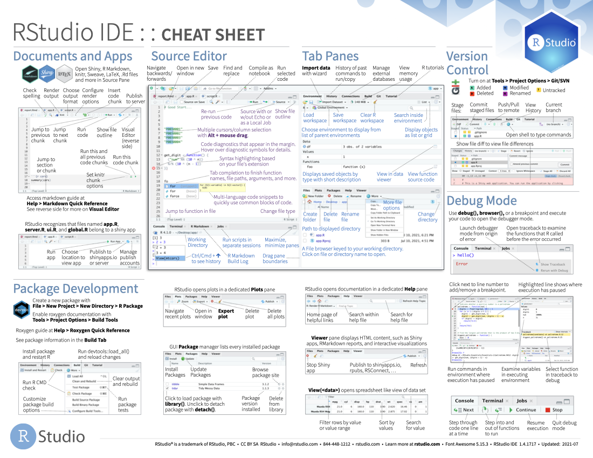

The following cheatsheets come from <https://posit.co/resources/cheatsheets>. We won't cover every function and functionality listed on them, but you might still find them useful as references.

::::: columns
::: {.column width="50%"}
[{fig-alt="ggplot2 cheat sheet" fig-align="left" width="300"}](https://raw.githubusercontent.com/rstudio/cheatsheets/main/data-visualization.pdf)

 

[{fig-alt="tidyr cheat sheet" fig-align="left" width="300"}](https://raw.githubusercontent.com/rstudio/cheatsheets/main/tidyr.pdf)

 

[{fig-alt="stringr cheat sheet" fig-align="left" width="300"}](https://raw.githubusercontent.com/rstudio/cheatsheets/main/strings.pdf)

 

[{fig-alt="lubridate cheat sheet" fig-align="left" width="300"}](https://raw.githubusercontent.com/rstudio/cheatsheets/main/lubridate.pdf)
:::

::: {.column width="50%"}
[{fig-alt="dplyr cheat sheet" fig-align="right" width="300"}](https://raw.githubusercontent.com/rstudio/cheatsheets/main/data-transformation.pdf)

 

[{fig-alt="readr cheat sheet" fig-align="right" width="300"}](https://raw.githubusercontent.com/rstudio/cheatsheets/main/data-import.pdf)

 

[{fig-alt="forcats cheat sheet" fig-align="right" width="300"}](https://raw.githubusercontent.com/rstudio/cheatsheets/main/factors.pdf)

 

[{fig-alt="rstudio ide cheat sheet" fig-align="right" width="300"}](https://raw.githubusercontent.com/rstudio/cheatsheets/main/rstudio-ide.pdf)
:::
:::::
