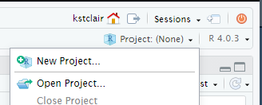
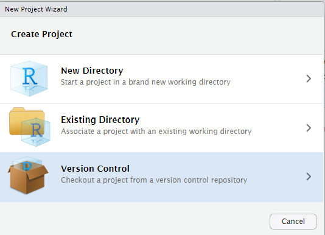
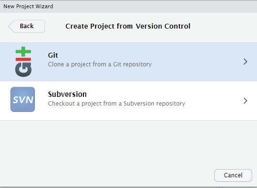
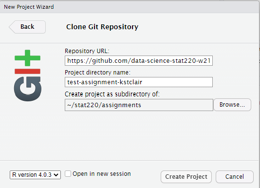

## Individual assignments

If you followed the suggestions in the [Rstudio in Stat 220](rstudio-stat220.qmd) page, then you should already have an assignments folder on your computer or maize account.

Each new assignment/project will be posted as a repository on GitHub and added directly to your account (within the Stat220 organization). This repository will contain assignment details (README, .Rmd).

You will be able to see repos you have access to both in GitHub itself and on GitHub Desktop.

### Creating an individual assignment repo and project

1.  Make sure you are logged into your account on GitHub Desktop. 
2   There, go to File > Clone Repository, which will open a small window.
3.  Make sure the default GitHub.com tab is chosen at the top of the window. Find your homework repo, such as `hw01-username` (where your username is attached).
4.  Click on the repo you want to clone, and click the blue Clone button at the bottom. The repo is now accessible on GitHub Desktop!
5.  Now open up RStudio and create a project as follows:

-   Click the **Project** button in the upper right corner of your RStudio window and select **New Project...**

```{r echo=FALSE, fig.align='center'}

```

-   Select **Version Control** and then **New Project**

```{r echo=FALSE, fig.align='center', out.width="50%"}


```

-   Paste the link you just copied into the Repository URL box. Leave the Project directory name blank (or keep the auto-filled name). Use the **Browse** button to find your **assignments** folder, then click **Create Project**

```{r echo=FALSE, fig.align='center', out.width="70%"}

```

### Working on your assignment

An RStudio project should now open, which will allow you to start working on your homework assignment. You should see the project assignment name in the top left side of RStudio. You will probably see a blank console screen when you open a new project. Look in the **Files** tab for your homework .Rmd file. Click on whatever file you want to edit (probably the .Rmd file) and edit away. Make sure that your current assignment's project is the one open and showing in the upper right project name. To **open** a project, click on the `.Rproj` file or use the **Open Project...** option available in the upper right project link.

#### Commits

After you make changes to the homework assignment, commit them. What are commits you ask? Commits are essentially taking a snapshot of your projects. Commits save this snapshot to your local version of Git (located on your hard drive or the maize server). For example, if I make changes to a code so that it prints "Hello world", and then commit them with an informative message, I can look at the history of my commits and view the code that I wrote at that time. If I made some more changes to the function that resulted in an error, I could go back to the commit where the code was originally working. This prevents you from creating several versions of your homework (homework-v1, homework-v2, ...) or from trying to remember what your code originally looked like.

GitHub Desktop passively tracks the files in your repo that you have changed, along with the changes that were made. When you want to make a commit, open up GitHub Desktop and make sure the repo you are working on in RStudio is selected (the top left of GitHub Desktop will list a "Current repository"). Then, in the bottom left, you will see a blue (currently unclickable) "Commit x files to main" - where x is the number of files that have been changed. If you do not wish to commit changes for all files, you can unselect those which you do not wish to commit on the left hand side. Otherwise, add a summary of the changes you have made in the "Summary (required)" field and, if desired, elaborate in the "Description" box. Once you are done, click the blue button. You have made a commit!

Two things about committing.

-   You should **commit somewhat frequently**. At minimum, if you're doing a homework assignment, you should make a commit each time that you've finished a question.
-   Leave **informative commit messages**. "Added stuff" will not help you if you're looking at your commit history in a year. A message like "Added initial version of hello-world function" will be more useful.

#### Pushing changes to Github

At some point you'll want to get the updated version of the assignment back onto GitHub, either so that we can help you with your code or so that it can be graded. You will also want to push work frequently when you have a shared GitHub repo for project collaborations (i.e. more than one person is working on a project and code). If you are ready to push, make sure your commits are up to date, and in GitHub Desktop, go to the repo you would like to push. You should see a blue "Push origin" button. Click the button, and your changes have been pushed!

To "turn in" an assignment, all you need to do is push all your relevant files to Github by the deadline, and then link your submission on Gradescope.

------------------------------------------------------------------------

## Group work

Collaborative Github assignments are pretty similar to individual assignments.

### Creating a group/partner assignment repo and project

In GitHub Desktop, find the repo for your group, for example if your group name is "team01" the you might find the `mp1-team01` repo. Clone this repo to your computer/maize account using the same steps done for an individual assignment.

#### Working with collaborative repos

For group homework, I suggest that only the *recorder* edit the group-homework-x.Rmd file to avoid merge conflicts! Other group members can create a new Markdown doc to run and save commands. Only the recorder needs to **push** changes (answers) to the Github repo and all others can then **pull** these changes (i.e. the final answers) after the HW is submitted.

When you are working together on a Github project, you should commit and push your modifications frequently. You will also need to frequently **pull** updates from Github down to your local version of RStudio. These updates are changes that your teammates have made since your last pull. To pull in changes, click the "Pull origin" button in GitHub Desktop.

If you get an error about conflict after pulling or pushing, don't freak out! This can happen if you edit a file (usually an .Rmd or .R file) in a location that was also changed by a teammate. When this happens you should attempt to fix the **merge conflict**. Take a look at [this resource site](http://r-pkgs.had.co.nz/git.html#git-pull) and try to fix the merge conflict in Rstudio. If that doesn't work contact me! Seriously, don't be afraid. I do this a lot myself and it can be frustrating, but we will get through it!

------------------------------------------------------------------------

## Additional resources

-   [Git, GitHub, & GitHub Desktop for beginners](https://www.youtube.com/watch?v=8Dd7KRpKeaE)
-   [Rstudio, Git and GitHub](http://r-pkgs.had.co.nz/git.html#git-rstudio)
-   [GitHub Guides](https://guides.github.com/)

------------------------------------------------------------------------

#### Acknowledgements

Most of this content in this guide was taken from <https://github.com/jfiksel/github-classroom-for-students> and edited by Adam Loy for our classroom use. and is licensed under the CC BY-NC 3.0 Creative Commons License.
