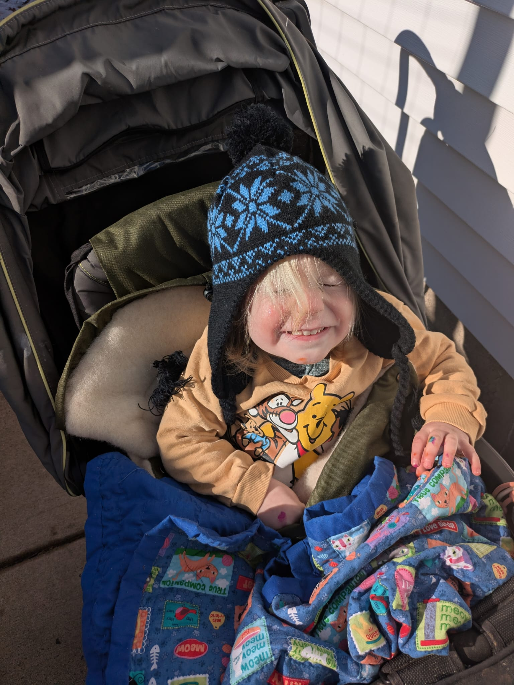
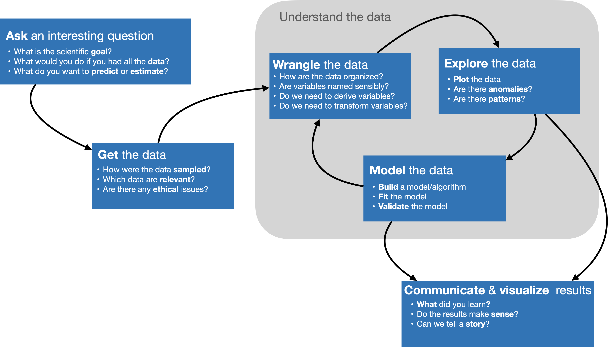
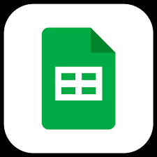
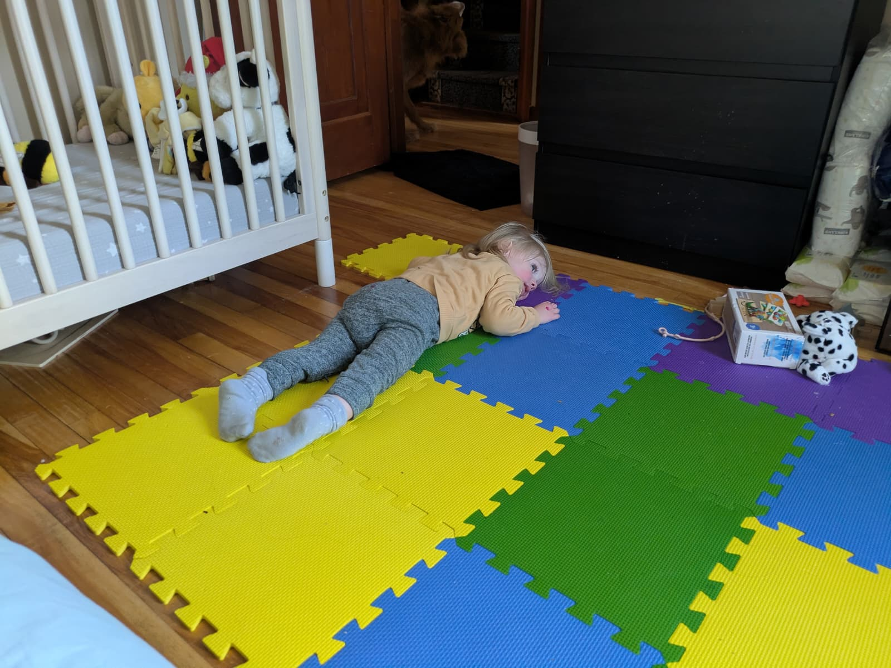

```{r}
#| echo: false
#| warning: false
#| message: false

library(gtrendsR)
library(countdown)
library(tidyverse)
library(lubridate)
library(scales)
library(here)

theme_set(theme_minimal(base_size = 16))
```

# Intros

## About me

::::: columns
::: {.column width="60%"}
-   First year at Carleton!
-   PhD in Political Science from the University of Minnesota
-   M.S. in Statistics from UMN
-   Originally from(ish) Cleveland, Ohio
-   Went to Wellesley College for undergrad
-   Have an almost 2 year old toddler named Glenn
-   Like to walk around lakes, bike, and try out local restaurants
:::

::: {.column width="40%"}

:::
:::::

## In groups of 5ish

To get to know you all better, you will make a dataset about yourselves to share with the class. You have 30 minutes to do so. You should hit on the following buckets:

::: {.task .nonincremental}
1.  **Describe your data**: What are you interested in describing as part of your dataset? What are you not?
2.  **Collect**: Gather your data in one place
3.  **Clean**: Edit the dataset so that it's in a presentable, clean format
4.  **Analyze**: What stories are in your dataset?
5.  **Distribute**: How will you share it back to us?
:::

```{r}
#| echo: false

countdown::countdown(30)
```

## What is this class all about?

{.r-stretch}

::: aside
Image by Adam Loy <br> adapted from work of Joe Blitzstein, Hanspeter Pfister,<br> and Hadley Wickham
:::

## Sneak peek: class survey data

```{r}
#| echo: false
#| message: false
survey <- read_csv(here(here(), "data/class_survey_sm.csv"))
survey |> sample_n(10)
```

## 

:::::: columns
::: {.column width="33%"}
You took a survey


:::

::: {.column width="33%"}
Google saved your responses in a sheet


:::

::: {.column width="33%"}
I read your data into R, cleaned it, and saved it as a CSV


:::
::::::

## Multiple choice question where you could only pick one option

What class year are you?

::: nonincremental
-   First year
-   Sophomore
-   Junior
-   Senior
:::

## Visualize

```{r}
#| code-fold: true
survey |>
  count(class_year) |>
  mutate(prop = n/sum(n)) |>
  ggplot(aes(y = class_year, x = prop, fill = class_year)) + 
  geom_col(show.legend = FALSE) + 
  scale_x_continuous(labels = percent_format(accuracy = 1), breaks = c(0, .1, .2, .3, .4, .5)) + 
  labs(
    title = "Class year among Stat220 Students",
    y = "",
    x = "Proportion",
    caption = "Self-reported data collected from Stat220 students by 10am on Jan 5"
  ) + 
  scale_fill_viridis_d(end = .75, option = "plasma")
```

## Question where you could enter a number

How many hours of sleep per night do you typically get during the term?

```{r}
summary(survey$sleep)
```

## Open-ended question

Where can you find the best food in Northfield?

```{r}
survey$northfield_food
```

## Visualize

```{r}
#| code-fold: true

survey |>
  count(northfield_food) |>
  mutate(prop = n/sum(n)) |>
  ggplot(aes(y = northfield_food, x = prop, fill = northfield_food)) + 
  geom_col(show.legend = FALSE) + 
  scale_x_continuous(labels = percent_format(accuracy = 1), breaks = c(0, .1, .2, .3, .4, .5)) + 
  labs(
    title = "Where can you find the best food in Northfield?",
    y = "",
    x = "Proportion",
    caption = "Self-reported data collected from Stat220 students by 10am on Jan 5"
  ) + 
  scale_fill_viridis_d(end = .75, option = "plasma")
```

##  {background-image="../img/wordcloud-nervous.png" background-size="contain"}

##  {.smaller}

::::: columns
::: {.column .center width="60%"}
{fig-align="left"}
:::

::: {.column width="40%"}
It’s easy when you start out programming to get really frustrated and think, “Oh it’s me, I’m really stupid,” or, “I’m not made out to program.” But, that is absolutely not the case. **Everyone gets frustrated**. I still get frustrated occasionally when writing R code. **It’s just a natural part of programming**. So, it happens to everyone and gets less and less over time. *Don’t blame yourself. Just take a break, do something fun, and then come back and try again later.*
:::
:::::

::: aside
Hadley Wickham, [Advice to Young (and Old) Programmers: A Conversation with Hadley Wickham](https://www.r-bloggers.com/advice-to-young-and-old-programmers-a-conversation-with-hadley-wickham/)
:::

## R and RStudio

::: {.large style="text-align: center;"}
[Installing R and RStudio](https://posit.co/download/rstudio-desktop/)
:::

*Heavily* encouraging you to have your own local R and RStudio

- You may have to install packages as we go - use `install.packages` function

- You may have used [Maize](https://maize.mathcs.carleton.edu) in the past

- Okay to use that for today, but work on downloading R and RStudio

# Syllabus highlights

Read the full syllabus by next class - on course website

## 

### Course website

::: {.large style="text-align: center;"}
<https://stat220kurtz.github.io/>
:::

-   access slides
-   see schedule
-   guides for installing R, RStudio, using GitHub and GitHub Desktop

### Course github organization

::: {.large style="text-align: center;"}
<https://github.com/stat220kurtz>
:::

-   access repositories for homework and projects

## Office hours (*tentative*)

| Day       | Time       | Type    | Location |
|:----------|:-----------|:--------|:---------|
| Monday    | 2-3        | Drop-in | CMC 225  |
| Tuesday   | 10:30-11:30| Appt    | CMC 225  |
| Wednesday | 11:30-12:30| Drop-in | CMC 225  |
| Friday    | 12-1       | Drop-in | CMC 225  |


## Grading system {.smaller}

Homework and will be graded as *successful*, *half credit*, or *not successful*. Projects will be graded as *excellent*, *successful*, or *not successful*.

To earn a course grade, you must meet **all** of the requirements in a given row:

|   | Homework Problems | Portfolio Projects (4 total) | Final Project |
|------------|------------|------------|------------|
| A | 90% | 2 Excellent + 2 Successful | Excellent |
| B | 80% | 4 Successful | Successful |
| C | 70% | 3 Successful | Successful |
| D | 50% | 2 Successful | Successful |

"+" and "-" grades are determined by partially meeting the requirements in a given row.

*Note:* I expect daily attendance and participation. Missing \>5 class meetings or consistent issues with being on-task will result in a 1/3 grade deduction.

## Tokens

You get 3 tokens. You can use a token to:

-   Revise a portfolio project
-   48-hour extension on a homework assignment or portfolio project submission (the request must be submitted before the deadline)


## GitHub {.smaller}

::: {.large style="text-align: center;"}
https://github.com/stat220kurtz
:::

-   GitHub organization for the course

-   All of your work and your membership (enrollment) in the organization is private

-   Each assignment is a private repo on GitHub, I distribute the assignments on GitHub.

-   You will work on your assignment, then "render ➡️ commit ✅ push ⤴️"

-   You'll then be able to submit your PDF via gradescope

. . .

::: task
Fill out the *Welcome Survey* for collection of your account names, later this week you will be invited to the course organization.
:::

# Wrap up

## Your tasks before next class

::: {.task .nonincremental}
1.  Create a GitHub account if you don't have one

2.  Complete the welcome survey if you haven't already

3.  Read the syllabus

4.  Download or update your local R/RStudio versions

5.  Complete the readings for next class
:::

