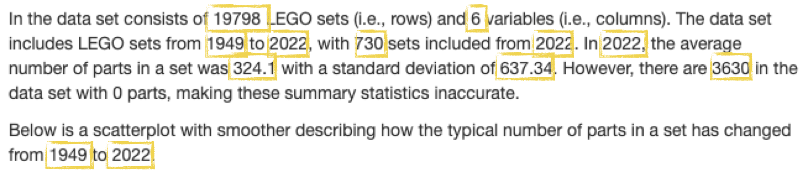

```{r}
#| echo: false
#| warning: false
#| message: false

library(countdown)
library(tidyverse)
library(lubridate)
library(ymlthis)

```

## Plan for today:

1.  Questions from syllabus quiz
2.  Github
    -   Accessing your private repos
    -   render ➡️ commit ✅ push ⤴️
3.  Reproducible Reporting

## Syllabus quiz

Which components of Stat220 are **graded**?

::: nonincremental
- [X] Homework
- [X] Lab Quizzes
- [ ] Participation
- [ ] Prep Assignments
- [ ] In-class exercises
- [X] Portfolio projects
- [X] Final project
:::

## Syllabus quiz

What percentage of homework problems do you need to successfully complete to earn an A in this class?

::: nonincremental

- [ ] 90%
- [X] 85%
- [ ] 80%
- [ ] NA- it can average out by doing well on projects and lab quizzes
:::

## Syllabus Quiz

How many tokens do you have available to use throughout the term?

**5**

## Syllabus Quiz

What room of the CMC are Amanda's drop-in hours in?

::: nonincremental

- [ ] CMC 223 - Amanda's office
- [ ] CMC 306 - Our classroom
- [X] CMC 307
:::

## Syllabus Quiz

What scenarios describe an **inappropriate** use of AI in Stat220?

::: nonincremental

- [ ] Asking for clarification on an R error message meaning
- [X] Creating "first pass" code for making a graph on a homework problem
- [X] Copying a homework problem into ChatGPT and asking for similar practice questions
- [X] Giving ChatGPT the study guide for a quiz and asking for practice questions
- [X] Giving ChatGPT the code to make a graph that you have written and asking it to add a new feature (like adding a line of best fit or changing the color scheme)
- [ ] Asking for an explanation of what a certain R function is used for

:::

## Questions from syllabus quiz

::: nonincremental

- Software packages for local installation
- Will the lab quizzes require memorizing R code?
- Tokens
:::

## Homework in Stat220

::: nonincremental

- Typically due on Wednesdays (Week 1: Friday)
- Due at 10pm (aligns with end of Stat Lab)
- 12 hour grace period (no penalty if turned in by 10am on Thurs)
- Beyond that, must use a token. Token form must be submitted by end of grace period (see Useful Links)
:::

# Github {.maize}

## Git + GitHub

::::: columns
::: {.column width="50%"}
-   **Git** is a version control system - like "Track Changes", on steroids
-   It's not the only version control system, but it's a very popular one
:::

::: {.column width="50%"}
-   **GitHub** is the home for your Git-based projects on the internet—like DropBox but much, much better
-   We will use GitHub as a platform for web hosting and collaboration
:::
:::::

## Why do we need it? {background-image="../img/phd_comics_vc.gif" background-size="contain" background-position="right"}

## Versioning 

{.r-stretch}

## Versioning (with human-readable messages)

{.r-stretch}

## {background-image="https://cdn.myportfolio.com/45214904-6a61-4e23-98d6-b140f8654a40/33f12eb3-e65b-46df-9a2e-e4b24a4b59cd_rw_3840.png?h=6f05681451d60f6ba15ae8f7cef56ba2" background-size="contain"}

## {background-image="https://cdn.myportfolio.com/45214904-6a61-4e23-98d6-b140f8654a40/78587c8b-fa99-4c94-bce2-026cf4e588b5_rw_3840.png?h=fe974bfc95ca6dc2261541a3dfc562ec" background-size="contain"}

## How does it work for Stat220?

{.r-stretch}

## How does it work for Stat220?

{.r-stretch}


## How does it work for Stat220?

{.r-stretch}

## How does it work for Stat220?

{.r-stretch}

## {background-image="https://cdn.myportfolio.com/45214904-6a61-4e23-98d6-b140f8654a40/68739659-fb6f-41e8-9813-32e1de3d82c0_rw_3840.png?h=5c36d3c50c350a440567a1f8f72ac028" background-size="contain"}

## Let's try it! {.smaller}

:::: nonincremental
::: task 

-   Follow the "Individual Assignment" directions at <https://stat220-s25.github.io/computing/git-stat220.html> to access your `day02` repo and create an R project
-   Edit the .qmd file:
    -   Change "author" to your name
    -   Use `#` to add descriptive section headers for each code chunk
    -   Add a sentence or two describing the summary statistics of the dataset
-   render ➡️ commit ✅ push ⤴️
-   View on `github.com` and confirm you can see your changes

:::
::::

::: callout-warning
## Help! I don't have a `day02` repo

::: nonincremental
- Never received github invite &rarr; Fill out the Welcome survey
- Never accepted GitHub invite  &rarr; Look for it in your email and accept it
- Opening repo in Rstudio failes &rarr; Review/redo the steps in Git/Github for Stat220 for setting up PAT
- Still no luck? &rarr; Come to office hours or make an appointment with me! 
:::
:::

```{r echo=FALSE}
countdown(minutes = 15, seconds = 0)
```

# Reproducible Reporting {.maize}

## Why do we need it?

Oops! I gave you the wrong set of data.

## Why do we need it?

::: popup
Karl -- this is very interesting , however you used an old version of the data (n=143 rather than n=226). I'm really sorry you did all that work on the incomplete dataset.

Bruce
:::

::: aside
Adapted from [Karl Broman](https://www.biostat.wisc.edu/~kbroman/presentations/repro_research_JSM2016.pdf)
:::

## Other examples:

-   The results in Table 1 don’t seem to correspond to those in Figure 2.
-   In what order do I run these scripts?
-   Where did we get this data file?
-   Why did I omit those samples?
-   How did I make that figure?
-   “Your script is now giving an error.”
-   “The attached is similar to the code we used.”

::: aside
Adapted from [Karl Broman](https://www.biostat.wisc.edu/~kbroman/presentations/repro_research_JSM2016.pdf)
:::

## Reproducible data science

::::: columns
::: {.column width="50%"}
**Short Term Impact**

-   Are the tables and figures reproducible from the code and data?
-   Does the code actually do what you think it does?
-   In addition to what was done, is it clear **why** it was done? (e.g., how were parameter settings chosen?)
:::

::: {.column width="50%"}
**Long Term Impact**

-   Can the code be used for other data?
-   Can you extend the code to other things?
:::
:::::

## The toolkit

```{r echo=FALSE}
knitr::include_graphics("../img/01-repro-toolkit.png")
```

-   Scriptability $\rightarrow$ R

-   Code environment $\rightarrow$ RStudio

-   Literate programming (code, narrative, output in one place) $\rightarrow$ Quarto

-   Version control $\rightarrow$ Git / GitHub

##  {background-image="../img/horst_rmarkdown_wizards.png" background-size="contain"}

## What is Quarto?

1.  An authoring framework for data science.

2.  A document format (`.qmd`).

3.  A software package

4.  A file format for making dynamic documents with R.

5.  A tool for integrating prose, code, and results.

6.  A computational document.

## Anatomy of a quarto doc

## Chunk Options

```{r}
#| echo: false

test_function = function(x){
  print(x)
  message("This is a message.")
  warning("This is a warning!")
}

```

::: {.panel-tabset}
## Default

What's in .qmd: 

````
```
test_function(20)
```
````

How it looks in rendered file: 

```{r}
test_function(20)
```

## message

What's in .qmd: 

````
```
#| message: false
test_function(20)
```
````

How it looks in rendered file: 

```{r}
#| message: false
test_function(20)
```

## warning

What's in .qmd: 

````
```
#| warning: false
test_function(20)
```
````

How it looks in rendered file: 

```{r}
#| warning: false
test_function(20)
```

## echo

What's in .qmd: 

````
```
#| echo: false
test_function(20)
```
````

How it looks in rendered file: 

```{r}
#| echo: false
test_function(20)
```

## eval

What's in .qmd: 

````
```
#| eval: false
test_function(20)
```
````

How it looks in rendered file: 

```{r}
#| eval: false
test_function(20)
```

:::

## Global options

Sometimes, you'll want to set every chunk option at once. You can do so in the YAML header using `execute`:

```{r}
#| eval: FALSE
---
title: "My report"
author: "Amanda Luby"
execute:
  echo: false
---
```

## Parameters

```{r}
#| echo: false
#| warning: false
yml_empty() %>% 
  yml_title("Survivor") %>% 
  yml_output(html_document(toc = TRUE,
                           toc_float = TRUE,
                           theme = "flatly")) %>% 
  yml_params(
    season = '20'
  ) %>% 
  asis_yaml_output()
```

## Your Task {.smaller}

:::: nonincremental

::: task 
There's an example HTML report on the schedule

Your task is to reproduce it in `02-example-lego.qmd` 

To be as reproducible as possible, you'll need to use:

-   YAML metadata
-   YAML parameters
-   Code chunks with appropriate options
-   Inline R code
:::

::::

::: callout-tip
## Where do I find `02-example-lego.qmd`?

If you have a `day02` repo, use that! 

If you don't have a `day02` repo, you can find `02-example-lego.qmd` on the schedule
:::

## Hints {.scrollable .smaller}

::: nonincremental
1.  To begin, use inline R code to replace “hard coding” the quantities that are highlighted below.



      
For example, instead of typing 19798 you would include `nrow(sets)`
as an inline code chunk. Make sure the report knits and you get the
right values.


2.  Next, add a parameter to your YAML header that stores the location of the data set. Make sure the report knits.

3.  Change the code chunk where you load the data set to use the `data` parameter you just defined rather than the hard-coded URL. Make sure the report knits.

4.  Now, let’s make a parameter for the source of the data set so you don’t have to search where every mention of it in the report, it will be with the other metadata (where it belongs). To do this, add a parameter that gives the source of your data (call it `data_source`) and set it equal to “the [2022-09-09 repository](https://github.com/rfordatascience/tidytuesday/tree/master/data/2022/2022-09-06) on [Tidy Tuesday](https://github.com/rfordatascience/tidytuesday).” Make sure the report knits.

5. At this point it looks like everything is working—awesome job! To put it to the test, let’s update the parameters of your report and knit it to see if everything changes as we would expect. Here are the new parameter values:

``` yaml
data: "https://raw.githubusercontent.com/stat220-w26/stat220-w26.github.io/refs/heads/main/data/lego_subset.csv"
data_source: "Stat220 website"
```


6. (optional) If you have time, or would like to try outside of class, I've created a practice gradescope assignment space. First, add .pdf output to your document and knit to PDF. Commit the PDF and push to github. Then, log into gradescope (you may have to go through the link on moodle the first time) and link your github repo to the submission space.

``` yaml
format: 
  html: default
  pdf: default
```
:::
