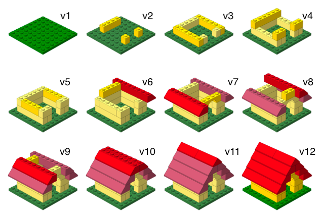
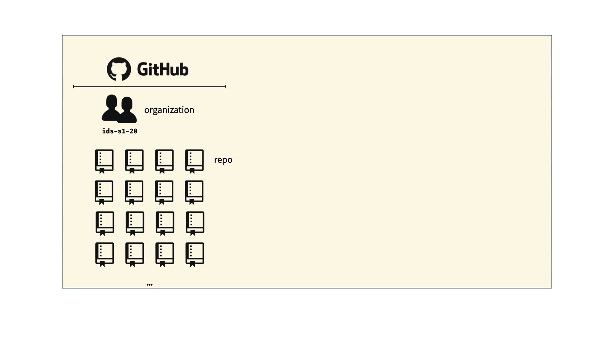
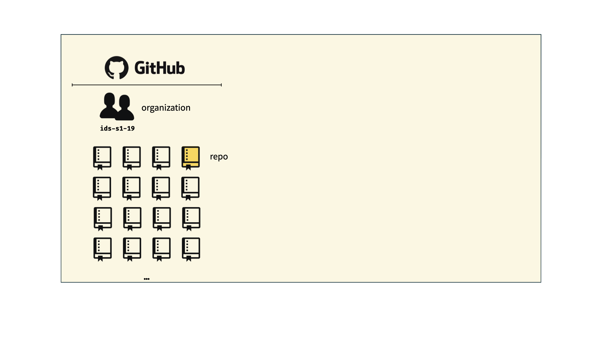
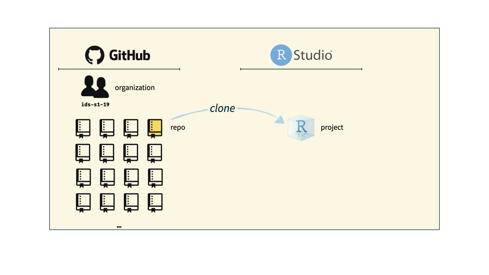
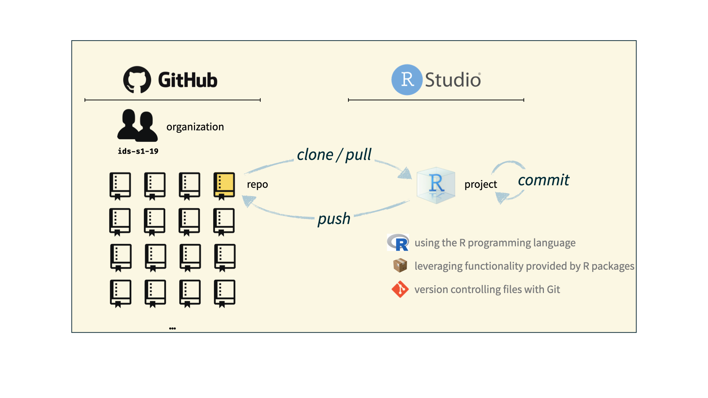
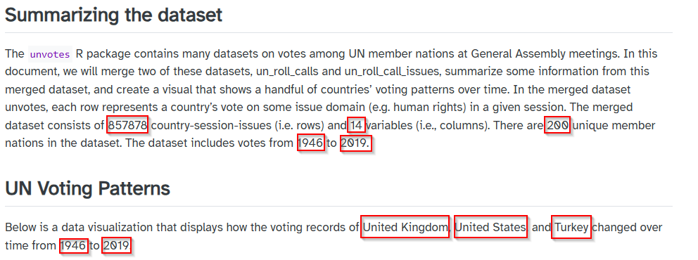

```{r}
#| echo: false
#| warning: false
#| message: false

library(countdown)
library(tidyverse)
library(lubridate)
library(ymlthis)

```

## Plan for today:

1.  Questions about syllabus
2.  GitHub
    -   Accessing your private repos
    -   render ➡️ commit ✅ push ⤴️
3.  Reproducible Reporting

# Github {.maize}

## Git + GitHub

::::: columns
::: {.column width="50%"}
-   **Git** is a version control system - like "Track Changes", on steroids
-   It's not the only version control system, but it's a very popular one
:::

::: {.column width="50%"}
-   **GitHub** is the home for your Git-based projects on the internet—like DropBox but much, much better
-   We will use GitHub as a platform for web hosting and collaboration
:::
:::::

## Why do we need it? {background-image="../img/phd_comics_vc.gif" background-size="contain" background-position="right"}

## Versioning 

{.r-stretch}

## Versioning (with human-readable messages)

{.r-stretch}

## {background-image="https://cdn.myportfolio.com/45214904-6a61-4e23-98d6-b140f8654a40/33f12eb3-e65b-46df-9a2e-e4b24a4b59cd_rw_3840.png?h=6f05681451d60f6ba15ae8f7cef56ba2" background-size="contain"}

## {background-image="https://cdn.myportfolio.com/45214904-6a61-4e23-98d6-b140f8654a40/78587c8b-fa99-4c94-bce2-026cf4e588b5_rw_3840.png?h=fe974bfc95ca6dc2261541a3dfc562ec" background-size="contain"}

## How does it work for Stat220?

{.r-stretch}

## How does it work for Stat220?

{.r-stretch}


## How does it work for Stat220?

{.r-stretch}

## How does it work for Stat220?

{.r-stretch}

## {background-image="https://cdn.myportfolio.com/45214904-6a61-4e23-98d6-b140f8654a40/68739659-fb6f-41e8-9813-32e1de3d82c0_rw_3840.png?h=5c36d3c50c350a440567a1f8f72ac028" background-size="contain"}

## Let's try it! {.smaller}

:::: nonincremental
::: task 

-   If you haven't already, download [GitHub Desktop](https://github.com/apps/desktop) and sign into your GitHub account on GitHub Desktop
    -   To sign in, in GitHub Desktop, go to File > Options > Sign In > Continue with Browser, then sign in as usual
-   Follow the "Individual Assignment" directions at <https://stat220kurtz.github.io/computing/git-stat220.html> to access your `hw01` repo and create an R project
-   Edit the .Rmd file:
    -   Change "name" and "surname" to match your name
    -   Add your education history under the Education section (note: we use `#` to add descriptive section headers for each section/code chunk)
-   Render ➡️ your changes, and commit and push them
-   View on `github.com` and confirm you can see your changes
-   Congrats! You have gotten started with your homework due Friday! Read more about what is expected for this homework in the README.md file contained in the repo after class

:::
::::

::: callout-warning
## Help! I don't have a `hw01` repo

::: nonincremental
- Never received GitHub invite &rarr; Fill out the Welcome survey
- Never accepted GitHub invite  &rarr; Look for it in your email and accept it
- Opening repo in Rstudio fails &rarr; Make sure you have cloned the repo in GitHub Desktop
- Still no luck? &rarr; Come to office hours or make an appointment with me! 
:::
:::

```{r echo=FALSE}
countdown(minutes = 15, seconds = 0)
```

# Reproducible Reporting {.maize}

## Why do we need it?

Oops! I gave you the wrong set of data.

## Why do we need it?

::: popup
Karl -- this is very interesting , however you used an old version of the data (n=143 rather than n=226). I'm really sorry you did all that work on the incomplete dataset.

Bruce
:::

::: aside
Adapted from [Karl Broman](https://www.biostat.wisc.edu/~kbroman/presentations/repro_research_JSM2016.pdf)
:::

## Other examples:

-   The results in Table 1 don’t seem to correspond to those in Figure 2.
-   In what order do I run these scripts?
-   Where did we get this data file?
-   Why did I omit those samples?
-   How did I make that figure?
-   “Your script is now giving an error.”
-   “The attached is similar to the code we used.”

::: aside
Adapted from [Karl Broman](https://www.biostat.wisc.edu/~kbroman/presentations/repro_research_JSM2016.pdf)
:::

## Reproducible data science

::::: columns
::: {.column width="50%"}
**Short Term Impact**

-   Are the tables and figures reproducible from the code and data?
-   Does the code actually do what you think it does?
-   In addition to what was done, is it clear **why** it was done? (e.g., how were parameter settings chosen?)
:::

::: {.column width="50%"}
**Long Term Impact**

-   Can the code be used for other data?
-   Can you extend the code to other things?
:::
:::::

## The toolkit

```{r echo=FALSE}

```

-   Scriptability $\rightarrow$ R

-   Code environment $\rightarrow$ RStudio

-   Literate programming (code, narrative, output in one place) $\rightarrow$ Quarto

-   Version control $\rightarrow$ Git / GitHub

##  {background-image="../img/horst_rmarkdown_wizards.png" background-size="contain"}

## What is Quarto?

1.  An authoring framework for data science.

2.  A document format (`.qmd`).

3.  A software package

4.  A file format for making dynamic documents with R.

5.  A tool for integrating prose, code, and results.

6.  A computational document.

## Anatomy of a quarto doc

## Chunk Options

```{r}
#| echo: false

test_function = function(x){
  print(x)
  message("This is a message.")
  warning("This is a warning!")
}

```

::: {.panel-tabset}
## Default

What's in .qmd: 

````
```
test_function(20)
```
````

How it looks in rendered file: 

```{r}
test_function(20)
```

## message

What's in .qmd: 

````
```
#| message: false
test_function(20)
```
````

How it looks in rendered file: 

```{r}
#| message: false
test_function(20)
```

## warning

What's in .qmd: 

````
```
#| warning: false
test_function(20)
```
````

How it looks in rendered file: 

```{r}
#| warning: false
test_function(20)
```

## echo

What's in .qmd: 

````
```
#| echo: false
test_function(20)
```
````

How it looks in rendered file: 

```{r}
#| echo: false
test_function(20)
```

## eval

What's in .qmd: 

````
```
#| eval: false
test_function(20)
```
````

How it looks in rendered file: 

```{r}
#| eval: false
test_function(20)
```

:::

## Global options

Sometimes, you'll want to set every chunk option at once. You can do so in the YAML header using `execute`:

```{r}
#| eval: FALSE
---
title: "My report"
author: "Emily Kurtz"
execute:
  echo: false
---
```

## Your Task {.smaller}

:::: nonincremental

::: task 
There's an example HTML report on the schedule - `UN report to replicate`

Your task is to reproduce it in `02-example-unvotes.qmd` 

To be as reproducible as possible, you'll need to use:

-   YAML metadata
-   Code chunks with appropriate options
-   Inline R code

You will also recreate the visualization at the bottom, but pick new countries that interest you.
:::

::::

::: callout-tip
## Where do I find `02-example-unvotes.qmd`?

You can find `02-example-unvotes.qmd` on the schedule for today
:::

## Hints {.scrollable .smaller}

::: nonincremental
1.  Use inline R code to replace “hard coding” the quantities, years, and country names that are highlighted below.



      
For example, instead of typing 857878 you would include `nrow(unvotes)`
as an inline code chunk. Make sure the report knits and you get the
right values.

2. The .qmd file creating the report includes chunks of code - some of which may throw warnings - but of course the finished report does not show any of that. Edit the YAML header so that you don't have to set options to suppress these features for each code chunk.

:::
