```{r setup, include=FALSE}
knitr::opts_chunk$set(echo = FALSE, message = FALSE, warning = FALSE)

library(countdown)
library(tidyverse)
library(lubridate)
library(ymlthis)
library(palmerpenguins)
library(patchwork)

slides_theme = theme_minimal(
  base_family = "Atkinson Hyperlegible",
  base_size = 20)
theme_set(theme_gray(
  base_size = 20
))
```

## Today

- `ggplot2` review
- customizations in `ggplot2`
- Some guidelines for plot design

## What we know:

:::::: columns
::: {.column width="35%"}
1.  A basic set of geometries

-   `geom_point()`
-   `geom_histogram()`
-   `geom_boxplot()`
-   `geom_violin()`
-   `geom_bar()`
:::

::: {.column width="30%"}
2.  How to map variables to aesthetics

-   `x` and `y` axis
-   `color`
-   `shape`
-   `alpha`
-   `size`
:::

::: {.column width="30%"}
3.  How to change axis labels and titles

-   `labs()`
:::
::::::

## What next? {background-image="../img/02-ggplot-layers.png" background-size="60%" background-position="right" background-opacity="0.8"}

-   Setting aesthetics
-   Using facets
-   Changing scales
-   Changing coordinates
-   Changing themes
-   Adding annotations

## Survivor 

From Season02 to Season 20, Survivor aired on Thursdays. After Season 20, it switched to airing on Wednesdays. Thursday is better for my schedule, so I'd like to make an argument for switching back to Thursdays.

```{r}
#| echo: false
#| fig-width: 8

season_summary = readr::read_csv(here::here(here::here(), "data/survivor_season_summary.csv")) |>
  separate(timeslot, into = c("day_of_week", "time"))


hist1 = ggplot(season_summary) + 
  geom_histogram(aes(x = imdb_mean, fill = day_of_week), bins = 15) 

hist1
```

## Warm Up {.smaller}

:::::: columns
:::: {.column width="50%"}
::: {.task .nonincremental}
1.  Log into maize
    -   If you have to type your PAT in everytime you push to GitHub, follow the directions at [Getting Set up with Git and GitHub](https://stat220-w25.github.io/computing/git-stat220.html#getting-setup-with-git-and-github) #4 to tell RStudio to save your credentials
2.  Find the `.qmd` template for today at the course website
3.  Open it up in maize/Rstudio
4.  Work with a neighbor to recreate this graph &rarr; (use 15 bins)
:::
::::

::: {.column width="50%"}
```{r}
#| echo: false
#| fig-width: 6

season_summary = readr::read_csv(here::here(here::here(), "data/survivor_season_summary.csv")) |>
  separate(timeslot, into = c("day_of_week", "time"))


hist1 = ggplot(season_summary) + 
  geom_histogram(aes(x = imdb_mean, fill = day_of_week), bins = 15) 

hist1
```
:::
::::::

```{r echo=FALSE}
countdown(8)
```

## Polishing plots

::::: columns
::: {.column width="50%"}
```{r}
#| echo: false
#| fig-width: 6
hist1
```
:::

::: {.column width="50%"}
We're not quite satisfied....

-   I want the bars to have a border that stands out
-   I find stacked histograms hard to read
-   I don't like the default color scheme
-   I don't like the gray background
:::
:::::

## *Setting* aesthetics

Setting = choosing a certain value for an aesthetic

```{r}
#| echo: true
#| code-line-numbers: "5"
#| output-location: column-fragment

ggplot(season_summary) + 
  geom_histogram(
    aes(x = imdb_mean, fill = day_of_week), 
    bins = 15,
    color = "white"
    ) 
```

## Facets

```{r}
#| echo: true
#| code-line-numbers: "7"
#| output-location: column-fragment

ggplot(season_summary) + 
  geom_histogram(
    aes(x = imdb_mean, fill = day_of_week), 
    bins = 15,
    color = "white"
    ) +
  facet_wrap(vars(day_of_week))
```

## Changing scales

```{r}
#| eval: false
#| echo: true


scale_<aes>_<method>()
```

::::: columns
::: {.column .fragment width="50%"}
Examples:

-   `scale_fill_manual()`

-   `scale_fill_brewer()`

-   `scale_color_viridis()`

-   `scale_shape_manual()`
:::

::: {.column .fragment .nonincremental width="50%"}
Recommended reading:

-   [Using colors in R](http://stat545.com/block018_colors.html)

-   [Taking control of qualitative colors in ggplot2](http://stat545.com/block019_enforce-color-scheme.html)
:::
:::::


## Example (built-in scale)

```{r}
#| echo: true
#| code-line-numbers: "7"
#| output-location: column

ggplot(season_summary) + 
  geom_histogram(
    aes(x = imdb_mean, fill = day_of_week), 
    bins = 15,
    color = "white"
    ) + 
  scale_fill_brewer(palette = "Greens")
```

## Example (built-in scale)

```{r}
#| echo: true

RColorBrewer::display.brewer.all()
```

## Aside: types of color scales


::: aside
Source: [Datawrapper Blog](https://www.datawrapper.de/blog/which-color-scale-to-use-in-data-vis)
:::

## Example (manual color palette)

Let's make Wednesdays `navyblue` and Thursdays `gold2`

```{r}
#| echo: true
#| code-line-numbers: "7"
#| output-location: column

ggplot(season_summary) + 
  geom_histogram(
    aes(x = imdb_mean, fill = day_of_week), 
    bins = 15,
    color = "white"
    ) + 
  scale_fill_manual(values = c("gold2", "navyblue"))
```

## Can also change non-color scales

```{r}
#| echo: true
#| code-line-numbers: "8"
#| output-location: column

ggplot(season_summary) + 
  geom_histogram(
    aes(x = imdb_mean, fill = day_of_week), 
    bins = 15,
    color = "white"
    ) + 
  scale_fill_manual(values = c("gold2", "navyblue")) + 
  scale_x_continuous(limits = c(1,10))
```

## Can also change non-color scales

```{r}
#| echo: true
#| code-line-numbers: "8"
#| output-location: column

ggplot(season_summary) + 
  geom_histogram(
    aes(x = imdb_mean, fill = day_of_week), 
    bins = 15,
    color = "white"
    ) + 
  scale_fill_manual(values = c("gold2", "navyblue")) + 
  scale_x_log10(limits = c(1,10))
```

## Can also change non-color scales

```{r}
#| echo: true
#| code-line-numbers: "8"
#| output-location: column

ggplot(season_summary) + 
  geom_histogram(
    aes(x = imdb_mean, fill = day_of_week), 
    bins = 15,
    color = "white"
    ) + 
  scale_fill_manual(values = c("gold2", "navyblue")) + 
  scale_x_reverse()
```

## Changing Themes

**Theme:** The non-data ink on your plots

::::: columns
::: {.column .nonincremental width="30%"}
-   background
-   tick marks
-   grid lines
-   font
-   legend position
-   legend appearance
:::

::: {.column width="70%"}
```{r}
#| layout-ncol: 2
#| fig-width: 4
#| fig-height: 3

p_hist = ggplot(season_summary) + 
  geom_histogram(
    aes(x = imdb_mean, fill = day_of_week), 
    bins = 15,
    color = "white"
    ) + 
  scale_fill_manual(values = c("gold2", "navyblue"))

p_hist + 
  theme_gray()

p_hist + 
  labs(
    fill = ""
  ) + 
  theme_minimal() + 
  theme(legend.position = "bottom")


p_hist + 
  ggthemes::theme_economist()

p_hist + 
  hrbrthemes::theme_ft_rc()
```

:::
:::::

## Prepackaged themes

::::: columns
::: {.column .nonincremental width="50%"}
`ggplot2` themes

-   `theme_grey()`
-   `theme_bw()`
-   `theme_linedraw()`
-   `theme_light()`
-   `theme_dark()`
-   `theme_minimal()`
-   `theme_classic()`
-   `theme_void()`
-   `theme_test()`
:::

::: {.column .nonincremental width="50%"}
`ggthemes` themes

-   `theme_clean()`
-   `theme_economist()`
-   `theme_excel()`
-   `theme_fivethirtyeight()`
-   `theme_gdocs()`
-   `theme_solarized()`
-   `theme_stata()`
-   `theme_tufte()`
-   `theme_wsj()`
-   And more!
:::
:::::

## Using a prepackaged theme {.middle}

```{r}
#| eval: false
#| echo: true
#| code-line-numbers: "6"
ggplot(data = <DATA>) + 
  <GEOM_FUNCTION>(
     mapping = aes(<MAPPINGS>)
  ) +
  <FACET_FUNCTION> +
  theme_<name>()  
```

## Try it

Apply `theme_light()` to the histogram

```{r}
last_plot() + 
  theme_light()
```

```{r echo=FALSE}
countdown(0, 30)
```

## Even *more* customizations

-   Move legend
-   Clean up labels and title
-   Get rid of .5's in x-axis
-   Annotations

## 

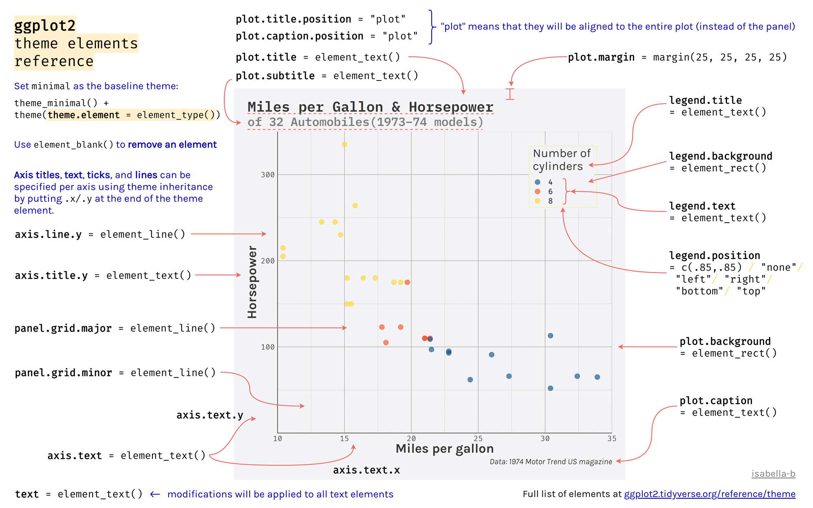

::: {.aside}
Source: [Isabella Benabaye](https://isabella-b.com/blog/ggplot2-theme-elements-reference/)
:::

## `?theme`

```{r}
#| eval: false
#| echo: true
theme(line, rect, text, title, aspect.ratio, axis.title, axis.title.x,
  axis.title.x.top, axis.title.x.bottom, axis.title.y, axis.title.y.left,
  axis.title.y.right, axis.text, axis.text.x, axis.text.x.top,
  axis.text.x.bottom, axis.text.y, axis.text.y.left, axis.text.y.right,
  axis.ticks, axis.ticks.x, axis.ticks.x.top, axis.ticks.x.bottom,
  axis.ticks.y, axis.ticks.y.left, axis.ticks.y.right, axis.ticks.length,
  axis.line, axis.line.x, axis.line.x.top, axis.line.x.bottom, axis.line.y,
  axis.line.y.left, axis.line.y.right, legend.background, legend.margin,
  legend.spacing, legend.spacing.x, legend.spacing.y, legend.key,
  legend.key.size, legend.key.height, legend.key.width, legend.text,
  legend.text.align, legend.title, legend.title.align, legend.position,
  legend.direction, legend.justification, legend.box, legend.box.just,
  legend.box.margin, legend.box.background, legend.box.spacing,
  panel.background, panel.border, panel.spacing, panel.spacing.x,
  panel.spacing.y, panel.grid, panel.grid.major, panel.grid.minor,
  panel.grid.major.x, panel.grid.major.y, panel.grid.minor.x,
  panel.grid.minor.y, panel.ontop, plot.background, plot.title,
  plot.subtitle, plot.caption, plot.tag, plot.tag.position, plot.margin,
  strip.background, strip.background.x, strip.background.y,
  strip.placement, strip.text, strip.text.x, strip.text.y,
  strip.switch.pad.grid, strip.switch.pad.wrap, ..., complete = FALSE,
  validate = TRUE)
```

::: aside
To see examples in action, see ["Theme Elements"](https://ggplot2-book.org/themes#sec-theme-elements) of the ggplot2 book
:::

## Move legend and make the background transparent

```{r}
#| echo: true
#| code-line-numbers: "9-13"
#| output-location: column

ggplot(season_summary) + 
  geom_histogram(
    aes(x = imdb_mean, fill = day_of_week), 
    bins = 15,
    color = "white"
    ) + 
  scale_fill_manual(values = c("gold2", "navyblue")) + 
  theme_minimal() + 
  theme(
    legend.position = c(.15, .85),
    legend.background = element_blank()
  )
```

## Clean up labels and title

```{r}
#| echo: true
#| code-line-numbers: "13-18"
#| output-location: column

ggplot(season_summary) + 
  geom_histogram(
    aes(x = imdb_mean, fill = day_of_week), 
    bins = 15,
    color = "white"
    ) + 
  scale_fill_manual(values = c("gold2", "navyblue")) + 
  theme_minimal() + 
  theme(
    legend.position = c(.15, .85),
    legend.background = element_blank()
  ) + 
  labs(
    x = "Season Average IMDB Rating",
    y = "",
    fill = "",
    title = "Survivor is better on Thursdays"
  )
```

## Remove minor gridlines

```{r}
#| echo: true
#| code-line-numbers: "12"
#| output-location: column

ggplot(season_summary) + 
  geom_histogram(
    aes(x = imdb_mean, fill = day_of_week), 
    bins = 15,
    color = "white"
    ) + 
  scale_fill_manual(values = c("gold2", "navyblue")) + 
  theme_minimal() + 
  theme(
    legend.position = c(.15, .85),
    legend.background = element_blank(),
    panel.grid.minor = element_blank()
  ) + 
  labs(
    x = "Season Average IMDB Rating",
    y = "",
    fill = "",
    title = "Survivor is better on Thursdays"
  )
```

## Get rid of .5's 

```{r}
#| echo: true
#| code-line-numbers: "8"
#| output-location: column

ggplot(season_summary) + 
  geom_histogram(
    aes(x = imdb_mean, fill = day_of_week), 
    bins = 15,
    color = "white"
    ) + 
  scale_fill_manual(values = c("gold2", "navyblue")) + 
  scale_x_continuous(breaks = c(6, 7, 8, 9)) +
  theme_minimal() + 
  theme(
    legend.position = c(.15, .85),
    legend.background = element_blank(),
    panel.grid.minor = element_blank()
  ) + 
  labs(
    x = "Season Average IMDB Rating",
    y = "",
    fill = "",
    title = "Survivor is better on Thursdays"
  )
```

## Add an annotation

```{r}
#| echo: true
#| code-line-numbers: "21-25"
#| output-location: column

ggplot(season_summary) + 
  geom_histogram(
    aes(x = imdb_mean, fill = day_of_week), 
    bins = 15,
    color = "white"
    ) + 
  scale_fill_manual(values = c("gold2", "navyblue")) + 
  scale_x_continuous(breaks = c(6, 7, 8, 9)) +
  theme_minimal() + 
  theme(
    legend.position = c(.15, .85),
    legend.background = element_blank(),
    panel.grid.minor = element_blank()
  ) + 
  labs(
    x = "Season Average IMDB Rating",
    y = "",
    fill = "",
    title = "Survivor is better on Thursdays"
  ) +
  annotate("text", 
           x = 6, 
           y = 3, 
           label = "Lowest ratings \n occur on \n Wednesdays",
           col = "navyblue")
```

## Increase text size

```{r}
#| echo: true
#| code-line-numbers: "9"
#| output-location: column

ggplot(season_summary) + 
  geom_histogram(
    aes(x = imdb_mean, fill = day_of_week), 
    bins = 15,
    color = "white"
    ) + 
  scale_fill_manual(values = c("gold2", "navyblue")) + 
  scale_x_continuous(breaks = c(6, 7, 8, 9)) +
  theme_minimal(base_size = 20) + 
  theme(
    legend.position = c(.15, .85),
    legend.background = element_blank(),
    panel.grid.minor = element_blank()
  ) + 
  labs(
    x = "Season Average IMDB Rating",
    y = "",
    fill = "",
    title = "Survivor is better on Thursdays"
  ) +
  annotate("text", 
           x = 6, 
           y = 3, 
           label = "Lowest ratings \n occur on \n Wednesdays",
           col = "navyblue")
```

# Plot Design {.maize}

## Which do you prefer? 

::: panel-tabset

## Plot A: 

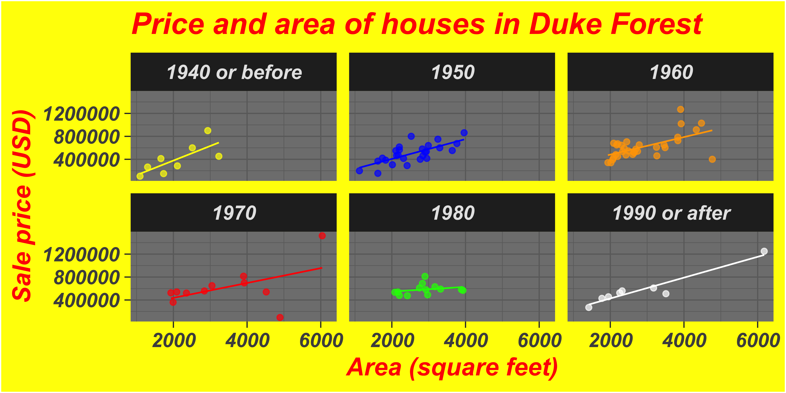


## Plot B: 

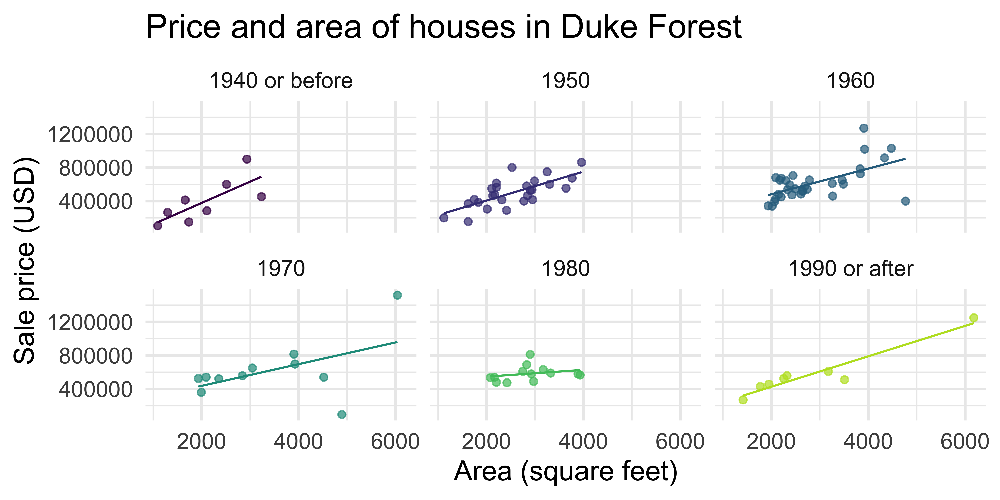

:::

## General guidelines

1. Show the data, don't distort it
2. Choose the right plot
3. Use color meaningfully and with restraint
4. Tell a story
5. Leave out non-story details

## 1. Show the data, don't distort it

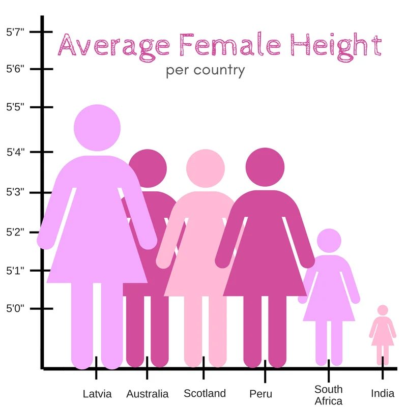{.r-stretch}

## 1. Show the data, don't distort it

::::: columns
::: {.column .nonincremental width="50%"}
What a huge effect! 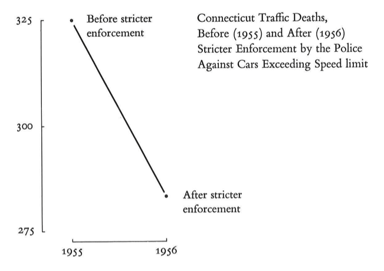
:::

::: {.column .fragment width="50%"}
But it isn't the whole story

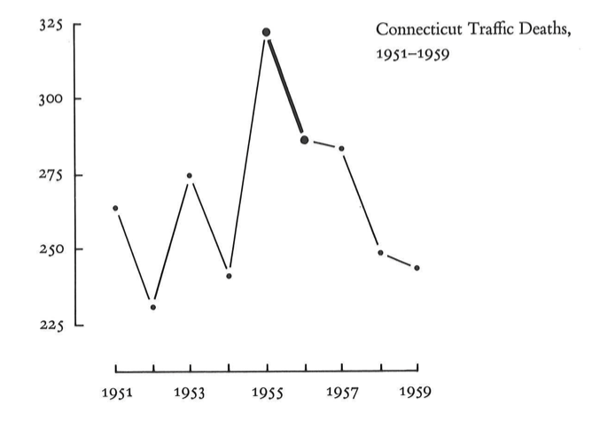
:::
:::::

## 2. Choose the right plot: Which slice is the biggest/smallest?

{fig-align="center" width="800"}

```{r}
countdown(0, 30)
```

. . .

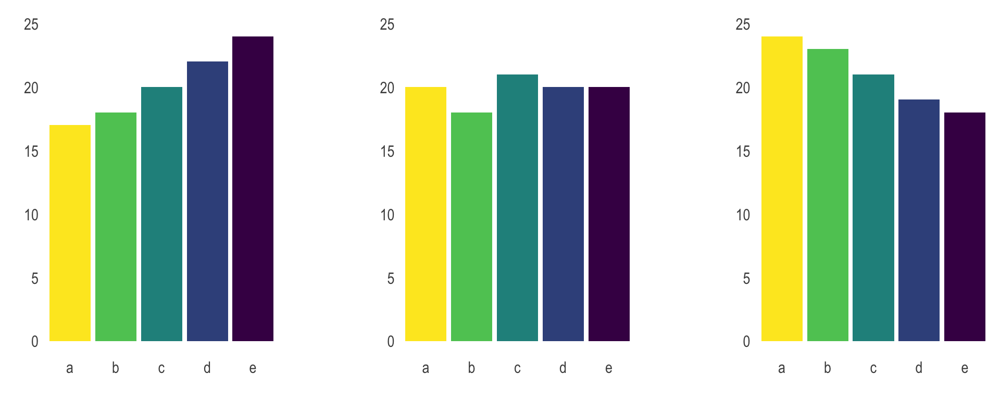{fig-align="center" width="800"}

::: aside
[The issue with pie chart](https://www.data-to-viz.com/caveat/pie.html) by Data to Viz
:::

## 2. Choose the right plot

::::: columns
::: {.column .nonincremental width="30%"}
- Wilke has good suggestions in [chapters 5-16](https://clauswilke.com/dataviz/directory-of-visualizations.html)

- Always stop and think about how easy it is to see the story

- Try a few different options
:::

::: {.column width="65%"}

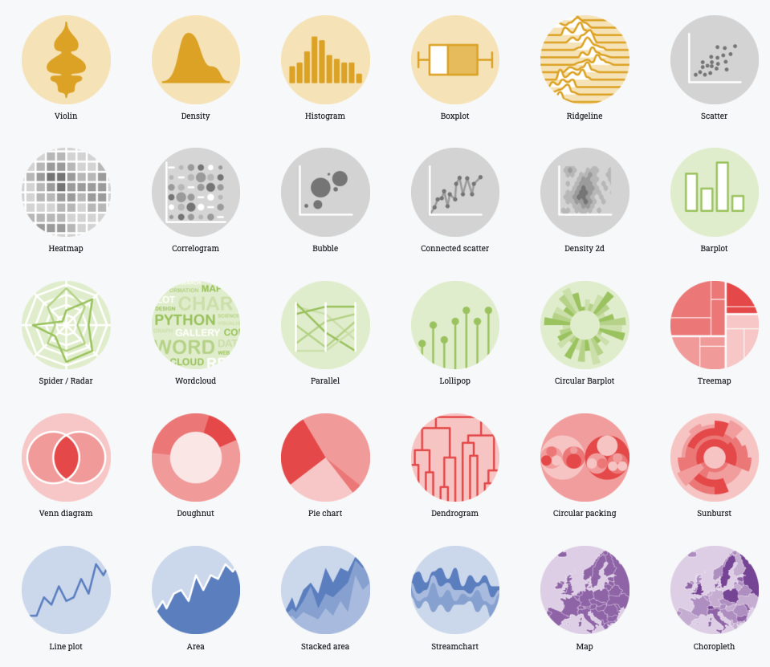
:::
:::::

## 3. Use color meaningfully and with restraint

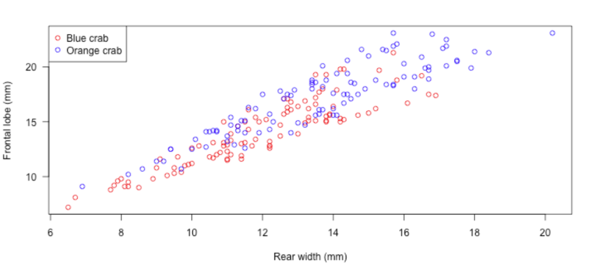{fig-align="center"}

## 3. Use color meaningfully and with restraint

```{r}
ggplot(season_summary, aes(x = viewers_mean, y = imdb_mean, col = season_name)) + 
  geom_point() +
  theme_minimal()
```

## 4. Tell a story

```{r}
#| echo: false

library(gapminder)

p_mess <- ggplot(gapminder, aes(x = year, y = lifeExp, group = country)) +
  geom_line(color = "grey30") +
  theme_minimal() +
  labs(
    title = "Life Expectancy (1952-2007)",
    x = "Year", y = "Life Expectancy"
  )


p_story <- ggplot(gapminder, aes(x = year, y = lifeExp, group = country)) +
  geom_line(color = "grey85", linewidth = 0.5) +
  geom_line(data = filter(gapminder, country == "Rwanda"), 
            color = "#D55E00", linewidth = 1.5) +
  theme_minimal() +
  labs(
    title = "The impact of the 1994 genocide",
    subtitle = "Life expectancy in Rwanda dropped 20+ years",
    x = "Year", y = "Life Expectancy"
  ) +
 # annotate("text", x = 1994, y = 35, label = "Rwanda", 
  #         color = "#D55E00", vjust = 1.5, fontface = "bold")
  gghighlight::gghighlight(country == "Rwanda", line_label_type = )

p_mess + p_story
```

## 4. Tell a story

One way to do this is by highlighting the important parts

```{r}
#| layout-ncol: 2


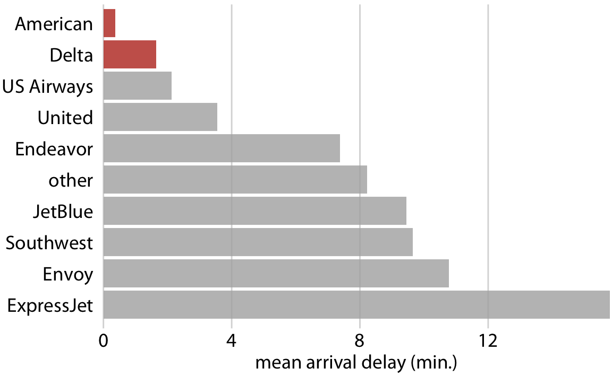

```


## 5. Leave out non-story details

Is this train schedule easy to read?

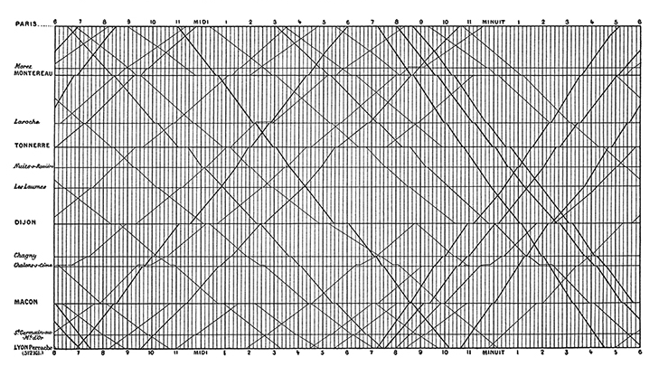

## 5. Leave out non-story details

Does removing gridlines make it *somewhat* easier?

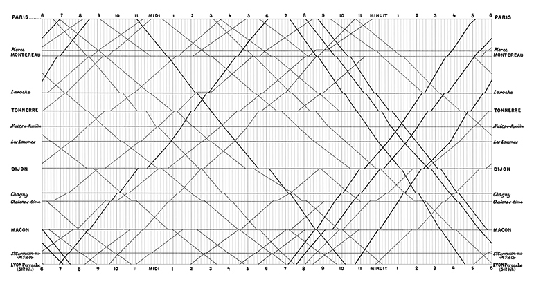

## Data visualizations have an aura of objectivity {.smaller}

:::::: columns
:::: {.column .nonincremental width="30%"}
> "We focus on four conventions which imbue visualisations with a sense of objectivity, transparency and facticity. These include: a) two-dimensional viewpoints; b) clean layouts; c) geometric shapes and lines; d) the inclusion of data sources."

::: aside
From Kennedy, Hill, Aiello & Allen. (2016) The work that visualisation conventions do. Information, Communication and Society, 19 (6). pp. 715-735. ISSN 1369-118X
:::
::::

::: {.column .nonincremental width="70%"}
```{r echo=FALSE, out.width = "100%"}
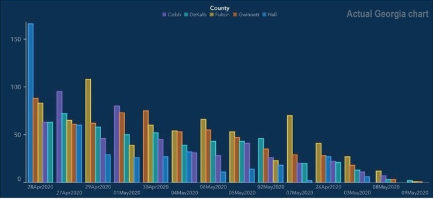
```
:::
::::::


## Good graphs can also break these guidelines

:::{layout-ncol=2}

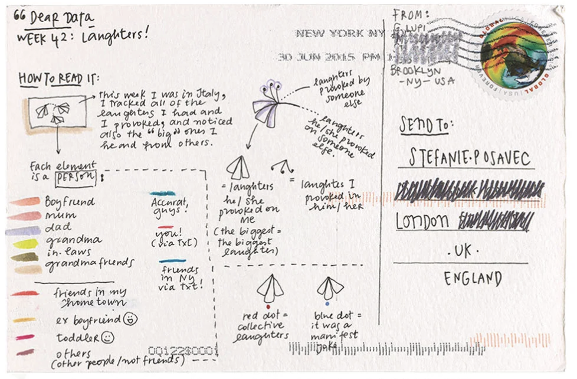

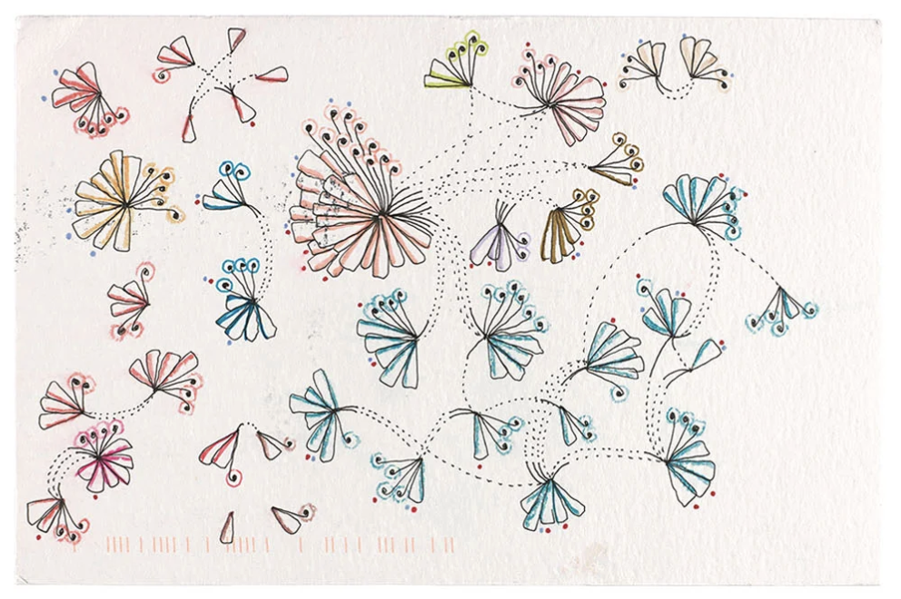

:::

::: aside
Source: [Dear Data Project](https://www.dear-data.com/theproject)
:::

## Good graphs can also break these guidelines

:::{layout-ncol=2}

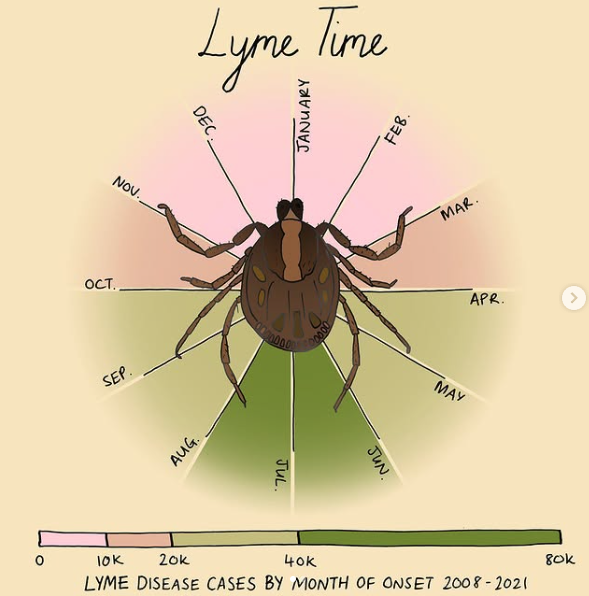

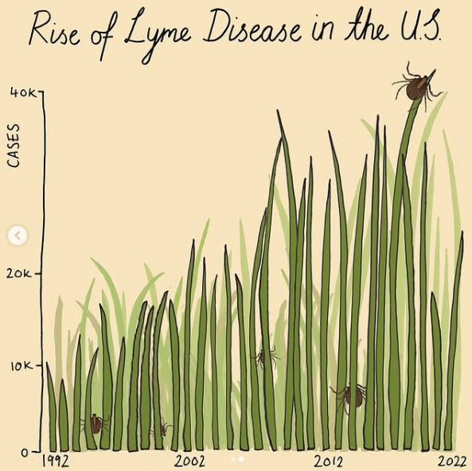

:::

::: aside
Source: Mona Chalabi `@monachalabi`
:::

## Your turn

Now that we have the toolkit to make customizations to our plots, and some "rules" for good graphs, let's break them! 

::: {.task .nonincremental}
1. Choose a graph (the one from class today, one from last class, one from homework, etc.)

2. Make it ugly

  - Change the `color` scale
  - Choose a complete theme
  - Make at least 3 custom tweaks to the `theme` options

3. Explain *why* it's ugly (what "rules" are you breaking? what makes it an ineffective graph?)

4. Post to our slack #social channel when you're done (you don't have to post your explanation)
:::
