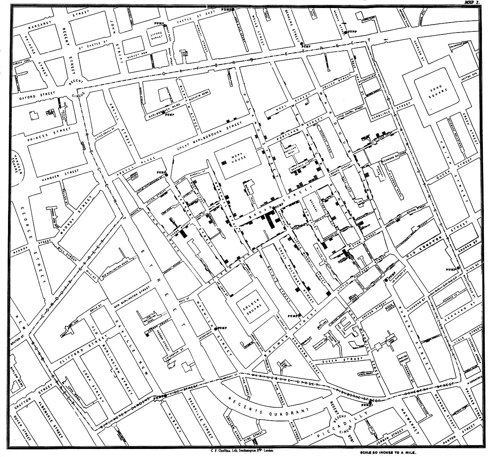
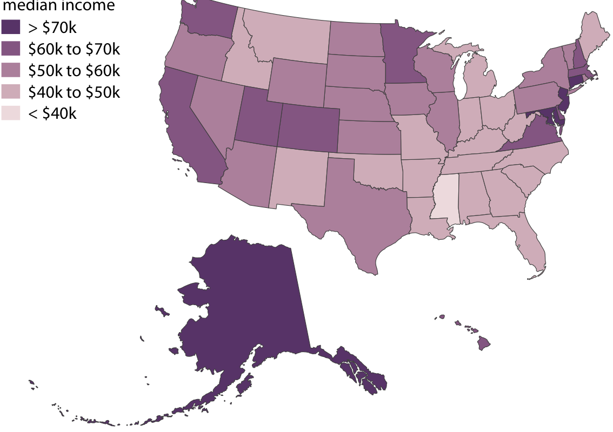
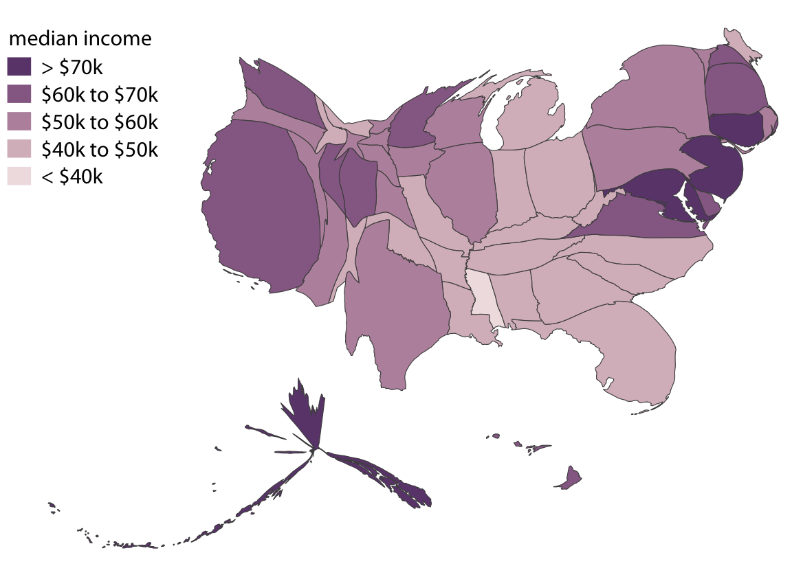
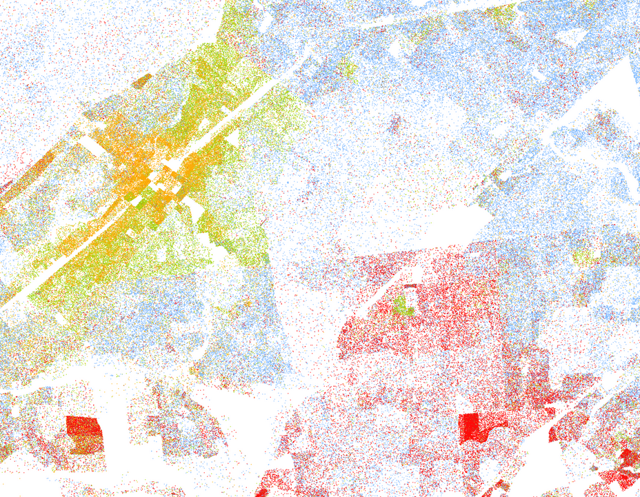
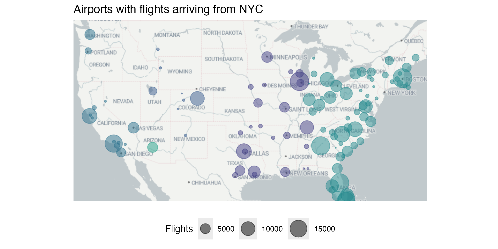
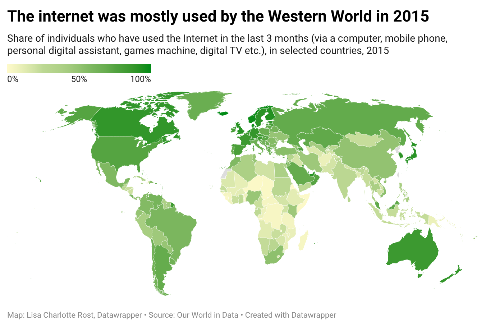
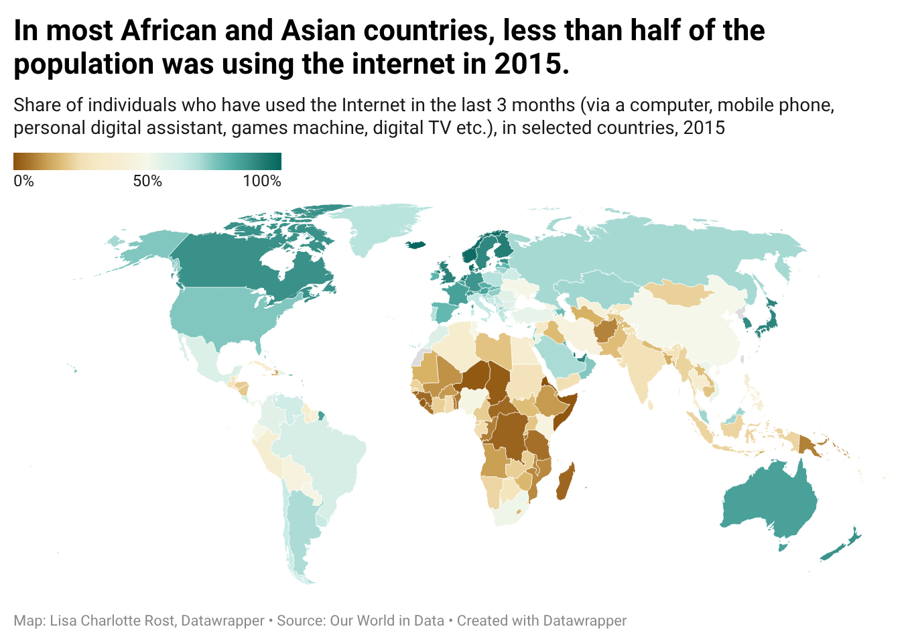
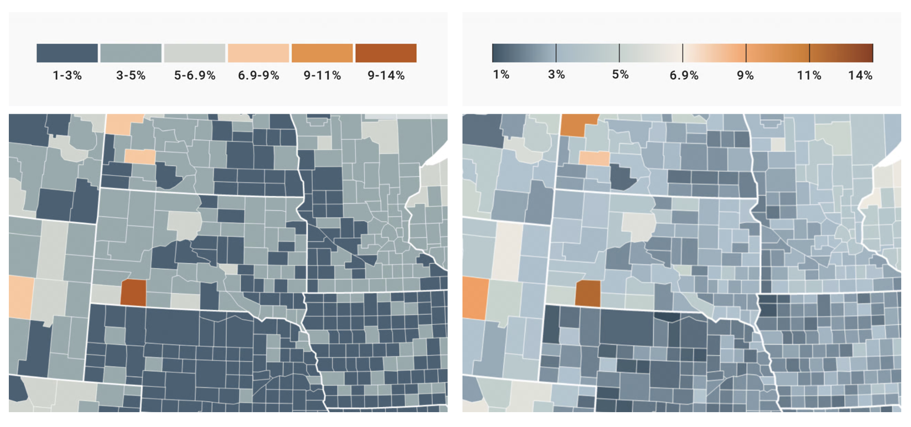
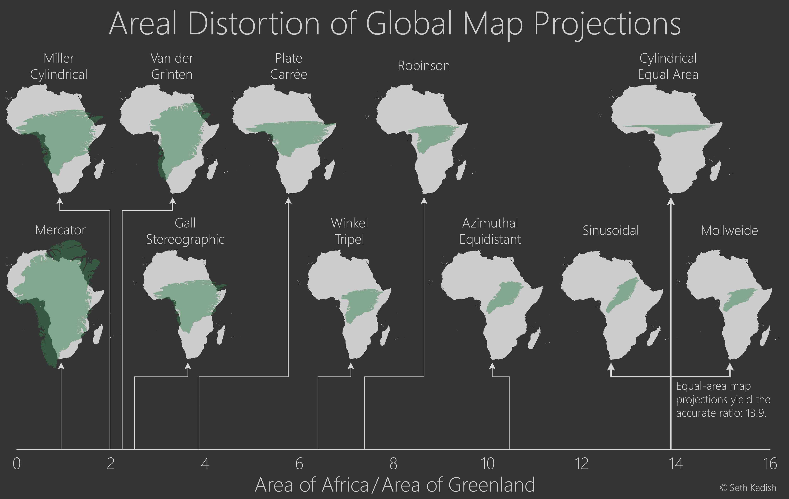

```{r setup, include=FALSE}
knitr::opts_chunk$set(echo = FALSE, message = FALSE, warning = FALSE)

library(countdown)
library(tidyverse)
library(lubridate)
library(ymlthis)
library(palmerpenguins)
library(patchwork)
library(graphics)
library(tidyverse)
library(maps)
library(mapproj)
library(ggthemes)

slides_theme = theme_minimal(
  base_family = "Atkinson Hyperlegible",
  base_size = 20)
theme_set(theme_gray(
  base_size = 20
))
```

## Today

-   git/GitHub
-   Intro to Spatial Data
-   Making Maps in `ggplot2`

##  {.smaller background-image="https://imgs.xkcd.com/comics/git.png" background-position="right" background-size="35%"}

::::: columns
::: {.column width="60%"}
-   Think of the state on GitHub as "worst case scenario"
-   If you screw things up, copy your important files (eg. `hw02.qmd`) to a safe place.
    -   Usually your files are JUST FINE. But it is easy to goof up the Git infrastructure when you’re new at this. And it can be hard to get that straightened out on your own.
-   Rename the existing local repo as a temporary measure, i.e. before you do something radical, like delete it.
-   Clone the original repo from GitHub to RStudio, and copy all relevant files back over from your safe space. The ones whose updated state you need to commit.
-   Render, commit, push
-   Carry on with your life.
:::

::: {.column width="50%"}
:::
:::::

::: aside
[Burn It All Down](https://happygitwithr.com/burn) from *Happy Git with R*
:::

# Spatial Data {.maize}

## Cholera {.smaller}

In 1854, a *Cholera* outbreak killed 127 people in 3 days in a London neighborhood, resulting in a mass exodus of local residents. At the time, people thought that Cholera was an airborne disease. John Snow was a physician who was critical of the airborne theory, and set out to investigate.

. . .

What might this data look like?

. . .

```{r, echo = FALSE}
tribble( ~"date", ~"last_name", ~"first_name", ~"address", ~age, ~"cause_of_death",
         "Aug 31, 1854",	"Jones",	"Thomas",	"26 Broad St.", 	37,	"cholera", 
         "Aug 31, 1854",	"Jones",	"Mary",	"26 Broad St.", 	11,	"cholera", 
         "Sept 1, 1854",	"Warwick",	"Martin",	"14 Broad St.", 	23	,"cholera") %>% 
  knitr::kable()
```

::: aside
Source: [MDSR Ch17.1](https://mdsr-book.github.io/mdsr3e/17-geospatialI.html)
:::

## 

What makes "address" a useful variable is that it is linked to a specific location in the physical world. If we plot these addresses, we get something like the following:

```{r}
library(tidyverse)
library(mdsr)
library(sf)
plot(CholeraDeaths["Count"])
```

::: aside
Source: [MDSR Ch17.1](https://mdsr-book.github.io/mdsr3e/17-geospatialI.html)
:::

## 

While we can see patterns in the last plot, the underlying map of the London streets provides helpful context that makes it more intelligible:

{.lightbox width="50%" fig-align="center"}

::: aside
Source: [MDSR Ch17.1](https://mdsr-book.github.io/mdsr3e/17-geospatialI.html)
:::

## 

::::: columns
::: {.column .nonincremental width="60%"}
Snow’s insight was driven by another set of data — the locations of the street-side water pumps (it's very hard to see, but they are labeled with circular dots on the map). Nearly all of the cases were clustered around a single pump on the center of Broad Street.

John Snow's map (and water pump) are now "famous" among epidemiologists and statisticians.
:::

::: {.column .fragment .nonincremental width="40%"}
{fig-align="center"}
:::
:::::

::: aside
Source: [MDSR Ch17.1](https://mdsr-book.github.io/mdsr3e/17-geospatialI.html)
:::

## A successful data science episode:

1.  Combine three sources of data (Cholera deaths, water pump locations, and street map)
2.  While a model might have come to the same conclusion, simply plotting the data is much simpler (and more convincing to lots of people)
3.  The problem was resolved when the data-based evidence was combined with a plausible model that explained the physical phenomenon.

::: aside
Source: [MDSR Ch17.1](https://mdsr-book.github.io/mdsr3e/17-geospatialI.html)
:::

## Common Types of Maps

1.  Choropleth
2.  Cartograms
3.  Dot density and Proportional Symbol

## Choropleth

Fill in regions with variable values

::::: columns
::: {.column .nonincremental width="40%"}
Need two data sources: 

1. map data with lat, long, region 
2. data with measurements for each region 

:::

::: {.column .nonincremental width="60%"}

:::
:::::

::: aside
[*Fundamentals of Data Visualization*](https://clauswilke.com/dataviz/geospatial-data.html)
:::

## Cartogram

Use approximate geographical position to encode information, but not lat/long directly

{.r-stretch}


::: aside
[*Fundamentals of Data Visualization*](https://clauswilke.com/dataviz/geospatial-data.html)
:::

## Dot density 

Uses points to show distribution and concentration, where each dot represents a specific quantity. Here 1 dot = 1 person:

{.r-stretch}

::: aside
Source: Cooper Center's [racial dot map](http://racialdotmap.demographics.coopercenter.org/); no longer active

:::

## Proportional Symbol

Overlay symbols on an existing map, where the size of the shape is proportional to the variable

{.r-stretch}

```{r}
#| eval: false
library(ggmap)
flights = nycflights23::flights |>
  count(dest)

airports = nycflights23::airports |>
  left_join(flights, by = join_by("faa" == "dest"))

museums <- read_csv("https://raw.githubusercontent.com/mateyneykov/315_code_data/master/data/museums.csv")
us <- c(left = -125, bottom = 25.75, right = -67, top = 49)
map <- get_stadiamap(us, zoom = 4, maptype = "alidade_smooth")


ggmap(map) +
  geom_point(aes(x = lon, y = lat, size = n, col = tzone), 
             data = airports, alpha = .5) + 
  scale_size(range = c(0, 10)) + 
  scale_color_viridis_d(end = .75, guide = "none")+
  labs(title = "Airports with flights arriving from NYC",
       x = "",
       y = "",
       size = "Flights") +
   theme(axis.title = element_blank(), 
         axis.text = element_blank(), 
         axis.ticks = element_blank(),
         legend.position = "bottom")

ggsave("slides/img/airport-ggmap.png", width = 8, height = 4, units = "in")
```

::: aside
Made with {ggmap} and {nycflights23}
:::

# Choropleth Maps in detail {.maize}

## What is a map?

A bunch of latitude longitude points...

```{r}
#| echo: false

states <- map_data("state")
```

```{r}
ggplot(states) + geom_point(aes(long, lat))
```

## What is a map?

... that are connected with lines in a very specific order.

```{r}
ggplot(states) + geom_path(aes(long, lat, group = group))
```

## Necessary map data

-   latitude/longitude points for all map boundaries

-   which boundary group all lat/long points belong

-   the order to connect points within each group

## State map data

`ggplot2::map_data()` provides the necessary information

```{r}
#| echo: true


states <- map_data("state")
head(states)
```

## Using `geom_polygon()`

Using `geom_polygon()` will treat states as solid shapes, making it easier to add color

```{r}
#| echo: true
ggplot(states, aes(x=long, y=lat, group=group)) + 
    geom_polygon(color="gold2", fill="navyblue")
```

## Warm Up

```{r}
#| eval: FALSE
#| echo: TRUE

ggplot(states, aes(x=long, y=lat, group=group)) + 
    geom_polygon(color="gold2", fill="navyblue") +
    coord_fixed()
```

::: {.task .nonincremental}
-   Edit this code so that each shape is colored in with a different color.
-   You only need the 3 variables used: `long`, `lat`, and `group`
-   `05-maps.qmd` is available on the website (push the Code button at the top right of the 05-maps link and paste into your own .qmd file)
:::

```{r}
countdown(3)
```

## But... how do we include data?

```{r}
#| echo: true
acs_state_data = read_csv("../../data/acs_state_data_2022_5y.csv")
acs_state_data$state = tolower(acs_state_data$NAME)
```

```{r}
knitr::kable(acs_state_data)
```

## `geom_map` is a "shortcut"

::::: columns
::: {.column .nonincremental width="60%"}

```{r}
#| output-location: slide
#| echo: true


ggplot(acs_state_data) + 
  geom_map(
    aes(map_id = state, fill = NAME),
    map = states
  ) +
  expand_limits(x = states$long, y = states$lat) +
  coord_map() +
  theme_map()
```
:::

::: {.column width="40%"}

- `acs_state_data` is the name of the dataset
- `map_id = state` tells `geom_map` to look in the "state" column in `acs_state_data` to find the state name
- `fill = NAME` tells ggplot to fill the states by the variable in `NAME`
:::
:::::

## Activity 1

::: {.task .nonincremental}
Comment out the `expand_limits` line. What happened? 
:::

```{r}
countdown(1)
```

## Sequential vs Diverging color scale


::: {.panel-tabset}

### Overview

The next two panels show the same data and the same graph with two different color scales. 

**Sequential** color scales are intuitive and can be read as "more is more"

**Diverging** scales emphasize how far away a data point is from a midpoint

### Sequential



### Diverging



:::


## Binned vs continuous color scale




::: aside
Unemployment rate by county in 2020. Source: [Datawrapper blog](https://www.datawrapper.de/blog/classed-vs-unclassed-color-scales)
:::

## Activity 2

::: {.task .nonincremental}
Edit your chloropleth map by: 

- Choosing a different variable in `acs_state_data` to map to `fill`
- Choosing a different color scale
- Updating the title, axis labels, and legend title
:::

```{r}
countdown(6)
```


## Coordinate Systems and Projections {background-image="../img/02-ggplot-layers.png" background-size="60%" background-position="right" background-opacity="0.8"}

##  {background-image="../img/cairo-projections.png" background-size="50%" background-position="right"}

:::: columns
::: {.column .nonincremental width="40%"}
Geospatial data exists on the globe and is generally described with a *latitude* and *longitude*. Any *projection* from the globe to euclidean space (X-Y plane) is going to cause some distortion.
:::
::::

## 

{.r-stretch}

## Changing the coordinate system

`coord_map` function provides a Mercator projection (`mapproj` package has more options)

```{r}
#| output-location: column
#| echo: true

ggplot(states, aes(x=long, y=lat, group=group)) + 
  geom_polygon(color="gold2", fill="navyblue") + 
  coord_map() + 
  theme_map()
```

## Changing the coordinate system

Here is a Gall projection 

```{r}
#| output-location: column
#| echo: true

ggplot(states, aes(x=long, y=lat, group=group)) + 
  geom_polygon(color="gold2", fill="navyblue") + 
  coord_map(projection = "gall", lat = 0) + 
  theme_map()
```

## Mercator vs Gall projection (world map)

```{r}
#| echo: true
#| eval: false

world <- map_data("world")

ggplot(world, aes(x=long, y=lat, group=group)) + 
  geom_polygon(color="gold2", fill="navyblue") + 
  coord_map(projection = "mercator", xlim = c(-180, 180)) + 
  theme_map()
```

```{r}
#| layout-nrow: 1
#| layout-ncol: 2

world <- map_data("world")

ggplot(world, aes(x=long, y=lat, group=group)) + 
  geom_polygon(color="gold2", fill="navyblue") + 
  coord_map(projection = "mercator", xlim = c(-180, 180)) + 
  theme_map()

ggplot(world, aes(x=long, y=lat, group=group)) + 
  geom_polygon(color="gold2", fill="navyblue") + 
  coord_map(projection = "gall", lat = 0, xlim = c(-180, 180)) + 
  theme_map()
```


## Activity 3

::: {.task .nonincremental}
Make a map showing per capita information by dividing the variable chosen in the previous problem by `total_pop` directly in the `aes()` function.
:::
