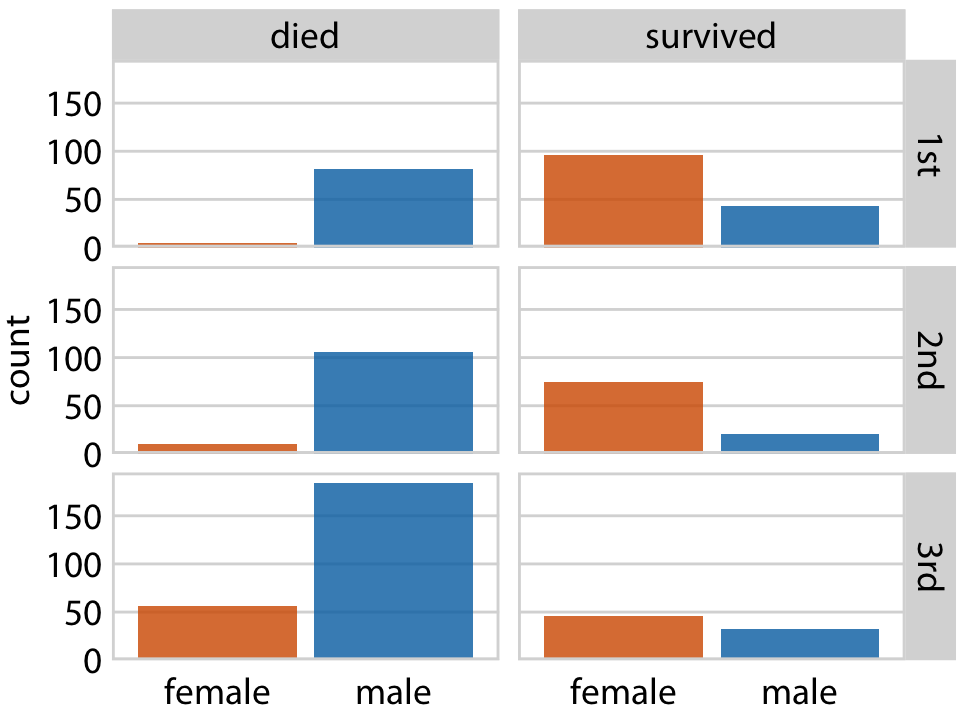
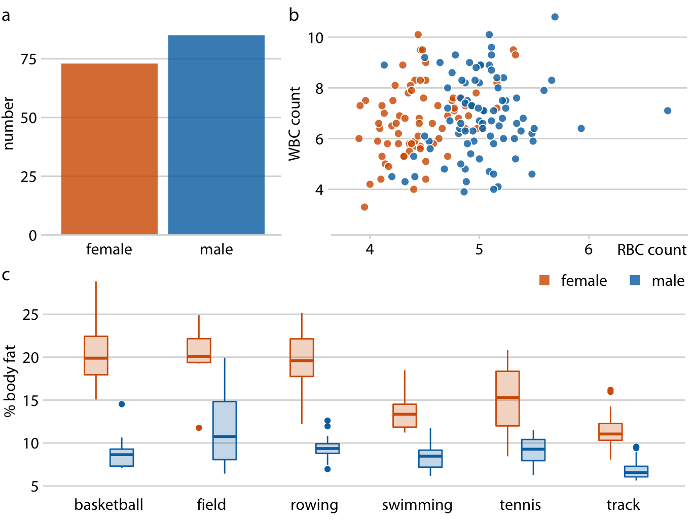

```{r setup, include=FALSE}
knitr::opts_chunk$set(echo = FALSE, message = FALSE, warning = FALSE)

library(countdown)
library(tidyverse)
library(lubridate)
library(ymlthis)
library(palmerpenguins)
library(patchwork)
library(graphics)
library(tidyverse)
library(maps)
library(mapproj)
library(ggthemes)

slides_theme = theme_minimal(
  base_family = "Atkinson Hyperlegible",
  base_size = 16)

theme_set(slides_theme)
```

## Today

-   {patchwork}
-   Colorblind-friendly color palettes
-   Writing alt-text

## Small Multiples

Each plot shares **aesthetics** but shows different subsets of **data**

{.r-stretch}

## Compound Plots

The plots might share data, but don't share **aesthetics**

{.r-stretch}

##  {background-image="../img/horst-patchwork.png" background-position="right" background-size="90%"}

## Compound Plot Example {.scrollable}

```{r}
#| echo: true

library(palmerpenguins)
ggplot(penguins) + 
  geom_histogram(bins = 20, col = "white", aes(x = body_mass_g))

ggplot(penguins) + 
  geom_histogram(bins = 20, col = "white", aes(x = flipper_length_mm))

ggplot(penguins) + 
  geom_point(aes(x = body_mass_g, y = flipper_length_mm))
```

## Patchwork {.smaller}

```{r}
#| echo: true
#| code-line-numbers: "2,5,8,11"
#| fig-width: 8
#| fig-height: 4
#| fig-align: 'center'
#| output-location: fragment

library(patchwork)
p1 <- ggplot(penguins) + 
  geom_histogram(bins = 20, col = "white", aes(x = body_mass_g))

p2 <- ggplot(penguins) + 
  geom_histogram(bins = 20, col = "white", aes(x = flipper_length_mm))

p3 <- ggplot(penguins) + 
  geom_point(aes(x = body_mass_g, y = flipper_length_mm))

(p1 + p2)/p3
```

## Patchwork (layout 2) {.smaller}

```{r}
#| echo: true
#| fig-width: 8
#| fig-height: 4
#| fig-align: 'center'


p3 + (p1/p2)
```

::: aside
For more complex layouts, see the ["Controlling Layouts"](https://patchwork.data-imaginist.com/articles/guides/layout.html) vignette
:::

## Patchwork  (layout 2) {.smaller}

```{r}
#| echo: true
#| code-line-numbers: "11,12"
#| fig-width: 8
#| fig-height: 4
#| fig-align: 'center'

p1 <- ggplot(penguins) + 
  geom_histogram(bins = 20, col = "white", aes(x = body_mass_g, fill = species))

p2 <- ggplot(penguins) + 
  geom_histogram(bins = 20,  col = "white", aes(x = flipper_length_mm, fill = species))

p3 <- ggplot(penguins) + 
  geom_point(shape = 21, alpha = .9, col = "white", aes(x = body_mass_g, y = flipper_length_mm, fill = species)) 

p3 + (p1/p2) 
```

## Patchwork (with a shared legend) {.smaller}

```{r}
#| echo: true
#| code-line-numbers: "11,12"
#| fig-width: 8
#| fig-height: 4
#| fig-align: 'center'

p1 <- ggplot(penguins) + 
  geom_histogram(bins = 20, col = "white", aes(x = body_mass_g, fill = species))

p2 <- ggplot(penguins) + 
  geom_histogram(bins = 20,  col = "white", aes(x = flipper_length_mm, fill = species))

p3 <- ggplot(penguins) + 
  geom_point(shape = 21, alpha = .9, col = "white", aes(x = body_mass_g, y = flipper_length_mm, fill = species)) 

p3 + (p1/p2) + 
  plot_layout(guides = 'collect')
```

## Patchwork (hiding `point` legend) {.smaller}

```{r}
#| echo: true
#| code-line-numbers: "9,12"
#| fig-width: 8
#| fig-height: 4
#| fig-align: 'center'

p1 <- ggplot(penguins) + 
  geom_histogram(bins = 20, col = "white", aes(x = body_mass_g, fill = species))

p2 <- ggplot(penguins) + 
  geom_histogram(bins = 20,  col = "white", aes(x = flipper_length_mm, fill = species))

p3 <- ggplot(penguins) + 
  geom_point(shape = 21, alpha = .9, col = "white", aes(x = body_mass_g, y = flipper_length_mm, fill = species)) +
  theme(legend.position = "none")

p3 + (p1/p2) + 
  plot_layout(guides = 'collect')
```

## Patchwork (with annotation) {.smaller}

```{r}
#| echo: true
#| code-line-numbers: "3-6"
#| fig-width: 8
#| fig-height: 4
#| fig-align: 'center'

p3 + (p1/p2) + 
  plot_layout(guides = 'collect') + 
  plot_annotation(
    title = "Penguin Plot",
    tag_levels = "A"
  ) 
```

## Patchwork (with a common theme) {.smaller}

```{r}
#| echo: true
#| code-line-numbers: "3,4"
#| fig-width: 8
#| fig-height: 4
#| fig-align: 'center'

p3 + (p1/p2) + 
  plot_layout(guides = 'collect') & 
  theme_minimal() &
  scale_fill_viridis_d()
```

## But what does this have to do with accessibility?

- Output (knitted files, slides, websites, etc.) should be designed to make it *as easy as possible* for the user to understand your content
- There's a cognitive load involved with scrolling or turning a physical page and trying to remember a visual from the previous page
- When plots belong together, we should put them together

# Colorblind-friendly palettes {.maize}

## Color scales

::::: columns
::: {.column .fragment width="33%"}
**Categorical variables**

Order doesn't matter

```{r}
#| echo: false
#| fig-height: 16


library(scales)
show_col(hue_pal()(6), ncol = 1, labels=FALSE)
```
:::

::: {.column .fragment width="33%"}
**Numeric variables**

Order matters

```{r}
#| echo: false
#| fig-height: 16

library(scales)
show_col(seq_gradient_pal(low = "#132B43", high = "#56B1F7")(seq(0,1,by=.15)), ncol = 1, labels=FALSE)
```
:::

::: {.column .fragment width="33%"}
**Diverging variables**

Midpoint matters

```{r}
#| fig-height: 16
#| echo: false
library(scales)
show_col(RColorBrewer::brewer.pal(7, "RdBu"), ncol = 1, labels=FALSE)
```
:::
:::::

## Color scales

Use colorblind friendly color scales (e.g., Okabe Ito, viridis)

```{r message = FALSE}
#| echo: false
nurses <- read_csv("data/nurses.csv") |> janitor::clean_names()
```

```{r}
#| echo: false
nurses_subset <- nurses |>
  filter(state %in% c("California", "New York", "Minnesota"))
```

```{r}
#| echo: false

nurses_subset |>
  ggplot(aes(x = year, y = hourly_wage_median, color = state)) +
  geom_point(size = 2) +
  ggthemes::scale_color_colorblind() +
  scale_y_continuous(labels = scales::label_dollar()) +
  labs(
    x = "Year", y = "Median hourly wage", color = "State",
    title = "Median hourly wage of Registered Nurses"
  ) +
  theme(
    legend.position = c(0.15, 0.75),
    legend.background = element_rect(fill = "white", color = "white")
  )
```

## 

```{r}
#| echo: true
colorBlindness::displayAllColors(scales::hue_pal()(10))
```

## 

```{r}
#| echo: true
colorBlindness::displayAllColors(rainbow(10))
```

## 

```{r}
#| echo: true
colorBlindness::displayAllColors(colorblindr::palette_OkabeIto)
```

## 

```{r}
#| echo: true
colorBlindness::displayAllColors(viridisLite::viridis(10))
```

## Double encoding

Use shape *and* color where possible

. . .

::::: columns
::: {.column width="40%"}
**Default ggplot2 scale**

```{r echo = FALSE, out.width = "100%"}
nurses_subset |>
  ggplot(aes(x = year, y = hourly_wage_median, color = state, shape = state)) +
  geom_point(size = 2) +
  scale_y_continuous(labels = scales::label_dollar()) +
  labs(
    x = "Year", y = "Median hourly wage", color = "State", shape = "State",
    title = "Median hourly wage of Registered Nurses"
  ) +
  theme(
    legend.position = c(0.15, 0.75),
    legend.background = element_rect(fill = "white", color = "white")
    )

```
:::

::: {.column width="60%"}
**Default ggplot2 scale with deuteranopia**

```{r}
cowplot::plot_grid(colorblindr::edit_colors(last_plot(), colorspace::deutan))
```
:::
:::::

::: aside
Source: Mine Çetinkaya-Rundel, [Sta313](https://vizdata.org/). Generated with [{colorblindr}](https://github.com/clauswilke/colorblindr/tree/master).
:::

## Use direct labeling

-   Prefer direct labeling where color is used to display information over a legend

-   Quicker to read

-   Ensures graph can be understood without reliance on color


## Without direct labeling

::::: columns
::: {.column width="40%"}
**Default ggplot2 scale**

```{r echo = FALSE, out.width = "100%"}
nurses_subset |>
  ggplot(aes(x = year, y = annual_salary_median, color = state)) +
  geom_line(linewidth = 2) +
  scale_y_continuous(labels = scales::label_dollar(scale = 1/1000, suffix = "K")) +
  labs(
    x = "Year", y = "Annual median salary", color = "State",
    title = "Annual median salary of Registered Nurses"
  ) +
  theme(
    legend.background = element_rect(fill = "white", color = "white"),
    legend.position = c(0.2, 0.75)
    )
```
:::

::: {.column width="60%"}
**Default ggplot2 scale with deuteranopia**

```{r}
cowplot::plot_grid(colorblindr::edit_colors(last_plot(), colorspace::deutan))
```
:::
:::::

::: aside
Source: Mine Çetinkaya-Rundel, [Sta313](https://vizdata.org/). Generated with [{colorblindr}](https://github.com/clauswilke/colorblindr/tree/master).
:::

## With direct labeling

::::: columns
::: {.column width="40%"}
**Default ggplot2 scale**

```{r echo = FALSE, out.width = "100%"}
nurses_subset |>
  ggplot(aes(x = year, y = annual_salary_median, color = state)) +
  geom_line(show.legend = FALSE, linewidth = 2) +
  geom_text(
    data = nurses_subset |> filter(year == max(year)),
    aes(label = state), hjust = 0, nudge_x = 1,
    show.legend = FALSE, size = 6
  ) +
  scale_y_continuous(labels = scales::label_dollar(scale = 1/1000, suffix = "K")) +
  labs(
    x = "Year", y = "Annual median salary", color = "State",
    title = "Annual median salary of Registered Nurses"
  ) +
  coord_cartesian(clip = "off") +
  theme(
    plot.margin = margin(0.1, 0.9, 0.1, 0.1, "in")
    )
```
:::

::: {.column width="60%"}
**Default ggplot2 scale with deuteranopia**

```{r}
cowplot::plot_grid(colorblindr::edit_colors(last_plot(), colorspace::deutan))
```

:::
:::::

Use `geom_text()` - will need to play with placement of the text

::: aside
Source: Mine Çetinkaya-Rundel, [Sta313](https://vizdata.org/). Generated with [{colorblindr}](https://github.com/clauswilke/colorblindr/tree/master).
:::

## Use whitespace or pattern to separate elements

-   Separate elements with whitespace or pattern

-   Allows for distinguishing between data without entirely relying on contrast between colors


## Without whitespace

::::: columns
::: {.column width="40%"}
**Default ggplot2 scale**

```{r echo = FALSE, out.width = "100%"}
nurses_subset |>
  filter(year %in% c(2000, 2010, 2020)) |>
  ggplot(aes(x = factor(year), y = total_employed_rn, fill = state)) +
  geom_col(position = "fill") +
  labs(
    x = "Year", y = "Proportion of Registered Nurses", fill = "State",
    title = "Total employed Registered Nurses"
  )
```
:::

::: {.column width="60%"}
**Default ggplot2 scale with tritanopia**

```{r}
cowplot::plot_grid(colorblindr::edit_colors(last_plot(), colorspace::tritan))
```

:::
:::::

::: aside
Source: Mine Çetinkaya-Rundel, [Sta313](https://vizdata.org/). Generated with [{colorblindr}](https://github.com/clauswilke/colorblindr/tree/master).
:::

## With whitespace

::::: columns
::: {.column width="40%"}
**Default ggplot2 scale**

```{r echo = FALSE, out.width = "100%"}
nurses_subset |>
  filter(year %in% c(2000, 2010, 2020)) |>
  ggplot(aes(x = factor(year), y = total_employed_rn, fill = state)) +
  geom_col(position = "fill", color = "white", linewidth = 1) +
  labs(
    x = "Year", y = "Proportion of Registered Nurses", 
    fill = "State",
    title = "Total employed Registered Nurses"
  )
```
:::

::: {.column width="60%"}
**Default ggplot2 scale with tritanopia**

```{r}
cowplot::plot_grid(colorblindr::edit_colors(last_plot(), colorspace::tritan))
```

:::
:::::

Add `color` = "white" to the geom_col (or other `geom`etry) function

::: aside
Source: Mine Çetinkaya-Rundel, [Sta313](https://vizdata.org/). Generated with [{colorblindr}](https://github.com/clauswilke/colorblindr/tree/master).
:::

# Alt-text {.maize}

## Alternative text

> It is read by screen readers in place of images allowing the content and function of the image to be accessible to those with visual or certain cognitive disabilities.
>
> It is displayed in place of the image in browsers if the image file is not loaded or when the user has chosen not to view images.
>
> It provides a semantic meaning and description to images which can be read by search engines or be used to later determine the content of the image from page context alone.

::: aside
Source: [WebAIM](https://webaim.org/techniques/alttext/)
:::

## Alt and surrounding text {.smaller}

**CHART TYPE** of **TYPE OF DATA** where **REASON FOR INCLUDING CHART**

(plus link to data source somewhere in the text)

-   **CHART TYPE**: It's helpful for people with partial sight to know what chart type it is and gives context for understanding the rest of the visual.
-   **TYPE OF DATA**: What data is included in the chart? The x and y axis labels may help you figure this out.
-   **REASON FOR INCLUDING CHART**: Think about why you're including this visual. What does it show that's meaningful. There should be a point to every visual and you should tell people what to look for.
-   **Link to data source**: Don't include this in your alt text, but it should be included somewhere in the surrounding text.

::: aside
Source: [Writing Alt Text for Data Visualization](https://medium.com/nightingale/writing-alt-text-for-data-visualization-2a218ef43f81)
:::

## Alt Text Practice {.smaller}

**CHART TYPE** of **TYPE OF DATA** where **REASON FOR INCLUDING CHART**

::::: columns
::: {.column width="50%"}
```{r}
#| echo: false
nurses_subset |>
  ggplot(aes(x = year, y = hourly_wage_median, color = state)) +
  geom_point(size = 2) +
  ggthemes::scale_color_colorblind() +
  scale_y_continuous(labels = scales::label_dollar()) +
  labs(
    x = "Year", y = "Median hourly wage", color = "State",
    title = "Median hourly wage of Registered Nurses"
  ) +
  theme(
    legend.position = c(0.15, 0.75),
    legend.background = element_rect(fill = "white", color = "white")
  )
```
:::

::: {.column width="50%"}
-   A scatterplot
-   of median hourly wage of RN's by year in California, Minnesota, and New York. The x-axis starts at the year 1996 and ends at the year 2020.
-   The three states follow the same linear increasing trend until about 2007, when New York and Minnesota begin to flatten.
:::
:::::

```{r}
countdown::countdown(1,30)
```


## Let's try it! {.smaller}

**CHART TYPE** of **TYPE OF DATA** where **REASON FOR INCLUDING CHART**

::: task
1. Take one graph and two blank cards

2. Write an alt text description of your graph on one of your blank cards. 
    - Please label with your plot number! 
  
3. In pairs, trade **alt text descriptions only**

4. On your second blank card, try to draw the graph based on the alt text provided. 

5. Now, look at the original graph. How'd you do?
:::

## Recap

- What was hard about *writing* alt text? 
- Looking at the graphs, do you notice things that make it harder/easier to write alt text?
- What was hard about *recreating* from the alt text?

# Code templates {.maize}

## Adding alt text to plots

Short:

```{r}
#| echo: fenced
#| fig-alt: Alt text goes here.

# code for plot goes here
```

. . .

Longer:

```{r}
#| echo: fenced
#| fig-alt: |
#|   Longer alt text goes here. Make sure to add line breaks ~roughly
#|   80 characters.

# code for plot goes here
```

## Using Okabe Ito palette

```{r}
#| echo: true
#| output-location: column
#| code-line-numbers: "4"


nurses_subset |>
  ggplot(aes(x = year, y = hourly_wage_median, color = state)) +
  geom_point(size = 2) +
  ggthemes::scale_color_colorblind() +
  scale_y_continuous(labels = scales::label_dollar()) +
  labs(
    x = "Year", y = "Median hourly wage", color = "State",
    title = "Median hourly wage of Registered Nurses"
  ) +
  theme(
    legend.position = c(0.15, 0.75),
    legend.background = element_rect(fill = "white", color = "white")
  )
```

## Double Encoding

Use both `color` and `shape` aesthetics

```{r}
#| echo: true
#| output-location: column
#| code-line-numbers: "2"


nurses_subset |>
  ggplot(aes(x = year, y = hourly_wage_median, color = state, shape = state)) +
  geom_point(size = 2) +
  scale_y_continuous(labels = scales::label_dollar()) +
  labs(
    x = "Year", y = "Median hourly wage", color = "State", shape = "State",
    title = "Median hourly wage of Registered Nurses"
  ) +
  theme(
    legend.position = c(0.15, 0.75),
    legend.background = element_rect(fill = "white", color = "white")
    )
```

## Direct Labeling

Could do "by hand" with `annotate()`. Alternatively, use `geom_text()`

```{r}
#| echo: true
#| output-location: column
#| code-line-numbers: "4"

nurses_subset |>
  ggplot(aes(x = year, y = annual_salary_median, color = state)) +
  geom_line(show.legend = FALSE, linewidth = 2) +
  geom_text(
    data = nurses_subset |> filter(year == max(year)),
    aes(label = state), hjust = 0, nudge_x = 1,
    show.legend = FALSE, size = 6
  ) +
  scale_y_continuous(labels = scales::label_dollar(scale = 1/1000, suffix = "K")) +
  labs(
    x = "Year", y = "Annual median salary", color = "State",
    title = "Annual median salary of Registered Nurses"
  ) +
  coord_cartesian(clip = "off") +
  theme(
    plot.margin = margin(0.1, 0.9, 0.1, 0.1, "in")
    )
```

## Direct Labeling

First, filter the data to include the *endpoints only*. Use the `label` aesthetic to map to the label in your data (in this case, `state`). `geom_label` by default will use the `x` and `y` aesthetics defined in `ggplot()`

```{r}
#| echo: true
#| output-location: column
#| code-line-numbers: "5-6"

nurses_subset |>
  ggplot(aes(x = year, y = annual_salary_median, color = state)) +
  geom_line(show.legend = FALSE, linewidth = 2) +
  geom_text(
    data = nurses_subset |> filter(year == max(year)),
    aes(label = state)
  ) +
  scale_y_continuous(labels = scales::label_dollar(scale = 1/1000, suffix = "K")) +
  labs(
    x = "Year", y = "Annual median salary", color = "State",
    title = "Annual median salary of Registered Nurses"
  ) +
  coord_cartesian(clip = "off") +
  theme(
    plot.margin = margin(0.1, 0.9, 0.1, 0.1, "in")
    )
```

## Direct Labeling

(Here's what it looks like if we *don't* filter to the endpoints)

```{r}
#| echo: true
#| output-location: column
#| code-line-numbers: "5"

nurses_subset |>
  ggplot(aes(x = year, y = annual_salary_median, color = state)) +
  geom_line(show.legend = FALSE, linewidth = 2) +
  geom_text(
    aes(label = state)
  ) +
  scale_y_continuous(labels = scales::label_dollar(scale = 1/1000, suffix = "K")) +
  labs(
    x = "Year", y = "Annual median salary", color = "State",
    title = "Annual median salary of Registered Nurses"
  ) +
  coord_cartesian(clip = "off") +
  theme(
    plot.margin = margin(0.1, 0.9, 0.1, 0.1, "in")
    )
```

## Direct Labeling

`hjust=0` means "left justified", or make the label start at the x-y coordinate you gave it. `size = 6` makes the label bigger


```{r}
#| echo: true
#| output-location: column
#| code-line-numbers: "7-8"

nurses_subset |>
  ggplot(aes(x = year, y = annual_salary_median, color = state)) +
  geom_line(show.legend = FALSE, linewidth = 2) +
  geom_text(
    data = nurses_subset |> filter(year == max(year)),
    aes(label = state), 
    hjust = 0, 
    size = 6
  ) +
  scale_y_continuous(labels = scales::label_dollar(scale = 1/1000, suffix = "K")) +
  labs(
    x = "Year", y = "Annual median salary", color = "State",
    title = "Annual median salary of Registered Nurses"
  ) +
  coord_cartesian(clip = "off") +
  theme(
    plot.margin = margin(0.1, 0.9, 0.1, 0.1, "in")
    )
```


## Direct Labeling

`nudge_x = 1` "nudges" each label one unit in the x-direction (so each label is a small distance away from what it's labeling). `show.legend=FALSE` tells ggplot not to include the aesthetics for `geom_text` in the legend


```{r}
#| echo: true
#| output-location: column
#| code-line-numbers: "9-10"

nurses_subset |>
  ggplot(aes(x = year, y = annual_salary_median, color = state)) +
  geom_line(show.legend = FALSE, linewidth = 2) +
  geom_text(
    data = nurses_subset |> filter(year == max(year)),
    aes(label = state), 
    hjust = 0, 
    size = 6,
    nudge_x = 1,
    show.legend = FALSE,
  ) +
  scale_y_continuous(labels = scales::label_dollar(scale = 1/1000, suffix = "K")) +
  labs(
    x = "Year", y = "Annual median salary", color = "State",
    title = "Annual median salary of Registered Nurses"
  ) +
  coord_cartesian(clip = "off") +
  theme(
    plot.margin = margin(0.1, 0.9, 0.1, 0.1, "in")
    )
```

## Direct Labeling

Finally, we have to tell ggplot not to trim the plot, and leave room in the right margin for the labels themselves


```{r}
#| echo: true
#| output-location: column
#| code-line-numbers: "17-20"

nurses_subset |>
  ggplot(aes(x = year, y = annual_salary_median, color = state)) +
  geom_line(show.legend = FALSE, linewidth = 2) +
  geom_text(
    data = nurses_subset |> filter(year == max(year)),
    aes(label = state), 
    hjust = 0, 
    size = 6,
    nudge_x = 1,
    show.legend = FALSE,
  ) +
  scale_y_continuous(labels = scales::label_dollar(scale = 1/1000, suffix = "K")) +
  labs(
    x = "Year", y = "Annual median salary", color = "State",
    title = "Annual median salary of Registered Nurses"
  ) +
  coord_cartesian(clip = "off") +
  theme(
    plot.margin = margin(0.1, 0.9, 0.1, 0.1, "in")
    )
```

## Add whitespace

**Set** the `color` aesthetic to white

```{r}
#| echo: true
#| output-location: column

nurses_subset |>
  filter(year %in% c(2000, 2010, 2020)) |>
  ggplot(aes(x = factor(year), y = total_employed_rn, fill = state)) +
  geom_col(position = "fill", color = "white", linewidth = 1) +
  labs(
    x = "Year", y = "Proportion of Registered Nurses", fill = "State",
    title = "Total employed Registered Nurses"
  )
```
