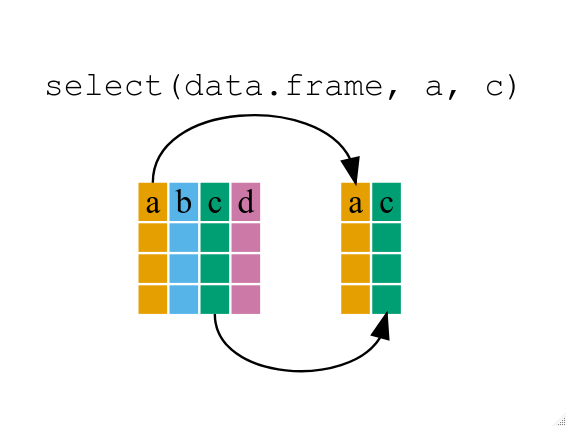

```{r setup, include=FALSE}
knitr::opts_chunk$set(echo = FALSE, message = FALSE, warning = FALSE)

library(countdown)
library(tidyverse)
library(lubridate)
library(ymlthis)
library(palmerpenguins)
library(patchwork)
library(graphics)
library(tidyverse)
library(maps)
library(mapproj)
library(ggthemes)
library(nycflights23)

slides_theme = theme_minimal(
  base_family = "Atkinson Hyperlegible",
  base_size = 16)

theme_set(slides_theme)
```

## {dplyr} {.center}

::::: columns
::: {.column .nonincremental width="60%"}
-   A package that transforms data

-   Implements a *grammar* of transforming tabular data

-   Part of the `tidyverse`
:::

::: {.column width="40%"}

:::
:::::

## Warm up

::: {.task .nonincremental}
With your neighbors, identify the data verb (function) that does the following:

-   Picks rows by their values
-   Reorders the rows
-   Picks variables by their names
-   Creates new variables with functions of existing variables
:::

```{r}
countdown::countdown(2, 30)
```

##  {background-image="../img/horst_dplyr_filter.jpg"}

## Logical tests

::::: columns
::: {.column .nonincremental width="35%"}
For help:

`?Comparison`
:::

::: {.column .nonincremental width="65%"}
| Syntax      | Description              |
|-------------|--------------------------|
| `x < y`     | less than                |
| `x > y`     | greater than             |
| `x <= y`    | less than or equal to    |
| `x >= y`    | greater than or equal to |
| `x == y`    | equal to                 |
| `x != y`    | not equal to             |
| `x %in% y`  | group membership         |
| `is.na(x)`  | is NA (missing)          |
| `!is.na(x)` | is not NA                |
:::
:::::

## Your turn:

::: {.task .nonincremental}
With your neighbors, use `filter()` to wrangle the `nycflights23::flights` data frame.

-   Find all flights that had an arrival delay of two or more hours.
-   Find all flights to MSP
-   Find all flights that arrived more than two hours late, but left less than one hour late
-   (if time) Find all flights that were delayed by at least an hour, but made up over 30 minutes in flight.
:::

```{r}
countdown::countdown(5)
```

## `slice(.data, ...)`

Extract (omit) rows by row number

## Slicing flights data

Extracting rows 10 to 20

```{r}
#| echo: true

slice(flights, 10:20)
```

## Slicing flights data

Omitting rows 100 to 1000

```{r}
#| echo: true

slice(flights, -c(100:1000))
```

## `select()`

Extract columns by name or number

```{r}
#| echo: true
#| eval: false

select(.data, ...)
```



::: aside
Source: [software carpentry](https://swcarpentry.github.io/r-novice-gapminder/13-dplyr.html)
:::

## Storms data

```{r}
#| echo: true
glimpse(storms)
```

::: aside
Subset of the NOAA Atlantic hurricane database best track data, https://www.nhc.noaa.gov/data/#hurda
:::

## `select()` helpers

::: panel-tabset
### `:`

select range of columns

```{r}
#| echo: true

select(storms, status:pressure)
```

### `-`

select every column but

```{r}
#| echo: true

select(storms, -c(status, pressure))
```

### `starts_with()`

select columns that start with...

```{r}
#| echo: true

select(storms, starts_with("w"))
```

### `ends_with()`

select columns that end with...

```{r}
#| echo: true

select(storms, ends_with("e"))
```

### `contains()`

select columns whose names contain...

```{r}
#| echo: true

select(storms, contains("d"))
```
:::

## Try it:

::: {.task .nonincremental}
Brainstorm as many ways as possible to `select()` the following columns from `flight`:

-   `dep_time`
-   `dep_delay`
-   `arr_time`
-   `arr_delay`
:::

```{r}
countdown(2)
```

## `arrange()`

Order rows from smallest to largest

```{r eval=FALSE}
arrange(.data, ...)
```

## Arranging by wind speed

By default, `arrange` orders in ascending order

::: panel-tabset
### Original Data

```{r}
#| echo: true

storms
```

### Ascending

```{r}
#| echo: true

arrange(storms, wind)
```

### Descending

```{r}
#| echo: true

arrange(storms, desc(wind))
```
:::

## Try it:

::: {.task .nonincremental}
Use `arrange` to answer the following questions:

-   Which flights traveled the farthest?
-   Which traveled the shortest?
-   Which flights lasted the longest?
-   Which lasted the shortest?
:::

```{r}
countdown::countdown(2,30)
```

## 

### `slice_min(.data, order_by, n)`

select rows with n smallest values of a variable

### `slice_max(.data, order_by, n)`

select rows with n largest values of a variable

## Continuing storms example

::: panel-tabset
### `slice_max`

Extracting storms with 3 highest wind speeds

```{r}
#| echo: true

slice_max(storms, wind, n = 3)
```

### `slice_min`

Extracting storms with the lowest wind speed

```{r}
#| echo: true

slice_min(storms, wind, n = 1)
```
:::

##  {background-image="../img/horst_dplyr_mutate.png" background-size="70%"}

## Translating wind speed to km/hour

Most of the world uses kilometers instead of miles. We can calculate km/hr by using: 

$$\text{kmh} = 1.60934 \times \text{mph}$$

```{r}
#| echo: true

storms <- mutate(storms, wind_kmh = 1.60934 * wind)
```

```{r}
#| echo: true

select(storms, wind, wind_kmh)
```

## Try it

::: task
Create a new column in `flights` giving the *average speed* of the flight while it was in the air. What are the units of this variable? Make the variable in terms of miles per hour.
:::

```{r}
countdown(2,30)
```

##  {background-image="../img/horst_dplyr_case_when.png" background-size="90%"}

## Example

The Federal Aviation Administration (FAA) considers a flight to be delayed when it is 15 minutes later than its scheduled time.

```{r}
#| echo: true

flights <- mutate(
  flights, 
  delayed = case_when(
    dep_delay >= 15 ~ "Delayed", 
    dep_delay < 15 ~ "On time",
    .default = "other")
)
```

## Your turn

::: {.task .nonincremental .smaller}
Suppose that you don't think the FAA gives enough information in their definition of a delayed flight, so you come up with the following delay categories:

-   `dep_delay <= 0` -\> none
-   `dep_delay` between 1 and 15 minutes -\> minimal
-   `dep_delay` between 16 and 30 minutes -\> delayed
-   `dep_delay` between 31 and 60 minutes -\> major
-   `dep_delay` over 60 minutes -\> extreme

Use `mutate()` and `case_when()` to create a `delay_category` variable in the `flights` data frame.
:::

# `%>% or |>` {.maize}

##  {.center}

::::: columns
::: {.column .nonincremental width="60%"}
-   "dataframe first, dataframe once"

-   Combine multiple operations with the pipe

-   Think "and then" when reading code
:::

::: {.column width="40%"}
{fig-align="right"}
:::
:::::

## Using `%>%` or `|>`

-   `%>%` or `|>` passes result on left into first argument of function on right

-   *Chaining* functions together lets you read Left-to-right, top-to-bottom

## Using `%>% or |>`

### `filter()`:

```{r}
#| eval: false
#| echo: true

filter(storms, status == "hurricane")
```

becomes

```{r}
#| eval: false
#| echo: true

storms %>%
  filter(status == "hurricane")
```

::: {.fragment}
### `arrange()`:

```{r}
#| eval: false
#| echo: true

arrange(storms, wind)
```

becomes

```{r}
#| eval: false
#| echo: true

storms |>
  arrange(wind)
```
:::


## Using `%>%` or `|>`

We can also build up a series of pipes.

We're interested in the storms with the *lowest* wind speed *that were still classified as hurricanes*.

```{r}
#| echo: true
#| code-line-numbers: "1|2|3"
#| output-location: fragment

storms %>%
  filter(status == "hurricane") %>%
  arrange(wind)
```

## Using `%>%` or `|>`

We're interested in the storms with the *lowest* wind speed *that were still classified as hurricanes*, *that reached category 2*.

```{r}
#| echo: true
#| code-line-numbers: "1|2|3|4"
#| output-location: fragment


storms %>%
  filter(status == "hurricane") %>%
  filter(category > 1) %>%
  arrange(wind)
```

## Combining with `ggplot`

Pipes become especially useful when we combine them with `ggplot()`:

```{r}
#| echo: true
#| output-location: column-fragment
#| code-line-numbers: "1-3|4|4-9"

storms |>
  filter(status == "hurricane") |>
  filter(category > 1) |>
  ggplot(aes(x = wind, y = hurricane_force_diameter)) + 
  geom_jitter() +
  labs(
    title = "Force diameter vs wind speed",
    subtitle = "Hurricanes only"
  )
```

## Your turn

::: {.task .nonincremental}
*Chain* the last two parts together, so that the resulting dataset contains both `avg_speed` and `delay_category`. Pipe this new dataset into `ggplot()` to answer the question "is there a relationship between average speed and how late a flight is delayed?"

If you have time, create a new graph which only contains *flights to MSP*.
:::

```{r}
countdown::countdown(4)
```

# Lab Quiz 1 {.maize}
