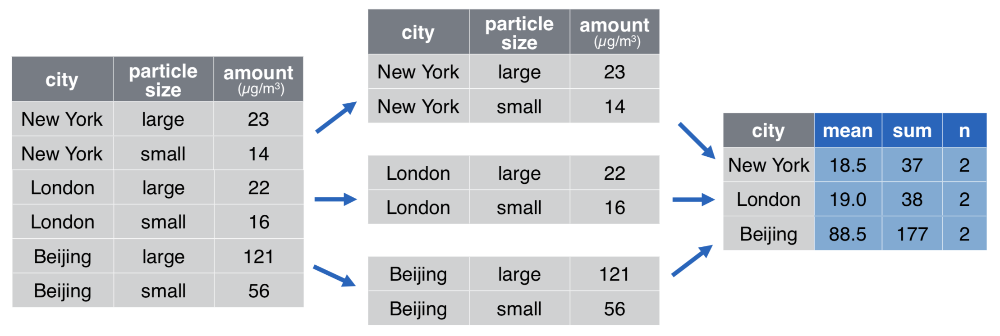
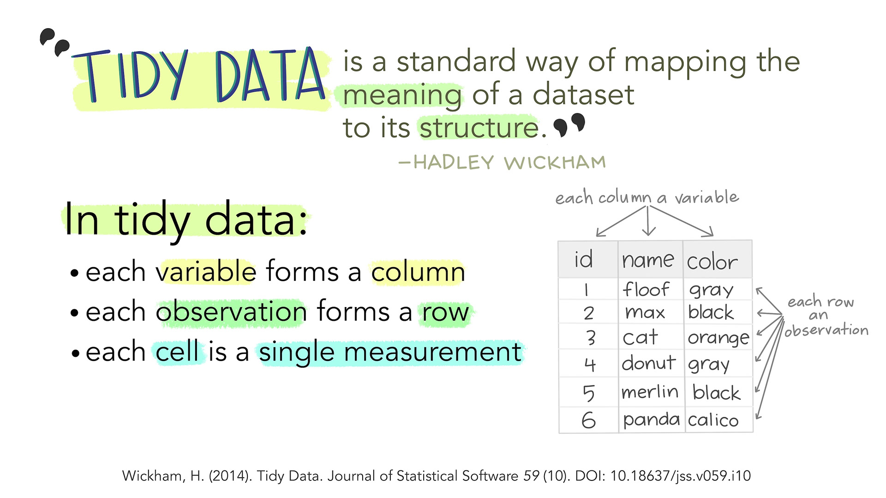

```{r setup, include=FALSE}
knitr::opts_chunk$set(echo = FALSE, message = FALSE, warning = FALSE)

library(countdown)
library(tidyverse)
library(lubridate)
library(ymlthis)
library(palmerpenguins)
library(patchwork)
library(graphics)
library(tidyverse)
library(maps)
library(mapproj)
library(ggthemes)
library(nycflights23)

pollution <- tribble(
       ~city,   ~size, ~amount, 
  "New York", "large",      23,
  "New York", "small",      14,
    "London", "large",      22,
    "London", "small",      16,
   "Beijing", "large",      121,
   "Beijing", "small",      56
)

slides_theme = theme_minimal(
  base_family = "Atkinson Hyperlegible",
  base_size = 16)

theme_set(slides_theme)
```

# Calculating Summaries {.maize}

## The College Scorecard

```{r include=FALSE}
colleges <- read_csv("https://aloy.rbind.io/data/scorecard_sample2019.csv")
```

> The College Scorecard is designed to increase transparency and to see how well schools are serving their students.

```{r}
glimpse(colleges)
```

## Computing statistics: `summarize`

-   collapse many values down into a statistic

-   `summarize(data, newstat = fun(var))`<br> applies the `fun` function to `var` variable(s) and returns one value in `newstat` column

## Computing statistics: `summarize`

::: panel-tabset
### `dplyr`

Average and SD of cost in a data frame format:

```{r}
#| echo: true
#| output-location: default


colleges %>%
  summarize(
    avg_cost = mean(cost, na.rm = TRUE), 
    sd_cost = sd(cost , na.rm = TRUE)
  )
```

### `base` R

```{r}
#| echo: true

mean(colleges$cost, na.rm = TRUE)
sd(colleges$cost, na.rm = TRUE)
```
:::

## Your turn

::: {.task .nonincremental}
Using the `flights` data from the {nycflights23} package, use `summarize()` to compute statistics about the data:

1.  The lowest and highest `distance` traveled

2.  The lowest and highest `air_time`

3.  The median `dep_delay` 
:::

```{r echo=FALSE}
countdown(5)
```

## Your turn

::: {.task .nonincremental}
Using the `flights` data from the {nycflights23} package, extract the rows for **Delta** flights. (*Hint:* the carrier shortcode code is "DL")

Then use `summarize()` and a summary function to find:

1.  The number of flights in this subset

2.  The median `dep_delay`. How does it compare to the overall median?

You should do both (1) and (2) in a single pipeline

```{r echo=FALSE}
countdown(3)
```
:::


## `group_by()`

Groups cases by common values of one or more columns

::: panel-tabset
### colleges

```{r}
#| echo: true
#| eval: false
colleges
```

```{r echo=FALSE}
#| output-location: default
colleges %>% print(n = 3)
```


### colleges with group_by


```{r}
#| echo: true
#| eval: false
colleges %>% 
  group_by(state)
```

```{r echo=FALSE}
#| output-location: default
colleges %>% group_by(state) %>% print(n = 3)
```

:::

## Split-apply-combine

```{r echo=FALSE}

```

```{r results='hide'}
pollution %>%
  group_by(city) %>%
  summarize(mean = mean(amount), sum = sum(amount), n = n())
```

## Statistics by group: `group_by` + `summarize`

Summary statistics **by state**

```{r }
#| echo: true
#| output-location: column


colleges %>%
  group_by(state) %>%
  summarize(
    n_schools = n(),
    avg_cost = mean(cost, na.rm = TRUE),
    min_size = min(undergrads, na.rm = TRUE),
    max_size = max(undergrads, na.rm = TRUE)
  )
```

## Aside: code commenting {.smaller}

In R, you can use `#` for adding comments to your code. Any text that follows the `#` will be printed as-is and won't be run as code. This is useful for leaving comments in your code and for temporarily disabling certain lines of code for debugging.

```{r}
#| echo: true

colleges %>%
  group_by(state) %>%
  summarize(
    n_schools = n(),                               # This is a reminder to me
    # avg_cost = mean(cost, na.rm = TRUE),         # This line isn't run
    min_size = min(undergrads, na.rm = TRUE),
    max_size = max(undergrads, na.rm = TRUE)
  )
```

## Aside: code commenting

And it works especially well when you've used *chaining* in your code

```{r}
#| echo: true

colleges %>%
  #group_by(state) %>%
  summarize(
    n_schools = n(),                               
    avg_cost = mean(cost, na.rm = TRUE),         
    min_size = min(undergrads, na.rm = TRUE),
    max_size = max(undergrads, na.rm = TRUE)
  )
```

## Your turn

::: task
Use `group_by()`, `summarize()`, and `slice_max()` to display the five `dest` airports with the most flights from NYC airports in 2023. Your display should include the median flight delay for these airports along with the number of flights to each airport. 
:::

```{r echo=FALSE}
countdown(3.5)
```

## Calculating counts

`count()` can be used as a short cut to `group_by() + summarize()` if you are only calculating counts

::: panel-tabset
### `group_by()`

```{r}
#| echo: true
#| output-location: column


colleges %>% 
  group_by(state) %>%
  summarize(n = n())
```

### `count()`

```{r}
#| echo: true
#| output-location: column


colleges %>% count(state)
```
:::

## Calculations by group: `group_by` + `mutate`

Calculate z-scores **within regions**

```{r}
#| echo: true
#| output-location: fragment


colleges %>%
  group_by(region) %>%
  mutate(z_cost = (cost - mean(cost, na.rm = TRUE)) / sd(cost, na.rm = TRUE)) %>%
  relocate(unitid:region, z_cost, everything())
```


<!-- 
## `ungroup()` {.smaller}

-   Once data are grouped, they remain grouped until you manually ungroup them

-   Some summary functions ungroup them for you, e.g., `count()` and `summarize()`

. . .


::: panel-tabset
### With `ungroup()`

```{r}
#| echo: true
#| output-location: default

colleges %>%
  group_by(region) %>%
  mutate(z_cost = (cost - mean(cost, na.rm = TRUE)) / sd(cost, na.rm = TRUE)) %>%
  ungroup() %>%
  summarize(mean_z = mean(z_cost, na.rm = TRUE))
```

### Without `ungroup()`

```{r}
#| echo: true
#| output-location: default

colleges %>%
  group_by(region) %>%
  mutate(z_cost = (cost - mean(cost, na.rm = TRUE)) / sd(cost, na.rm = TRUE)) %>%
  summarize(mean_z = mean(z_cost, na.rm = TRUE))

```
:::
-->


# Intro to tidy data {.maize}

## 



## 


## 


## Bakeoff ratings

-   Ratings data for each episode in series 1-8 (in millions of viewers)

. . .

```{r}
bakeoff_ratings <- read_csv("https://stat220kurtz.github.io/data/bakeoff_messy_ratings.csv")
bakeoff_ratings
```

::: aside
Source: [bakeoff](https://bakeoff.netlify.app/) R package
:::

## Discuss

::: {.task .nonincremental}
Is this dataset in tidy format? Why or why not?

If not, what would a tidy data set look like? Sketch out the first few rows of this data set in tidy format
:::

```{r echo=FALSE}
countdown(2)
```


##  `{tidyr}` {.center}

::::: columns
::: {.column .nonincremental width="55%"}
-   Reshape the layout of tabular data

-   Part of the `tidyverse`
:::

::: {.column width="45%"}
{fig-align="right"}
:::
:::::

## What variables are needed to make this graph?

```{r}
#| echo: false

bakeoff_tidy <- bakeoff_ratings %>%
  pivot_longer(cols = e1:e10, names_to = "episode", values_to = "rating") %>%
  mutate(
    episode = parse_number(episode)
  ) 
  
bakeoff_tidy |>
  ggplot(aes(x = episode, y = rating, col = series, group = series)) + 
  geom_line() + 
  geom_text(
    data = bakeoff_tidy |> group_by(series) |> drop_na(rating) |> filter(episode == max(episode)),
    aes(label = paste("Series", series)), 
    hjust = 0, 
    size = 6,
    nudge_x = 1,
    show.legend = FALSE,
  ) +
  scale_color_viridis_c(end = .8, option = "magma") +
  coord_cartesian(clip = "off") +
  theme(
    plot.margin = margin(0.1, 0.9, 0.1, 0.1, "in"),
    legend.position = "none"
    )
```

## Goal

Want to *reshape* the data to be in tidy format:

::: panel-tabset
### Current

```{r}
bakeoff_ratings
```

### Target

```{r}
bakeoff_ratings %>%
  pivot_longer(cols = e1:e10, names_to = "epsiode", values_to = "rating")
```
:::

## `pivot_longer()`

::::: columns
::: {.column .nonincremental width="50%"}
-   `data` (as usual)
:::

::: {.column width="50%"}
```{r}
#| eval: false
#| echo: true
#| code-line-numbers: "2"


pivot_longer(
  data, 
  cols, 
  names_to = "name", 
  values_to = "value"
  )
```
:::
:::::

## `pivot_longer()`

::::: columns
::: {.column .nonincremental width="50%"}
-   `data` (as usual)
-   `cols`: columns to pivot into longer format
:::

::: {.column width="50%"}
```{r}
#| eval: false
#| echo: true
#| code-line-numbers: "3"


pivot_longer(
  data, 
  cols, 
  names_to = "name", 
  values_to = "value"
  )
```
:::
:::::

## `pivot_longer()`

::::: columns
::: {.column .nonincremental width="50%"}
-   `data` (as usual)
-   `cols`: columns to pivot into longer format
-   `names_to`: name of the column where column names of pivoted variables go (character string)
:::

::: {.column width="50%"}
```{r}
#| eval: false
#| echo: true
#| code-line-numbers: "4"


pivot_longer(
  data, 
  cols, 
  names_to = "name", 
  values_to = "value"
  )
```
:::
:::::

## `pivot_longer()`

::::: columns
::: {.column .nonincremental width="50%"}
-   `data` (as usual)
-   `cols`: columns to pivot into longer format
-   `names_to`: name of the column where column names of pivoted variables go (character string)
-   `values_to`: name of the column where data in pivoted variables go (character string)
:::

::: {.column width="50%"}
```{r}
#| eval: false
#| echo: true
#| code-line-numbers: "5"


pivot_longer(
  data, 
  cols, 
  names_to = "name", 
  values_to = "value"
  )
```
:::
:::::

## wider $\rightarrow$ longer ratings

```{r}
#| echo: true
#| code-line-numbers: "1|2|3|4|5"
#| output-location: column-fragment

longer_ratings <- bakeoff_ratings %>%
  pivot_longer( 
    cols = e1:e10, 
    names_to = "episode", 
    values_to = "rating" 
  )
longer_ratings
```

## {background-image="../img/horst-parse-number.png" background-size="50%"}

## `parse_number()`

```{r}
#| echo: true
#| code-line-numbers: "3"
ratings <- longer_ratings %>%
  mutate(
    episode = parse_number(episode) 
  )
ratings
```


## Other parsing functions

::::: columns
::: {.column .nonincremental width="50%"}
`parse_character`

`parse_date`

`parse_double`

`parse_double`

`parse_factor`
:::

::: {.column width="50%"}
`parse_integer`

`parse_logical`

`parse_number`

`parse_time`
:::
:::::

::: aside
The `parse_*` functions are from `readr`
:::

## Try it: `messy_ratings`

::: {.task .nonincremental}
Tidy this data set by

1.  Selecting the `series` and `e*_7day` columns
2.  Pivoting the data to add a column for `episode` and a column for `rating` (we'll clean up the episode column later)
:::

```{r echo=TRUE}
messy_ratings2 <- read_csv("https://stat220kurtz.github.io/data/messy_ratings2.csv")
messy_ratings2
```


```{r echo=FALSE}
countdown(4)
```

## Cleaning `episode`

```{r}
#| echo: true
#| code-line-numbers: "2|3-5"
ratings2 <- messy_ratings2 %>%
  select(series, contains("7day")) %>%
  pivot_longer(contains("7day"), 
               names_to = "episode", 
               values_to = "rating")
ratings2
```

## `separate()`

::::: columns
::: {.column .nonincremental width="50%"}
-   `data` (as usual)
:::

::: {.column width="50%"}
```{r}
#| eval: false
#| echo: true
#| code-line-numbers: "2"


separate(
  data, 
  col, 
  into = c("col1", "col2"),
  sep 
  )
```
:::
:::::

## `separate()`

::::: columns
::: {.column .nonincremental width="50%"}
-   `data` (as usual)
-   `col`: column to separate
:::

::: {.column width="50%"}
```{r}
#| eval: false
#| echo: true
#| code-line-numbers: "3"


separate(
  data, 
  col, 
  into = c("col1", "col2"),
  sep 
  )
```
:::
:::::

## `separate()`

::::: columns
::: {.column .nonincremental width="50%"}
-   `data` (as usual)
-   `col`: column to separate
-   `into`: names of new columns to create
:::

::: {.column width="50%"}
```{r}
#| eval: false
#| echo: true
#| code-line-numbers: "4"


separate(
  data, 
  col, 
  into = c("col1", "col2"),
  sep 
  )
```
:::
:::::

## `separate()`

::::: columns
::: {.column .nonincremental width="50%"}
-   `data` (as usual)
-   `col`: column to separate
-   `into`: names of new columns to create
-   `sep`: separator between columns
:::

::: {.column width="50%"}
```{r}
#| eval: false
#| echo: true
#| code-line-numbers: "5"


separate(
  data, 
  col, 
  into = c("col1", "col2"),
  sep 
  )
```
:::
:::::

## Cleaning `episode`

```{r}
#| echo: true
#| code-line-numbers: "2|3|4"
ratings2 %>%
  separate( 
    col = episode, 
    into = c("episode", "period") 
  )
```

## Wrap it up

::: {.task .nonincremental}
-   Clean the `episode` and `period` column
-   Make a *line plot* with episode on the x-axis, rating on the y-axis, colored by series. (You will also need to map the `group` aesthetic to series)
:::

```{r}
#| include: false


ratings2 %>%
  separate( 
    col = episode, 
    into = c("episode", "period") 
  ) %>%
  mutate(
    episode = parse_number(episode),
    period = parse_number(period)
  ) %>%
  ggplot(aes(x = episode, y = rating, col = series, group = series)) + 
  geom_line() + 
  scale_color_viridis_c()
```
