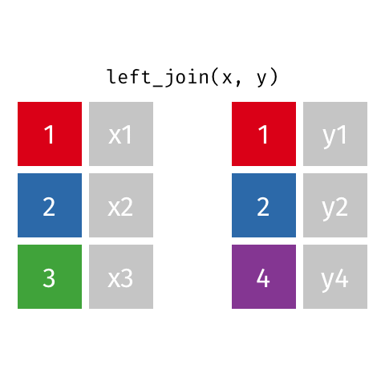
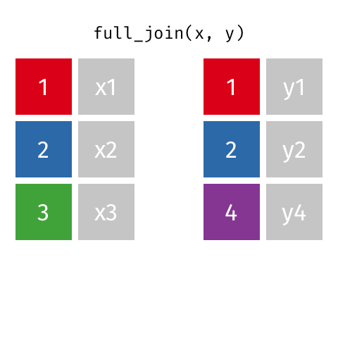

```{r setup, include=FALSE}
knitr::opts_chunk$set(echo = FALSE, message = FALSE, warning = FALSE)

library(countdown)
library(tidyverse)
library(lubridate)
library(ymlthis)
library(palmerpenguins)
library(patchwork)
library(graphics)
library(tidyverse)
library(maps)
library(mapproj)
library(ggthemes)
library(nycflights23)
library(here)

slides_theme = theme_minimal(
  base_family = "Atkinson Hyperlegible",
  base_size = 16)

theme_set(slides_theme)

load(here::here("data", "combining-data-examples.Rda"))
```

## Today

More on wrangling:

-   Combining datasets
-   More practice with `pivot_`

## Peer programming

-   Work on code in a small group (2-3)
-   One person does the typing, the others observe and support
-   Rules of thumb:
    -   no typing until your group has discussed a possible approach
    -   let the typer finish their command/line/pipeline before pointing out any typos
    -   everybody should contribute ideas and understand the code that is written
-   Whoever does the typing will share the completed .Rmd so you all have it

## Warm up

::: {.task .nonincremental}
1.  Open the [`10-combining.rmd`](https://stat220-w26.github.io/activities/10-combining.html) activity in RStudio
2.  Take a look at the first 3 pairs of data together and talk through (conceptually! in words! no R code!) how you think they should be combined
:::

```{r}
countdown::countdown(2)
```

## Example 1: Star Wars Characters {.smaller}

Dataset 1:

```{r}
#| echo: true
starwars_characters
```

Dataset 2:

```{r}
#| echo: true
starwars_lastjedi
```

## `bind_rows()`

::::: columns
::: {.column .nonincremental width="50%"}
-   `data_1`: our "starting" data
-   `data_2` to `data_n`: additional rows of data that we want to add to `data_1`
:::

::: {.column width="50%"}
```{r}
#| eval: false
#| echo: true

bind_rows(
  data_1, 
  data_2, 
  ..., 
  data_n
  )
```
:::
:::::

##  {.scrollable}

```{r}
#| echo: true
#| output-location: fragment
#| code-line-numbers: "1|2|3"

starwars_characters %>%
  bind_rows(starwars_lastjedi) %>%
  slice_tail(n=10)
```

## Example 2: Stats Sections {.smaller}

Dataset 1:

```{r}
#| echo: true
stats_sections_fw
```

Dataset 2:

```{r}
#| echo: true
stats_sections_s
```

## `bind_cols()`

::::: columns
::: {.column .nonincremental width="50%"}
-   `data_1`: our "starting" data
-   `data_2` to `data_n`: additional columns of data that we want to add to `data_1`
:::

::: {.column width="50%"}
```{r}
#| eval: false
#| echo: true

bind_cols(
  data_1, 
  data_2, 
  ..., 
  data_n
  )
```
:::
:::::

##  {.scrollable}

```{r}
#| echo: true
#| output-location: fragment
#| code-line-numbers: "1|2"

stats_sections_fw %>%
  bind_cols(stats_sections_s)
```

##  {.center background-color="#f4e335"}

{.r-stretch}

## We got lucky

::::: columns
::: {.column .nonincremental width="50%"}
Our second dataset followed this structure:

```{r}
tibble(class = stats_sections_fw$class, spring = stats_sections_s$spring)
```
:::

::: {.column .fragment width="50%"}
But it could have also had this structure:

```{r}
tibble(class = stats_sections_fw$class, spring = stats_sections_s$spring) %>%
  arrange(spring)
```
:::
:::::

## Example 3: Survivor castaways {.smaller}

Dataset 1:

```{r}
#| echo: true
us_castaway_results
```

Dataset 2:

```{r}
#| echo: true
cast_details
```

## Desired output {.scrollable}

```{r}
us_castaway_results %>%
  left_join(cast_details)
```

## `left_join()` {.scrollable}

```{r}
#| echo: true
#| output-location: fragment
#| code-line-numbers: "1|2"

us_castaway_results %>%
  left_join(cast_details, by = "castaway_id") %>%
  select(-season_name)
```

## `left_join()` keeps duplicate rows in `x` {.scrollable}

```{r}
#| echo: true
#| output-location: fragment
#| code-line-numbers: "1|2|3"

us_castaway_results %>%
  left_join(cast_details, by = "castaway_id") %>%
  filter(castaway == "Sandra") %>%
  select(-season_name)
```

## Other types of `_join`s {.nonincremental}

-   `left_join()`: all rows from x
-   `right_join()`: all rows from y
-   `full_join()`: all rows from both x and y
-   `inner_join()`: all rows from x where there are matching values in y, return all combination of multiple matches in the case of multiple matches
-   `semi_join()`: all rows from x where there are matching values in y, keeping just columns from x
-   `anti_join()`: return all rows from x where there are not matching values in y, never duplicate rows of x
-   ...

## Setup

For the next few slides...

::::: columns
::: {.column width="50%"}
```{r}
x <- tibble(
  id = c(1, 2, 3),
  value_x = c("x1", "x2", "x3")
  )
```

```{r}
#| echo: true
x
```
:::

::: {.column width="50%"}
```{r}
y <- tibble(
  id = c(1, 2, 4),
  value_y = c("y1", "y2", "y4")
  )
```

```{r}
#| echo: true
y
```
:::
:::::

## `left_join()`

Keep all rows from `x`

::::: columns
::: {.column width="50%"}

:::

::: {.column width="50%"}
```{r}
#| echo: true
left_join(x, y, by = "id")
```
:::
:::::

## `full_join()`

Keep all rows from both `x` and `y`

::::: columns
::: {.column width="50%"}

:::

::: {.column width="50%"}
```{r}
#| echo: true
full_join(x, y)
```
:::
:::::

## `semi_join()`

Keep all rows from `x` where there are matching values in `y`, keeping just columns from `x`

::::: columns
::: {.column width="50%"}

:::

::: {.column width="50%"}
```{r}
#| echo: true
semi_join(x, y)
```
:::
:::::

Similar to `filter()`

## `anti_join()`

Keep all rows from `x` where there are *not* matching values in `y`, never duplicate rows of `x`

::::: columns
::: {.column width="50%"}

:::

::: {.column width="50%"}
```{r}
#| echo: true
anti_join(x, y)
```
:::
:::::

Similar to `filter()` with `!`

## `*_join()` functions

-   From **dplyr**
-   Incredibly useful for bringing datasets with common information (e.g., unique identifier) together
-   Use `by` argument
-   Always check that the numbers of rows and columns of the result dataset makes sense
-   Refer to [two-table verbs vignette](https://dplyr.tidyverse.org/articles/two-table.html) when needed

## keys

In these examples, the colored boxes represent **keys**

::::: columns
::: {.column width="50%"}

:::

::: {.column width="50%"}
-   **keys** uniquely identify the observation of interest
-   Are present in both datasets and used to match the rows
-   Depend on the context (e.g. could be castaway ID, could be season ID, could be epiosde number, etc.)
-   Can be multiple columns
-   `dplyr` will try to find them automatically, but it's better to be explicit using the `by` argument
:::
:::::

## Let's try it: Bakeoff data (again)

On Friday, we tidied data containing ratings from *The Great British Bakeoff*.

. . .

*Before:*

```{r}
messy_ratings2 <- read_csv("https://stat220-w26.github.io/data/messy_ratings2.csv")
messy_ratings2 %>% slice(1:3)
```

. . .

*After:*

```{r}
tidy_ratings2 <- messy_ratings2 %>%
  select(series, contains("7day")) %>%
  pivot_longer(-series, names_to = "episode", values_to = "viewers") %>%
  separate(episode, into = c("episode", "period")) %>%
  mutate(
    episode = parse_number(episode),
    period = parse_number(period)
  )
tidy_ratings2 %>% slice(1:5)
```

## Let's try it: Bakeoff data (again)

But that data only had through season 8. We now have a new dataset with seasons 9-14:

```{r}
messy_ratings2 <- read_csv(here(here(), "data/messy_ratings2_9_14.csv"))
messy_ratings2 %>%
  head()
```

. . .

::: {.task .nonincremental}
Your task is to join these two datasets together using (1) `bind_rows()`, (2) `_join()` and (3) `bind_cols()` (you'll also get some `pivot_` practice along the way)
:::

## Part II: the `episodes` data {.scrollable}

The `episodes` data has information about each episode of GBBO. 

::::: columns
::: {.column width="50%" .nonincremental}
In particular, it includes:

-   `baker`: each baker that competed on that episode
-   `signature`: the name of the dessert they made for the signature challenge
-   `technical`: the place the baker earned in the technical challenge
-   `showstopper`: the name of the dessert they made for the showstopper challenge
-   `result`: whether the baker was "Safe" or "Eliminated"
:::

::: {.column width="50%"}

```{r}
episodes <- read_csv(here(here(), "data/bakeoff-episodes.csv"))
```

```{r}
#| echo: true
episodes
```

:::

:::::

## Let's try it: Bakeoff data (episodes)

::: {.task .nonincremental}
Join the tidy dataset (all 14 seasons) with the `episodes` data.

Your task is to print the "signature" desserts that were made on the 10 episodes that had the highest 7-day viewership.
:::
