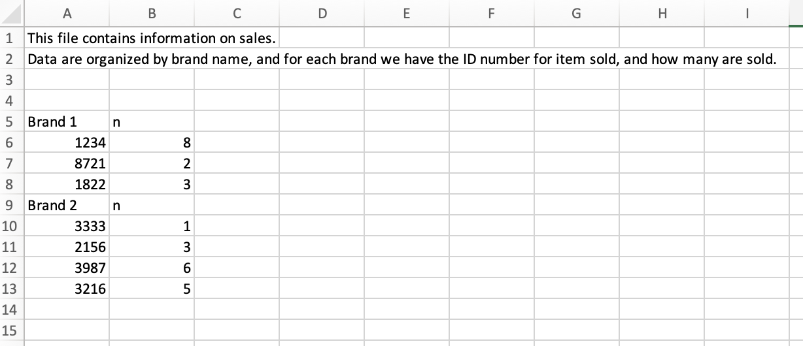
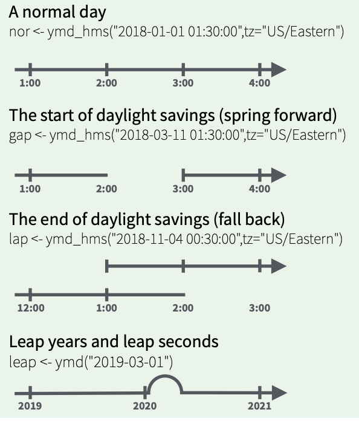
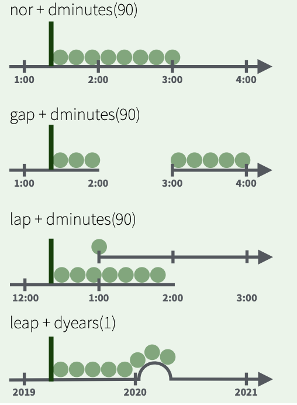
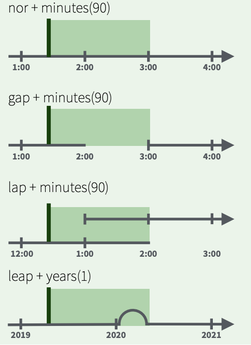

```{r setup, include=FALSE}
knitr::opts_chunk$set(echo = FALSE, message = FALSE, warning = FALSE)

library(countdown)
library(tidyverse)
library(lubridate)
library(ymlthis)
library(palmerpenguins)
library(patchwork)
library(graphics)
library(tidyverse)
library(maps)
library(mapproj)
library(ggthemes)
library(nycflights23)
library(here)

slides_theme = theme_minimal(
  base_family = "Atkinson Hyperlegible",
  base_size = 16)

theme_set(slides_theme)
```

## Today

1. Importing data into R
2. Working with dates and times


## Basic syntax - Importing Data

All `readr` functions share a common syntax

```{r}
#| echo: true
#| eval: false


df <- read_csv(file = "path/to/file.csv", ...)
```

## `readr` functions


function     | reads
:------------|:----------------------
read_csv()   | Comma separated values
read_csv2()  |Semi-colon separated values
read_delim() | General delimited files
read_fwf()   | Fixed width files
read_log()   | Apache log files
read_table() | Space separated
read_tsv()   | Tab delimited values


## `desserts` data

::: {.nonincremental}

- Contains results from series 1-8 of *The Great British Bake Off*

- Case defined by series, episode and baker

:::

```{r}
#| echo: false
desserts <- read_csv("https://stat220kurtz.github.io/data/desserts.csv")
desserts
```

::: aside
Source: Allison Hill and the [bakeoff](https://bakeoff.netlify.app) package; compiled by Adam Loy
:::

## Warm up {.scrollable}

::: {.task .nonincremental}

1. Use `read_csv()` to import the `desserts` data set from <br>
 https://stat220kurtz.github.io/data/desserts.csv
 
2. Store the data in the `desserts` object

3. Our goal is to make the following plot. Will this data allow us to do so?

:::


```{r}
countdown::countdown(4)
```

```{r}
desserts <- read_csv(
  "https://stat220-w26.github.io/data/desserts.csv",
  col_types = list(
    technical = col_number(), 
    uk_airdate = col_date(format = "%d %B %Y")
  ),
  na = c("", "NA", "N/A") 
)

desserts |>
  filter(series == 8) |>
  ggplot(aes(x = uk_airdate, y = technical, col = baker)) +
  geom_line(linewidth = 1.1,
            show.legend = FALSE) +
  geom_text(
    data = desserts |>
      filter(series == 8) |>
      filter(baker %in% c("Kate", "Steven", "Sophie"),
             uk_airdate == max(uk_airdate)),
    aes(label = baker),
    hjust = 0,
    size = 6,
    nudge_x = 1,
    show.legend = FALSE,
  ) +
  gghighlight::gghighlight(baker %in% c("Kate", "Steven", "Sophie"),
                           use_direct_label = FALSE) +
  scale_y_reverse() + 
  coord_cartesian(clip = "off") +
  theme(
    plot.margin = margin(0.1, 0.9, 0.1, 0.1, "in")
    ) + 
  scale_color_viridis_d(option = "plasma", end = .6)
```

## Could we make the plot? {.scrollable}

```{r}
#| echo: true


desserts <- read_csv("https://stat220kurtz.github.io/data/desserts.csv")
glimpse(desserts)
```

. . . 

A couple issues...

- `technical` is character, not numeric

- `uk_airdate` is character, not date


## The `col_types` argument {.scrollable}

By default, `read_csv` looks at first 1000 rows to guess variable data types (`guess_max`), but we can also tell R how to read column types

. . . 

```{r}
#| echo: true
#| code-line-numbers: "1|2-5|8"
#| output-location: fragment
desserts <- read_csv("https://stat220kurtz.github.io/data/desserts.csv",
  col_types = list( 
    technical = col_number(), 
    uk_airdate = col_date()   
  ) 
)

glimpse(desserts)
```


## Looking for `problems`

List of potential problems parsing the file


```{r}
#| echo: true
problems(desserts)
```

## Date formatting woes

```{r}
#| echo: false


print(problems(desserts), n=5)
```


ISO8601 format: `2010-08-17`

What we have: `17 August 2010`

## Adding `format` instructions

```{r}
#| echo: true
#| code-line-numbers: "5"
desserts <- read_csv(
  "https://stat220kurtz.github.io/data/desserts.csv",
  col_types = list(
    technical = col_number(), 
    uk_airdate = col_date(format = "%d %B %Y")  
  ) 
)
```


- Year: `"%Y"` (4 digits). `"%y"` (2 digits)

- Month: `"%m"` (2 digits), `"%b"` (abbreviated name in current locale), `"%B"` (full name in current locale).

- Day: `"%d"` (2 digits), `"%e"` (optional leading space)


## Looking for `problems`

List of potential problems parsing the file

```{r}
#| echo: true
problems(desserts)
```

## Addressing missing values

By default `na = c("", "NA")` are the recognized missing values

. . . 

```{r}
#| echo: true
#| code-line-numbers: "7"
desserts <- read_csv(
  "https://stat220kurtz.github.io/data/desserts.csv",
  col_types = list(
    technical = col_number(), 
    uk_airdate = col_date(format = "%d %B %Y")
  ),
  na = c("", "NA", "N/A") 
)
```

## Looking for `problems`

List of potential problems parsing the file

```{r}
problems(desserts)
```

## 

```{r}
#| echo: true 
desserts
```

## Column casting functions


Type | `dplyr::glimpse()` | `readr::col_*()`
-----|----------|------------
logical   | `<lgl>`            | `col_logical`
numeric   | `<int>` or `<dbl>` | `col_number`
character | `<chr>`            | `col_character`
factor    | `<fct>`            | `col_factor`
date      | `<date>`           | `col_date`

## `?read_csv`

```{r}
#| echo: true
#| eval: false
read_csv(file, 
         col_names = TRUE,
         col_types = NULL,
         locale = default_locale(),
         na = c("", "NA"), 
         quoted_na = TRUE,
         quote = "\"", 
         comment = "",
         trim_ws = TRUE,
         skip = 0,
         n_max = Inf,
         guess_max = min(1000, n_max),
         progress = show_progress())
```

## Your turn

::: {.task .nonincremental}
Use the appropriate `read_<type>()` function to import the following data sets:

- `data-4.csv`

- `tricky-1.csv`

The full URLs are in the `11-import.Rmd` activity. (It might be helpful to look at the data file before trying to import it into R - you can see it in "raw" form by visiting the site to download it and opening it with Notepad)

If you hit any errors/problems, be sure to explore them and identify the issue, even if you can't "fix" it.
:::

```{r}
countdown::countdown(5)
```

# read_sheet

## googlesheets4 {.center}
::::: columns
::: {.column .nonincremental width="55%"}
- Get data out of google sheets and into R

- Part of the `tidyverse`

- Need to load separately
:::

::: {.column width="45%"}
{fig-align="right" width="70%"}
:::
:::::

## `read_sheet` works like `read_csv`

```{r}
#| echo: true
#| eval: false

df <- read_sheet(ss = "url_to_googlesheet", ...)
```

## sales data

Are these data tidy? Why or why not?



## Sales data

What "data moves" do we need to go from the original, non-tidy data, to this tidy one?

```
# A tibble: 7 × 3
  brand   id    n    
  <chr>   <chr> <chr>
1 Brand 1 1234  8    
2 Brand 1 8721  2    
3 Brand 1 1822  3    
4 Brand 2 3333  1    
5 Brand 2 2156  3    
6 Brand 2 3987  6    
7 Brand 2 3216  5    
```

## Try it {.scrollable .smaller}

::: {.task .nonincremental}
Read in the file at `https://docs.google.com/spreadsheets/d/1HG49NrV9rdPPuAnra0nO1SjECisAMnnGcvBT7NZ_bNk/edit?usp=sharing`.
:::

::::: columns
::: {.column .nonincremental width="50%"}
Step 1: read in the data so it looks like the following:

```
# A tibble: 9 × 2
  id      n    
  <chr>   <chr>
1 Brand 1 n    
2 1234    8    
3 8721    2    
4 1822    3    
5 Brand 2 n    
6 3333    1    
7 2156    3    
8 3987    6    
9 3216    5   
```

Hint: revisit R4DS 7.2.2
:::

::: {.column width="50%"}
Stretch goal: Fully tidy the data. This is tricky! See the hints in the activity file.


```
# A tibble: 7 × 3
  brand   id    n    
  <chr>   <chr> <chr>
1 Brand 1 1234  8    
2 Brand 1 8721  2    
3 Brand 1 1822  3    
4 Brand 2 3333  1    
5 Brand 2 2156  3    
6 Brand 2 3987  6    
7 Brand 2 3216  5  
```

:::
:::::

```{r}
countdown::countdown(5)
```

## What if I already imported data and have dates/times as character strings or numeric vectors? {.smaller}

## Ultramarathon results

- Ultra marathon = anything longer than 26.2 miles
- The dates and times imported as character strings!

. . . 

```{r message=FALSE, collapse=TRUE}
#| message: false
mn_ultras <- read_csv(here("data", "mn_ultra_results.csv"))
glimpse(mn_ultras)
```

## {.center}
::::: columns
::: {.column .nonincremental width="55%"}
- Functions for working with dates and time spans

- Part of the `tidyverse`

- Need to load separately
:::

::: {.column width="45%"}
{fig-align="right" width="70%"}
:::
:::::

## Parsing dates {.nonincremental}

`{lubridate}` functions are intuitively named

```{r }
#| echo: true

library(lubridate)
mdy("01/29/25")
```

. . . 

```{r}
#| echo: true
dmy("29-01-2025")
```

. . . 

```{r}
#| echo: true
ymd("2025-01-29")
```

. . . 


```{r}
#| echo: true
ymd_hm("2025-01-29 09:55")
```

## Ultramarathon example

One date is `04/13/21`, so use `mdy()` to parse


```{r}
#| echo: true


mn_ultras <- mn_ultras %>% 
  mutate(date = mdy(date))

glimpse(mn_ultras)
```

## Extract info from a date/time 

`{lubridate}` functions are intuitively named


| function                           | action |
|------------------------------------|---------------------------|
| `year()`, `month()`                | extract year/month |
| `week()`                           | extract week of the year |
| `day()`, `wday()`                  | extract day of month/day of week |
| `hour()`, `minute()`, `second()`   | extract hour/minute/second |


Adding `label = TRUE` creates an *ordered factor* (for `month` or `wday`)

## Extract info from a date/time

The most recent race in the data set was on 2022-01-31

::: panel-tabset

### `month()`

What month was that in?

```{r}
#| echo: true
month("2022-01-31", label = TRUE)
```


### `day()`

What day of the month was it on?

```{r}
#| echo: true
day("2022-01-31")
```


### `wday()`

What day of the week was it on?

```{r}
#| echo: true

wday("2022-01-31", label = TRUE)
```

:::

## Measuring time

How long ago was the last race?

```{r}
#| echo: true


race <- ymd("2022-01-31")
today() - race
```


- Differences in date/time objects are `difftime` objects

- `difftime`s use inconsistent units (sometimes weeks, days, hours, minutes, or seconds)

## Math with date-times 

Math with date-times relies on the **timeline**, which behaves inconsistently: 

{height="500px"}

## Measuring time: `as.duration`

Track the passage of physical time; always measured in seconds

::::: columns
::: {.column .nonincremental width="50%"}
{height="500px"}
:::
::: {.column .nonincremental width="50%"}
Plus, a better display
```{r}
#| echo: true


as.duration(today() - race)
```
:::
:::::

## Measuring time: periods

**periods** track changes in clock times, ignoring timeline irregularities

::::: columns
::: {.column .nonincremental width="50%"}
{height="500px"}
:::

::: {.column .nonincremental width="50%"}
```{r }
#| echo: true
ymd_hms("2025-01-29 09:55:00", 
        tz = "America/Chicago") + 
  days(1)
```

```{r }
#| echo: true
ymd_hms("2024-02-28 09:55:00", 
        tz = "America/Chicago") + 
  days(1)
```
:::
:::::

## Try it {.smaller}

::: {.task .nonincremental}
Create a new copy of the `desserts` dataset, but do *not* parse the `uk_airdate` within `read_csv`. Instead, leave it as a character vector and parse the date using {lubridate} functions. Which approach do you prefer?

Then, create a new column called `how_long_ago` that measures the time between today and the UK airdate of the episode. Can you format this column:

  - in years
  - in months
  - in weeks
  - in days
  
*Hint:* see `time_length`
:::

If you finish this, go to the next slide and use what you've learned to start replicating the plot from the beginning of class!


## Replicate Series 8 Data Plot

```{r}
desserts |>
  filter(series == 8) |>
  ggplot(aes(x = uk_airdate, y = technical, col = baker)) +
  geom_line(linewidth = 1.1,
            show.legend = FALSE) +
  geom_text(
    data = desserts |>
      filter(series == 8) |>
      filter(baker %in% c("Kate", "Steven", "Sophie"),
             uk_airdate == max(uk_airdate)),
    aes(label = baker),
    hjust = 0,
    size = 6,
    nudge_x = 1,
    show.legend = FALSE,
  ) +
  gghighlight::gghighlight(baker %in% c("Kate", "Steven", "Sophie"),
                           use_direct_label = FALSE) +
  scale_y_reverse() + 
  coord_cartesian(clip = "off") +
  theme(
    plot.margin = margin(0.1, 0.9, 0.1, 0.1, "in")
    ) + 
  scale_color_viridis_d(option = "plasma", end = .6)
```


