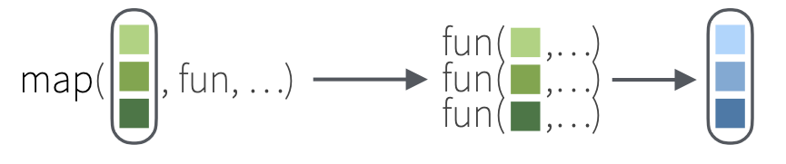

```{r setup, include=FALSE}
knitr::opts_chunk$set(echo = TRUE, message = FALSE, warning = FALSE)

library(countdown)
library(tidyverse)
library(lubridate)
library(palmerpenguins)
library(patchwork)
library(ggthemes)
library(nycflights23)
library(here)
library(fontawesome)
library(tictoc)
slides_theme = theme_minimal(
  base_family = "Atkinson Hyperlegible",
  base_size = 16)

theme_set(slides_theme)

set.seed(0206)

unscaled_cancer <- read_csv("https://raw.githubusercontent.com/UBC-DSCI/introduction-to-datascience/refs/heads/main/data/wdbc_unscaled.csv")
```

## Bakeoff data (season 14 only)

```{r}
bakeoff = read_csv("https://stat220-w26.github.io/data/bakeoff-episodes.csv") |>
  filter(series == 14)

bakeoff
```

## Warm up

::: {.task}
What does this chunk of code do? What will `results` look like?
:::

```{r}
results = character(10)

for(k in 1:10){
  eliminated = bakeoff |>
    filter(episode == k, str_detect(result, "Eliminated")) 
  
  if(nrow(eliminated) == 1){
    results[k] = eliminated$showstopper
  } else if(nrow(eliminated) > 1){
    results[k] = str_flatten(eliminated$showstopper, collapse = ", ")
  } else{
    results[k] = "none"
  }
}
```

```{r}
#| echo: false

countdown(2)
```

## Warm up

```{r}
results
```

## Warm up

```{r}
#| code-line-numbers: "1|3,14|4-5|7-8|9-10|11-12"
results = character(9)

for(k in 1:10){
  eliminated = bakeoff |>
    filter(episode == k, str_detect(result, "Eliminated")) 
  
  if(nrow(eliminated) == 1){
    results[k] = eliminated$showstopper
  } else if(nrow(eliminated) > 1){
    results[k] = str_flatten(eliminated$showstopper, collapse = ", ")
  } else{
    results[k] = "none"
  }
}
```

## Recap from last class

1. `for` loops for iteration
    - Pre-allocating storage
    - Creating an index vector

2. Using `across()` to iterate over columns

## Example

We want to find the *range* of any quantitative variables, and the *number of levels* of any factor variables in the `penguins` dataset.

. . . 

::: panel-tabset

### `for` loop

```{r}
output = numeric(8)

for(k in seq_along(penguins)){
  if(is.numeric(penguins[[k]])){
    output[k] = max(penguins[[k]], na.rm = TRUE) - min(penguins[[k]], na.rm = TRUE)
  }
  if(is.factor(penguins[[k]])){
    output[k] = length(levels(penguins[[k]]))
  }
}
output
```

### `across`

```{r}
penguins |>
  summarize(
    across(where(is.numeric), \(x) max(x, na.rm = TRUE) - min(x, na.rm = TRUE)),
    across(where(is.factor), \(x) length(levels(x)))
  )
```
:::

## 

The good news: we can use `across` to do lots of for-loop-type tasks in our {dplyr} pipelines. 

. . . 

The bad news: `across()` only works with {dplyr} functions like `mutate` or `summarize`

. . . 

The good news: there's a more general-purpose solution in the {tidyverse}

##  {.center}

::::: columns
::: {.column .nonincremental width="65%"}
-   Enhances the functional programming toolkit of R 

-   Main function is `map`, which allows you to replace many `for` loops

-   Loaded with `library(tidyverse)`
:::

::: {.column width="35%"}
{fig-align="right"}
:::
:::::

## `map()`

::::: columns
::: {.column width="50%"}
- `.x` what to iterate over
- `.f` function to apply
:::

::: {.column width="50%"}
```{r}
#| eval: false
map(.x, 
    .f,
    ...)
```
:::
:::::




## How does mapping work?

Suppose we have quiz 1 and quiz 2 scores of 4 students stored in a list...

```{r}
quiz_scores <- list(
  quiz1 <- c(80, 90, 70, 50),
  quiz2 <- c(85, 83, 45, 60)
)
```

. . . 

...and we find the mean score in each quiz

```{r}
map(quiz_scores, mean)
```

## 

...and suppose we want the results as a numeric (double) vector

```{r}
map_dbl(quiz_scores, mean)
```

. . . 

...or as a character string

```{r}
#| eval: false
map_chr(quiz_scores, mean)
```

## `map_something` 

Functions for looping over an object and returning a value (of a specific type):

::: {.nonincremental}
* `map()` - returns a list
* `map_lgl()` - returns a logical vector
* `map_int()` - returns a integer vector
* `map_dbl()` - returns a double vector
* `map_chr()` - returns a character vector
* `map_df()` / `map_dfr()` - returns a data frame by row binding
...
:::

## Try it: `map`

::: {.task .nonincremental}
1. Edit the code chunk below so it returns a numeric vector
2. Edit the code chunk so it only `map`s to the numeric columns (3-12) of `unscaled cancer`
:::

```{r}
#| eval: false
map(unscaled_cancer, mean)
```

::: {.task .nonincremental}
3. `map` the `summary` function to all columns in the {palmerpenguins} `penguins` data
:::

```{r}
#| echo: false

countdown(3)
```

## Example: bakeoff data

::: panel-tabset

### For loop 
```{r}
results = character(10)

for(k in 1:10){
  eliminated = bakeoff |>
    filter(episode == k, str_detect(result, "Eliminated")) 
  
  if(nrow(eliminated) == 1){
    results[k] = eliminated$showstopper
  } else if(nrow(eliminated) > 1){
    results[k] = str_flatten(eliminated$showstopper, collapse = ", ")
  } else{
    results[k] = "none"
  }
}
```

### For loop + function

```{r}

eliminated_showstopper = function(ep_number){
   bakeoff |>
    filter(episode == ep_number, str_detect(result, "Eliminated")) |>
    summarize(
      n = n(),
      showstopper = if_else(n > 0, 
                            str_flatten(showstopper, collapse = ","), "none")) |>
    pull(showstopper)
}

results = character(10)

for(k in 1:10){
  results[k] = eliminated_showstopper(k)
}
```

### Map + function

```{r}
map_chr(1:10, eliminated_showstopper)
```

:::

## `map` vs `for` loop

::::: columns
::: {.column width="50%"}
#### Pros

- Don't have to pre-allocate storage
- Don't have to define an index
- Less error-prone
- Takes advantage of functional programming
:::

::: {.column .fragment width="50%"}
#### Cons

- Hard to get used to if you've previously learned for-loops
- Often need to define a function
- Less fine-grained control 
:::
:::::

. . . 

For this class, we'll learn the basics of both and get practice on homework. For projects, you can use whichever approach makes more sense to you. 

## Your turn: `map` with `penguins`

::: {.task .nonincremental}
Using the `penguins` data, use `map` to calculate the `range` of a numeric variable and the `table` of a factor variable. (It may be helpful to first write a custom function for this output)

Your result should be a list (it will have length 8).
:::

```{r}
#| echo: false


countdown(4)
```

```{r}
#| include: false
summarize_depends = function(x){
  if(is.numeric(x)) return(max(x, na.rm = TRUE) - min(x, na.rm = TRUE))
  if(is.factor(x)) return(table(x))
}

map(penguins, summarize_depends)
```


## More practice: survivor data {.smaller}

```{r}
#| echo: false
load(url("https://stat220-w26.github.io/data/combining-data-examples.Rda"))
```

```{r}
us_castaway_results 
```

. . . 

::: {.task .nonincremental}

1. Write a function called `finalists` that takes the input of a survivor season (as a `numeric`) and outputs a string of the finalists' names for that season. The finalists' names should be separated with a comma. 

2. Use `map_chr` to return a character vector of finalists for seasons 31-40. 

:::

```{r}
#| echo: false


countdown(5)
```


```{r}
#| include: false

finalists = function(season_number){
  us_castaway_results |>
    filter(season == season_number, finalist) |>
    pull(castaway) 
}

map(31:40, finalists)

finalists_chr = function(season_number){
  us_castaway_results |>
    filter(season == season_number, finalist) |>
    pull(castaway) |>
    str_c(collapse = ", ")
}

map_chr(31:40, finalists_chr)
```

# Simulation {.maize}

## Simulation

- Iteration is especially useful for *simulation*
- In statistics, we often work with a random sample to try to learn something about a population. 
- We care about the *uncertainty* of our results: did we find a true trend, or could it be due to sampling variability? 

## Example: survivor data

If we randomly choose 20 previous survivor players to play on a new season, how likely are we to get zero finalists? 

```{r}
#| echo: false

set.seed(0217)
```

```{r}
#| output-location: fragment
us_castaway_results %>%
  slice_sample(n = 20) %>%
  filter(finalist) %>%
  count()
```


## The plan

1. Write a function that runs our "experiment" 
2. Set up an iteration procedure to run our experiment a bunch of times
3. Analyze the results

##

Write a function that runs our "experiment" 
 
```{r}
#| eval: false
#| code-line-numbers: "1-7"

sample_finalists = function(n){
    us_castaway_results %>%
    slice_sample(n = n) %>%
    filter(finalist) %>%
    count() %>%
    pull(n)
}

n_finalists = integer(1000)

for(k in 1:1000){
  n_finalists[k] = sample_finalists(20)
}

table(n_finalists)/1000
```

##

Set up a for loop to run our experiment a bunch of times
 
```{r}
#| eval: false
#| code-line-numbers: "9-13"

sample_finalists = function(n){
    us_castaway_results %>%
    slice_sample(n = n) %>%
    filter(finalist) %>%
    count() %>%
    pull(n)
}

n_finalists = integer(1000)

for(k in 1:1000){
  n_finalists[k] = sample_finalists(20)
}

table(n_finalists)/1000
```

##

Analyze the results
 
```{r}
#| output-location: fragment
#| code-line-numbers: "15"

sample_finalists = function(n){
    us_castaway_results %>%
    slice_sample(n = n) %>%
    filter(finalist) %>%
    count() %>%
    pull(n)
}

n_finalists = integer(1000)

for(k in 1:1000){
  n_finalists[k] = sample_finalists(20)
}

table(n_finalists)/1000
```

## Same approach using `map`


1. Define something to `map` over
2. Apply `sample_finalists` function to "something"
3. Analyze results

## Same approach using `map`

Define something to map over: 

```{r}
rep(20,5)
```

. . . 

Apply `sample_finalists` function and analyze results

```{r}
#| output-location: fragment
rep(20, 1000) |>
  map_dbl(sample_finalists) |>
  table()
```


## Your turn

::: task
Some survivor seasons only had 16 players, while others had 22. This could result in some seasons being slightly under/overrepresented in our sample. Let's account for this.

Edit this experiment to instead randomly sample one player from each season (this results in 47 players) and then sample 20 players from the 47 random ones. 

(*Hint:* look at the `by` argument in `slice_sample`)
:::

```{r}
#| include: false

sample_finalists_2 = function(n){
    us_castaway_results %>%
    slice_sample(n = 1, by = season) %>%
    slice_sample(n=20) %>%
    filter(finalist) %>%
    count() %>%
    pull(n)
}


rep(20, 1000) |>
  map_dbl(sample_finalists_2) |>
  table()/1000
```

```{r}
#| echo: false
countdown(4)
```

## `unscaled_cancer`

Recall the `unscaled_cancer` dataset from last week: 

```{r}
unscaled_cancer
```

## Differences in groups

One question we might be interested in is "Is the radius of malignant tumors noticeably different than the radius of benign tumors?"

```{r}
unscaled_cancer %>%
  group_by(Class) %>%
  summarize(
    mean = mean(Radius)
  )
```

. . . 

This tells us the average difference *within this sample*, but we don't know if this difference is "surprising" or not. 

## Permutation test

In a previous statistics class, you may have seen a *permutation test* for a difference in means. 

Basic idea: 

1. Assume there is no difference in the groups
2. Shuffle the group labels (benign/malignant) at random
3. Compute the difference in means for the two groups
4. Repeat the experiment a bunch of times
5. Compare the observed difference to the distribution of simulated differences

. . . 

If the observed difference is much bigger than the simulated differences, we have evidence of a *statistically significant* result

## Your turn: Permutation test

::: {.task .nonincremental}
1. Define a function to run the experiment
    - Create a new column of `unscaled_cancer` called `class_shuffled`, which is a permutation of the original `Class` variable (*Hint:* see `sample` function)
    - Group by `class_shuffled` and compute the group means
    - Find the difference in the means
2. Repeat the experiment 1000 times, making sure to save the difference in means
3. Make a histogram of the simulated differences. How (un)likely is the difference we observed?
:::

