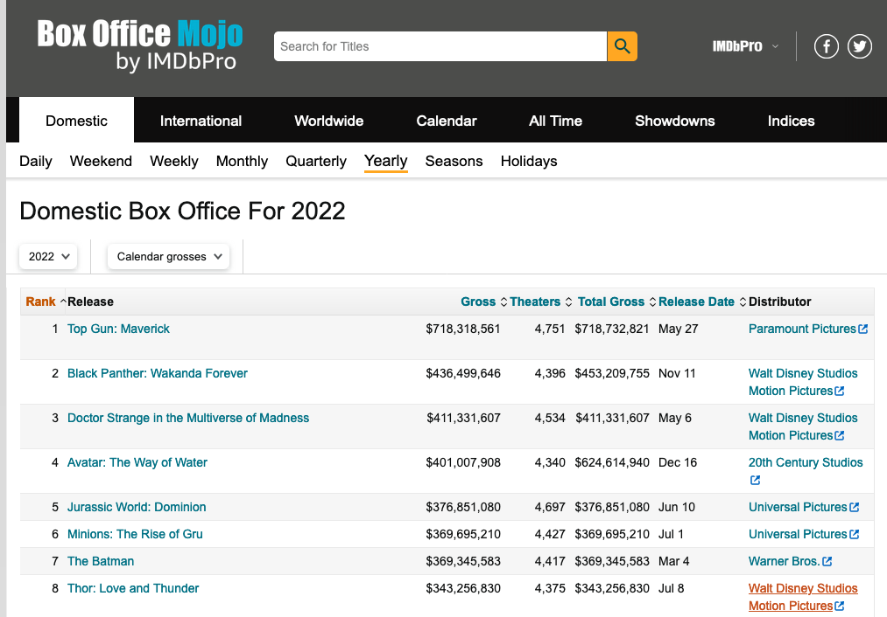
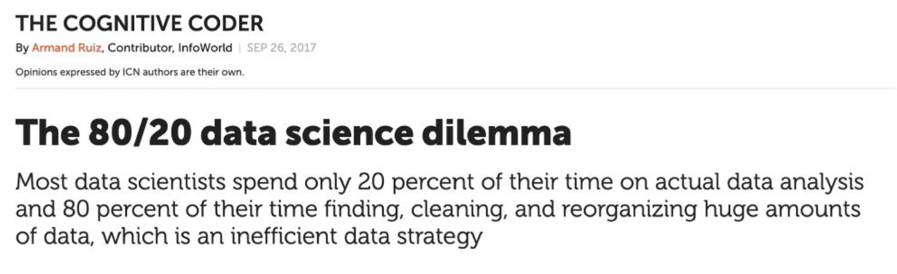
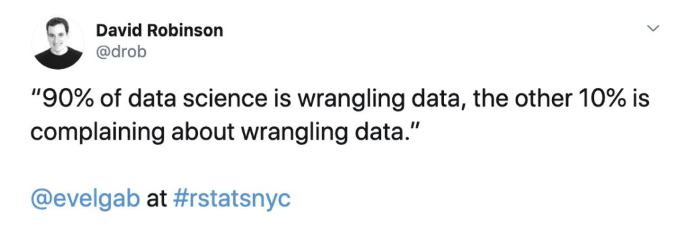

```{r setup, include=FALSE}
knitr::opts_chunk$set(echo = TRUE, message = FALSE, warning = FALSE)

library(countdown)
library(tidyverse)
library(lubridate)
library(palmerpenguins)
library(patchwork)
library(ggthemes)
library(nycflights23)
library(here)
library(httr2)
slides_theme = theme_minimal(
  base_family = "Atkinson Hyperlegible",
  base_size = 16)

theme_set(slides_theme)
```

## Ways to access data from the web: 

1. Web APIs (application programming interface): website offers a set of structured http requests that return JSON or XML files.

2. Screen scraping:<br> extract data from source code of website, with html parser (easy) or regular expression matching (less easy).

## API `httr` request from last class

```{r}
#| echo: true
#| eval: false
request("https://api.census.gov/data") %>% 
    req_url_path_append("2019") %>% 
    req_url_path_append("acs") %>% 
    req_url_path_append("acs1") %>% 
    req_url_query(get = c("NAME", "B02015_009E", "B02015_009M"), 
                  `for` = I("state:*"), 
                  key = census_api_key, 
                  .multi = "comma")
```

```
<httr2_request>
GET
https://api.census.gov/data/2019/acs/acs1?get=NAME,B02015_009E,B02015_009M&for=state:*&key=4a2344XXXXXXXXXXXXXXXXXXXXXXXXXXXXX
Body: empty
```

Can use your browser to go to the URL address and see what will be returned


## 

When debugging, you can also test a single URL and build up your pipeline from there

```{r}
#| echo: true
#| eval: false
request("https://api.census.gov/data/2019/acs/acs1?get=NAME,B02015_009E,B02015_009M&for=state:*") 

```

```
<httr2_request>
GET
https://api.census.gov/data/2019/acs/acs1?get=NAME,B02015_009E,B02015_009M&for=state:*
Body: empty
```

## API vs Screen Scraping

::::: columns
::: {.column .nonincremental width="50%"}

**API**:

  - Designed to be accessed by computers
  - Often need to sign up for a key
  - Structured set of requests, need to dig in to documentation to figure out how to access the data you need
  - Often more natural structure for tidying

:::

:::{.column .fragment .nonincremental width="50%"}

**Screen scraping:** 

  - Designed to be read by humans
  - Can be restricted or rate-limited in terms of service
  - Need to dig in to source code of the web page to figure out how to access the data that you need

:::
:::::


## Check the terms of use/service first!

- Can you query this webpage?

- Are there restrictions on the use of the data?

- How many requests can you make per minute?

- ...and more...

## Checking for permission to scrape


Use `robotstxt::paths_allowed()` to see if you can scrape the web page.

. . . 

You can scrape Zillow
```{r warning=FALSE}
library(robotstxt)
paths_allowed("http://www.zillow.com")
```

. . . 

But not Facebook
```{r warning=FALSE}
paths_allowed("http://www.facebook.com")
```

. . . 

::: {.task}
What websites have data about *you*? Think of 1-2 and see if scraping is allowed on those sites.
:::

## Hypertext Markup Language

::: {.nonincremental}

- Lots of data on the web is still available as HTML

- It is structured (hierarchical / tree based), but it's often not available in  a form useful for analysis (flat / tidy).

:::

```html
<html>
  <head>
    <title>This is a title</title>
  </head>
  <body>
    <p align="center">Hello world!</p>
  </body>
</html>
``` 

## HTML tags

HTML uses **tags** to describe different aspects of document content


Tag         |  Example
------------|---------------------------------------------------------------
heading     | `<h1>My Title</h1>`
paragraph   | `<p>A paragraph of content...</p>`
table       | `<table> ... </table>`
anchor (with attribute)     | `<a href="http://www.mysite.net">click here for link</a>`

## {rvest}

::::: columns
::: {.column .nonincremental width="50%"}

{width=70%}
:::

:::{.column .nonincremental width="50%"}

- Pronounced like "harvest"

- Processing and manipulation of HTML data

- *Installed* with the {tidyverse} but not *loaded* automatically


```{r}
library(rvest)
```

:::
:::::

## Core `rvest` functions {.smaller}

Function       | Description
---------------|---------------------------------------------
`read_html`    | Read HTML data from a url or character string
`html_element` | Select a specified element from HTML document
`html_elements`| Select specified elements from HTML document
`html_table`   | Parse an HTML table into a data frame
`html_text`    | Extract tag pairs' content
`html_name`    | Extract tags' names
`html_attrs`   | Extract all of each tag's attributes
`html_attr`    | Extract tags' attribute value by name

## Example: box office mojo

<https://www.boxofficemojo.com/year/2024/>

::::: columns
::: {.column .nonincremental width="50%"}

- Take a look at the web page **and** the html source code 

    Chrome or Firefox: right click -> View page source

- Look for the `"table"` div ID or tag

:::

:::{.column .nonincremental width="50%"}



:::
:::::

## Read HTML into R

```{r}
page <- read_html("https://www.boxofficemojo.com/year/2024/")
page
str(page)
```

## HTML elements

There are over 100 HTML elements: 

  - Every HTML page must be in an `<html>` element, and it must have two children: `<head>` and `<body>`
  - Block tags like `<h1>`, `<p>`, `<ol>` form the structure of the page
  - Inline tags like `<b>`, `<i>`, and `<a>` format text inside block tags

. . . 

We'll often work with `tables`. HTML tables are composed of four main elements `<table>`, `<tr>` (table row), `<th>` (table heading), and `<td>` (table data).
  
  
::: aside
If you run into one that you need to figure out, I recommend the [MDN Web Docs](https://developer.mozilla.org/en-US/docs/Web/HTML) for explanations and examples

:::

## Extract tables

Use `html_element()` or `html_elements()` to extract pieces out of HTML documents

```{r}
tables <- page %>% html_elements("table")
str(tables)
```

## `html_element()` vs `html_elements()` 

* `html_elements()` **returns all matching elements** beneath any of the inputs, flattening results into a new node set

* `html_element()` **always returns a vector the same length as the input**, using a "missing" element where needed.

. . . 

Typically, we'll use `html_elements` to get the overall structure for our data, followed by something else (sometimes `html_element`, sometimes `html_table`) to access what we need

## Check that it's the right table

It looks promising!

```{r}
tables
```

. . . 

But we don't have a data frame yet...

```{r}
tables[[1]]
```

## Parse a table into a data frame

```{r top2022-df}
top2024 <- html_table(tables[[1]])
glimpse(top2024)
```

## Parse tables into data frames

If there had been multiple tables on the webpage, then we could parse them all at once using `html_table()`

It returns a list of data frames

```{r}
table_list <- html_table(tables)
str(table_list)
```

## Scrape then wrangle

Data aren't ready for analysis, too many character columns!

```{r}
#| echo: false
glimpse(top2024)
```

## Scrape then wrangle

```{r}
top2024 <- top2024 %>%
  mutate(
    Gross = parse_number(Gross),
    Theaters = parse_number(Theaters),
    `Total Gross` = parse_number(`Total Gross`)
  ) %>%
  separate(`Release Date`, into = c("Month", "Day"))

glimpse(top2024)
```


## Scraped data will almost always need wrangling/cleaning

- Are numeric columns numeric?
- Are date columns dates? 
- Are factor and string columns treated correctly?

## 



. . . 



::: aside

Source: [Playing the Whole Game](https://www.tandfonline.com/doi/full/10.1080/10691898.2020.1799728#abstract), Kim & Hardin

:::

## What next? 

- Data we want to access isn't always stored in tables

  - Example: [Carleton course search](https://www.carleton.edu/catalog/current/search/?term=25/WI&subject=STAT&number=220)
  
- More next class! 
