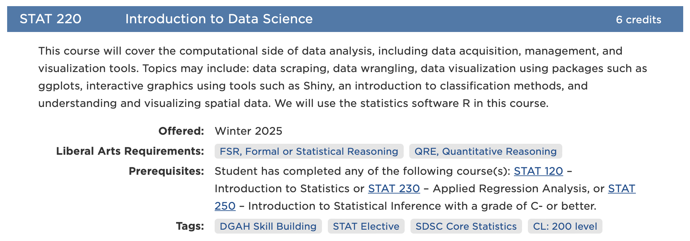
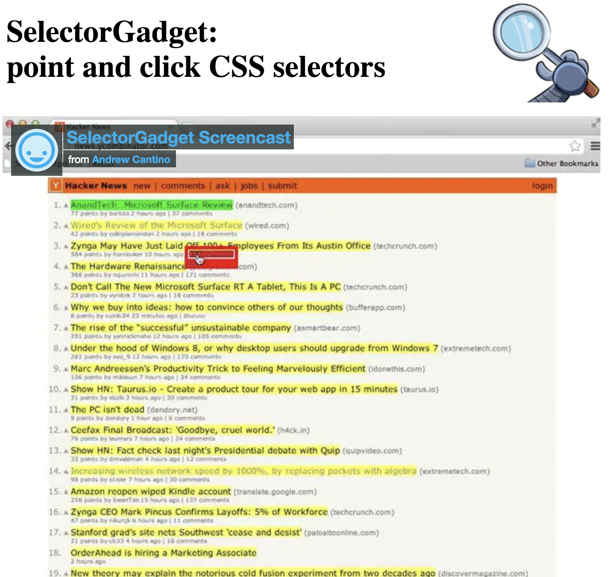
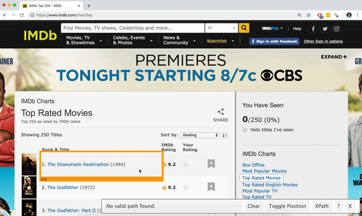
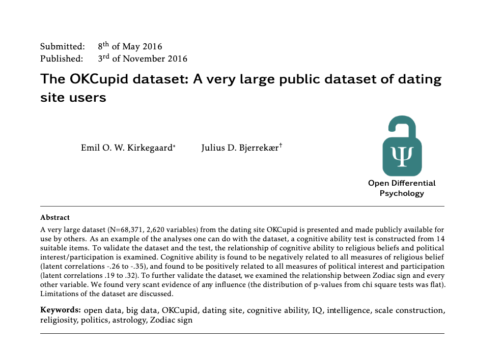
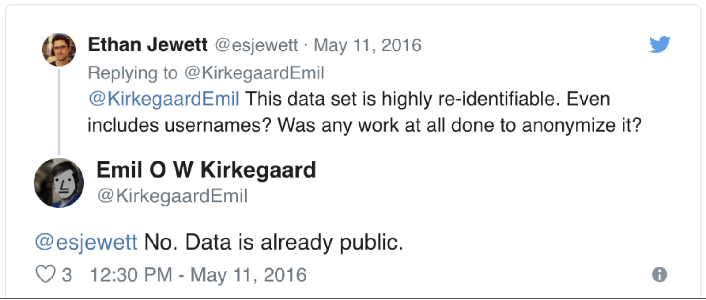

```{r setup, include=FALSE}
knitr::opts_chunk$set(echo = TRUE, message = FALSE, warning = FALSE)

library(countdown)
library(tidyverse)
library(lubridate)
library(palmerpenguins)
library(patchwork)
library(ggthemes)
library(nycflights23)
library(here)
library(httr2)
library(rvest)
slides_theme = theme_minimal(
  base_family = "Atkinson Hyperlegible",
  base_size = 16)

theme_set(slides_theme)
```

## Ways to access data from the web: 

1. Web APIs (application programming interface): website offers a set of structured http requests that return JSON or XML files.

2. Screen scraping:<br> extract data from source code of website, with html parser (easy) or regular expression matching (less easy).


## Check the terms of use/service first!

- Can you query this webpage?

- Are there restrictions on the use of the data?

- How many requests can you make per minute?

- ...and more...

## Checking for permission to scrape


Use `robotstxt::paths_allowed()` to see if you can scrape the web page.

. . . 

You can scrape Zillow
```{r warning=FALSE}
library(robotstxt)
paths_allowed("http://www.zillow.com")
```

. . . 

But not Facebook
```{r warning=FALSE}
paths_allowed("http://www.facebook.com")
```

. . . 

::: {.task}
What websites have data about *you*? Think of 1-2 and see if scraping is allowed on those sites.
:::

## Hypertext Markup Language

::: {.nonincremental}

- Lots of data on the web is still available as HTML

- It is structured (hierarchical / tree based), but it's often not available in  a form useful for analysis (flat / tidy).

:::

```html
<html>
  <head>
    <title>This is a title</title>
  </head>
  <body>
    <p align="center">Hello world!</p>
  </body>
</html>
``` 

## HTML tags

HTML uses **tags** to describe different aspects of document content


Tag         |  Example
------------|---------------------------------------------------------------
heading     | `<h1>My Title</h1>`
paragraph   | `<p>A paragraph of content...</p>`
table       | `<table> ... </table>`
anchor (with attribute)     | `<a href="http://www.mysite.net">click here for link</a>`

## {rvest}

::::: columns
::: {.column .nonincremental width="50%"}

{width=70%}
:::

:::{.column .nonincremental width="50%"}

- Pronounced like "harvest"

- Processing and manipulation of HTML data

- *Installed* with the {tidyverse} but not *loaded* automatically


```{r}
library(rvest)
```

:::
:::::

## Core `rvest` functions {.smaller}

Function       | Description
---------------|---------------------------------------------
`read_html`    | Read HTML data from a url or character string
`html_element` | Select a specified element from HTML document
`html_elements`| Select specified elements from HTML document
`html_table`   | Parse an HTML table into a data frame
`html_text`    | Extract tag pairs' content
`html_name`    | Extract tags' names
`html_attrs`   | Extract all of each tag's attributes
`html_attr`    | Extract tags' attribute value by name

## Example: box office mojo

<https://www.boxofficemojo.com/year/2024/>

::::: columns
::: {.column .nonincremental width="50%"}

- Take a look at the web page **and** the html source code 

    Chrome or Firefox: right click -> View page source

- Look for the `"table"` div ID or tag

:::

:::{.column .nonincremental width="50%"}


:::
:::::


## Read HTML into R

```{r}
page <- read_html("https://www.boxofficemojo.com/year/2024/")
page
str(page)
```

## HTML elements

There are over 100 HTML elements: 

::: nonincremental
  - Every HTML page must be in an `<html>` element, and it must have two children: `<head>` and `<body>`
  - Block tags like `<h1>`, `<p>`, `<ol>` form the structure of the page
  - Inline tags like `<b>`, `<i>`, and `<a>` format text inside block tags
::: 

We'll often work with `tables`. HTML tables are composed of four main elements `<table>`, `<tr>` (table row), `<th>` (table heading), and `<td>` (table data).
  
  
::: aside
If you run into one that you need to figure out, I recommend the [MDN Web Docs](https://developer.mozilla.org/en-US/docs/Web/HTML) for explanations and examples

:::

## Extract tables

Use `html_element()` or `html_elements()` to extract pieces out of HTML documents

```{r}
tables <- page %>% html_elements("table")
str(tables)
```


## Parse a table into a data frame/tibble

```{r top2022-df}
top2024 <- html_table(tables[[1]])
glimpse(top2024)
```


## Scrape then wrangle

```{r}
top2024 <- top2024 %>%
  mutate(
    Gross = parse_number(Gross),
    Theaters = parse_number(Theaters),
    `Total Gross` = parse_number(`Total Gross`)
  ) %>%
  separate(`Release Date`, into = c("Month", "Day"))

glimpse(top2024)
```

## Scraped data will almost always need wrangling/cleaning

- Are numeric columns numeric?
- Are date columns dates? 
- Are factor and string columns treated correctly?

## 


. . . 


::: aside

Source: [Playing the Whole Game](https://www.tandfonline.com/doi/full/10.1080/10691898.2020.1799728#abstract), Kim & Hardin

:::

## Data aren't always stored as tables

<https://www.carleton.edu/catalog/current/search/?subject=STAT&term=25WI>



## Where is the data stored?

::: {.task .nonincremental}
View the page source to try to find the html elements where this data is located (e.g. 'h1', 'p', 'table')

- Course number
- Course title
- Course description
- Course meetings
- Faculty
- Course meetings

:::
```{r}
#| echo: false
countdown(3)
```

## 

```{r}
listings = read_html("https://www.carleton.edu/catalog/current/search/?subject=STAT&term=25WI")
```

```{r}
listings |>
  html_elements("h3")
```

## 
```{r}
listings |>
  html_elements("h3") |>
  html_text()
```


## 

```{r}
listings |>
  html_elements("h3") |>
  html_text() |> 
  str_squish()
```

# CSS selectors {.maize}

## Selecting courseNumber class

Course numbers are between `<span class="courseNumber"> ... </span>` tags

These tags can be selected using `.` followed by the name of the class


```{r}
listings %>% 
  html_elements(".courseNumber")
```


## Scraping courseNumbers

```{r}
listings %>% 
  html_elements(".courseNumber") %>%
  html_text()
```

## Scraping credits

```{r}
listings %>% 
  html_elements(".credits") %>%
  html_text()
```

## Scraping credits

```{r}
listings %>% 
  html_elements(".credits") %>%
  html_text() %>%
  str_squish()
```

## 

```{r}
stat_winter2025 <- tibble(
  course = listings %>% html_elements(".courseNumber") %>% html_text(),
  title = listings %>% html_elements(".courseTitle") %>% html_text(),
  credits = listings %>% html_elements(".credits") %>% html_text() %>% str_squish(),
  description = listings %>% html_elements(".courseDetailWrapper") %>% html_text() %>% str_squish()
)

stat_winter2025
```

## What about sections?

```{r}
listings %>% 
  html_elements(".course-section") %>%
  html_element(".courseSectionNumber") %>% 
  html_text() %>% 
  str_squish()
```

## Sometimes, we can't get around regex :( 

```{r}
listings %>% 
  html_elements(".classMeetings") %>% 
  html_text() %>% 
  str_squish()
```

## selectorGadget

::::: columns
::: {.column .nonincremental width="50%"}

- Open source tool that eases CSS selector generation and discovery

- Easiest to use with the [Chrome Extension](https://chrome.google.com/webstore/detail/selectorgadget/mhjhnkcfbdhnjickkkdbjoemdmbfginb) 

- Find out more on the [SelectorGadget vignette](https://cran.r-project.org/web/packages/rvest/vignettes/selectorgadget.html)
:::

:::{.column .nonincremental width="50%"}


:::
:::::


## selectorGadget

::::: columns
::: {.column .nonincremental width="50%"}

- Click on the app logo next to the search bar
- A box will open in the bottom right of the website
- Click on a page element (it will turn green), SelectorGadget will generate a minimal CSS selector for that element, and will highlight (yellow) everything that is matched by the selector
- Click on a highlighted element to remove it from the selector (red), or 
click on an unhighlighted element to add it to the selector
:::

:::{.column .nonincremental width="50%"}



:::
:::::


## Try it 

::: {.task .nonincremental}
- Use the SelectorGadget to explore http://www.imdb.com/chart/top

- What should the columns of our target dataset be? Do they correspond to any specific css selectors?
:::

```{r echo=FALSE}
countdown(3)
```

## Extract title

```{r}
imdb <- read_html("http://www.imdb.com/chart/top")
titles <- imdb %>%
  html_elements(".with-margin .ipc-title__text") %>%
  html_text()

head(titles)

```

## Extract year

```{r}
years <- imdb %>%
  html_elements(".cli-title-metadata-item:nth-child(1)") %>%
  html_text()

head(years)

```


## Extract runtime

```{r}
runtimes <- imdb %>%
  html_elements(".cli-title-metadata-item:nth-child(2)") %>%
  html_text()

head(runtimes)

```

## Extract MPAA rating

```{r}
mpaas <- imdb %>%
  html_elements(".cli-title-metadata-item:nth-child(3)") %>%
  html_text()

head(mpaas)

```


## Put the pieces together

```{r}
imdb_top_250 <- tibble(
  title = titles, 
  year = years, 
  runtime = runtimes,
  mpaa = mpaas
  )

imdb_top_250
```


## Wait a second.... there's not 250 movies here

```{r}
imdb_top_250
```

. . . 

Most modern tables in webpages are *dynamically loaded* (they wait for you to scroll down to load more rows). `rvest` can't scroll, so it can only see the initial data that's loaded

## What do we do? 

1. Is there an API available? Can I access it as a student/researcher at no/low cost?
   - IMDb: Yes, but cost prohibitive

2. Is there a different scraping tool available? 
   - Yes, {RSelenium} is one that might work, but beyond the scope of this course
  
3. Can I get the information I need from a different website?
   - [The Movie Database](https://www.themoviedb.org/?language=en-US) might work

4. If I download the page, is more information available? 
   - In this case, yes, but might not always work
  
## With local copy of website

```{r}
imdb_local <- read_html("IMDb Top 250 Movies.html")
titles <- imdb_local %>%
  html_elements(".with-margin .ipc-title__text") %>%
  html_text()


titles
```

# .rmd vs .R {.maize}

## 

::::: columns
::: {.column .nonincremental width="50%"}

**Rmarkdown**:

  - Integrate code, text, and graphs
  - Output is a "report"
  - Code is run interactively (in chunks) and when knitting your final document
:::

:::{.column .fragment .nonincremental width="50%"}

**R script:** 

  - Think of it as a file that contains *only* R chunks
  - No "knitting": all code must be run explicitly
  - Useful for longer chunks of code 
      - `data-cleaning.R`
      - `fit-models.R`
      - `scrape-data.R`

:::
:::::

## For scraping: 

- We don't want to scrape a website more than we need to
- For HW, it's OK to continue to use .Rmd unless specified
- For projects that involve intensive data-gathering:
    - use an R script to read in the "raw" data, clean it, and save it to a tidy csv
    - Read your "clean" data to your .rmd and proceed as usual

# Example {.maize}

## Your turn: 

::: {.task .nonincremental}

- In an R script:

  - Scrape the names, scores, and years of most popular TV shows on IMDB:
  [www.imdb.com/chart/tvmeter](http://www.imdb.com/chart/tvmeter)
  
  - Create a data frame called `tvshows` with the variables:
    `rank`, `title`, `stars`, `year`, `episodes`, `n_ratings`
    
  - Wrangle your resulting data so that all variable types are imported correctly
  
  - Use `write_csv` to save your file. If time, read it into the `21-scraping.rmd` and make a graph
:::

## 

::::: columns
::: {.column .nonincremental width="50%"}

Dataset includes variables like: 

- Political leanings
- Religion
- Drug usage
- Sexual preferences
- Zodiac sign
- With over 2,000 total variables (although not all users had all variables recorded)


:::

:::{.column .nonincremental width="50%"}



:::
:::::

##



## Follow-up study (and article correction)

<https://www.tandfonline.com/doi/abs/10.1080/10691898.2015.11889737>
