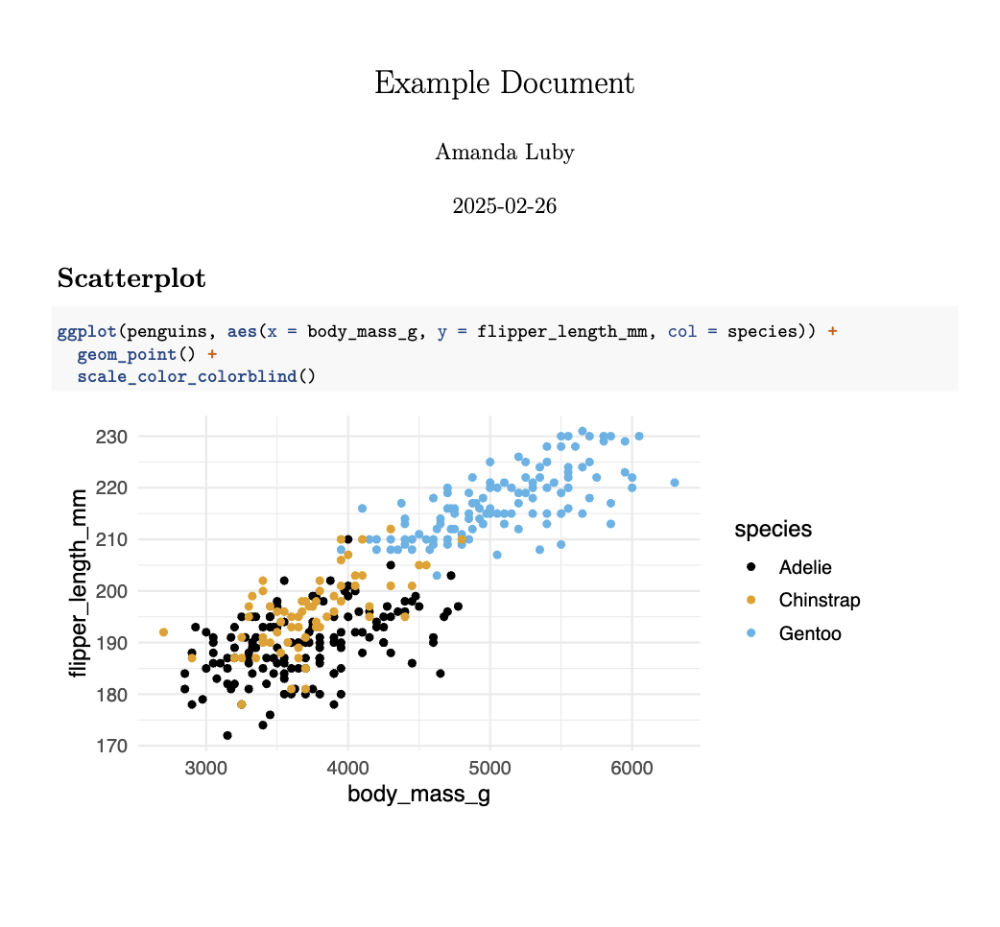
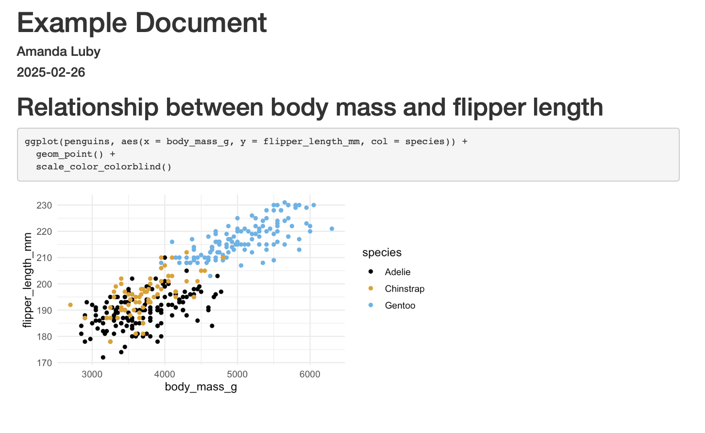
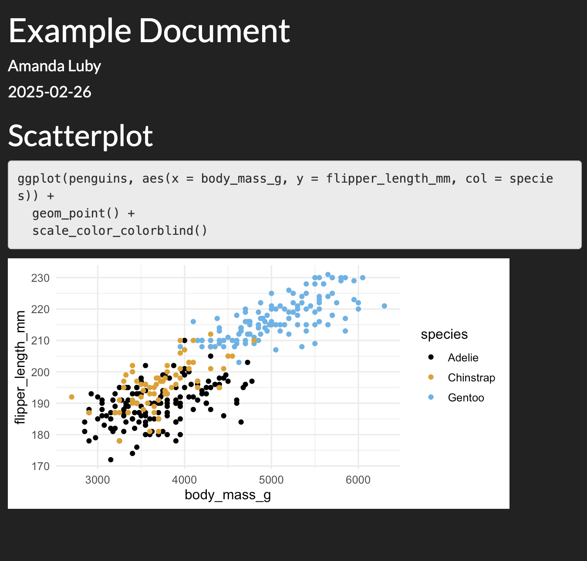
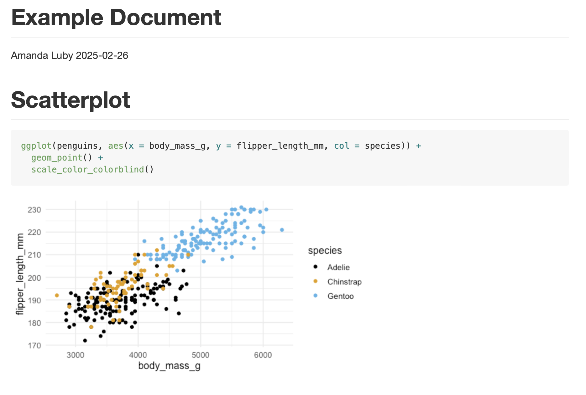
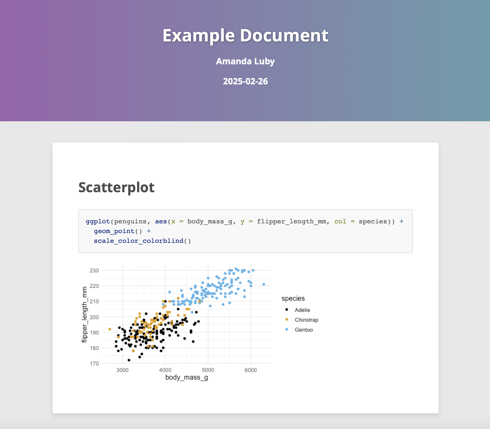
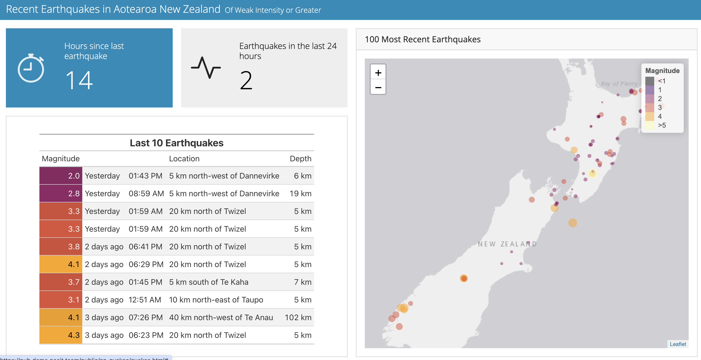
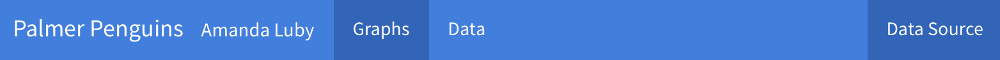
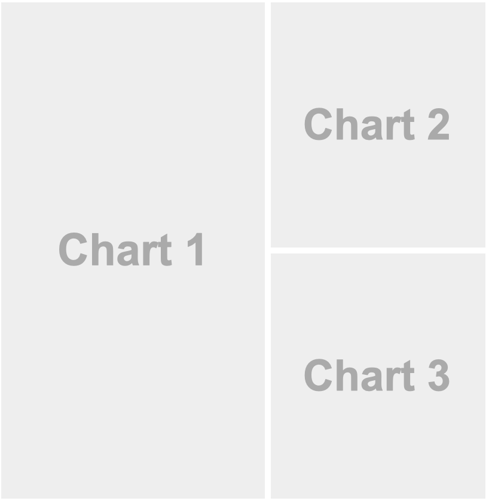
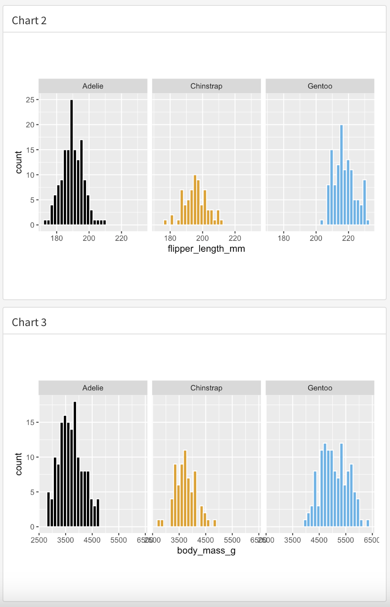

```{r setup, include=FALSE}
knitr::opts_chunk$set(echo = TRUE, message = FALSE, warning = FALSE)

library(countdown)
library(tidyverse)
library(lubridate)
library(palmerpenguins)
library(patchwork)
library(ggthemes)
library(nycflights23)
library(here)
library(httr2)
library(rvest)
slides_theme = theme_minimal(
  base_family = "Atkinson Hyperlegible",
  base_size = 16)

theme_set(slides_theme)
```


```{r}
#| echo: false

gapminder <- read_csv(here("data", "gapminder2021.csv"))
gapminder2021 <- gapminder %>%
  filter(year == 2021)
```

## Today

- RMarkdown outputs
- Dashboards
- Intro to interactive toolkit

## rmarkdown outputs: pdf 

::::: columns
::: {.column .nonincremental width="50%"}
```{r}
#| eval: false
---
title: "Example Document"
author: "Amanda Luby"
date: "2025-02-26"
output:
  pdf_document
---

```

:::

:::{.column .nonincremental width="50%"}



:::
:::::

## rmarkdown outputs: html 

::::: columns
::: {.column .nonincremental width="50%"}
```{r}
#| eval: false
---
title: "Example Document"
author: "Amanda Luby"
date: "2025-02-26"
output:
  html_document
---

```

:::

:::{.column  .nonincremental width="50%"}


:::
:::::

## rmarkdown outputs: html, custom theme 

::::: columns
::: {.column .nonincremental width="50%"}
```{r}
#| eval: false
---
title: "Example Document"
author: "Amanda Luby"
date: "2025-02-26"
output:
  html_document:
    theme: darkly
---

```

:::

:::{.column  .nonincremental width="50%"}


:::
:::::

## rmarkdown outputs: github-flavored markdown

::::: columns
::: {.column .nonincremental width="50%"}
```{r}
#| eval: false
---
title: "Example Document"
author: "Amanda Luby"
date: "2025-02-26"
output:
  github_document
---

```

:::

:::{.column  .nonincremental width="50%"}



:::
:::::

## rmarkdown outputs: html theme in a package

::::: columns
::: {.column .nonincremental width="50%"}
```{r}
#| eval: false
---
title: "Example Document"
author: "Amanda Luby"
date: "2025-02-26"
output:
 prettydoc::html_pretty:
    theme: hpstr
---

```

:::

:::{.column .nonincremental width="50%"}


:::
:::::

## Dashboards

::::: columns
::: {.column .nonincremental width="50%"}
```{r}
library(flexdashboard)
```
```{r}
#| eval: false
---
title: "Recent Earthquakes in Aotearoa New Zealand"
subtitle: "Of Weak Intensity or Greater"
output: 
  flex_dashboard:
    orientation: columns
    vertical_layout: fill
---
```

:::

:::{.column  .nonincremental width="50%"}



:::
:::::

## Components of a dashboard

1. Navigation Bar and Pages — Title and author along with links to sub-pages (if more than one page is defined).

2. Sidebars, Rows & Columns, and Tabsets — Rows and columns using markdown heading (with optional attributes to control height, width, etc.). Sidebars for interactive inputs. Tabsets to further divide content.

3. Sections -- Sections are containers for cell outputs and free form markdown text. The content of sections typically maps to cells in your notebook or source document.

## Navigation bar and pages

```
---
title: "Palmer Penguins"
author: "Amanda Luby"
output: 
  flexdashboard::flex_dashboard:
    orientation: columns
    vertical_layout: fill
    navbar:
      - { title: "Data Source", href: "https://allisonhorst.github.io/palmerpenguins/", align: right }
---

Graphs
===================================== 
      
Data 
=====================================  
```



## Rows and columns

::::: columns
::: {.column .nonincremental width="50%"}
```

Graphs
===================================== 

Column {data-width=650}
-----------------------------------------------------------------------

### Chart 1

Column {data-width=350}
-----------------------------------------------------------------------

### Chart 2

### Chart 3

```
:::
::: {.column .nonincremental width="50%"}

:::
:::::

## Sections 

::::: columns
::: {.column .nonincremental width="50%"}
```

Column {data-width=350}
-----------------------------------------------------------------------

### Chart 2

### Chart 3

```
:::
::: {.column .nonincremental width="50%"}

:::
:::::

# [html Widgets Showcase](https://testing-apps.shinyapps.io/flexdashboard-storyboard/)

# [Earthquake Explorer](https://pub.demo.posit.team/public/nz-quakes/quakes.html) + [Source Code](https://github.com/cwickham/quakes/blob/main/quakes.qmd)

# Interactive Graphics

## Interactive Graphics add dimensions to static visualizations via features that the user controls

## Features we'll focus on in this class: 

- Hovering
  - Display additional information about an observation or group via cursor
- Changing the representation of the data
  - User decides if they want to see the data in a table or a graph
  - Option to select variables
  - Option to select graph
  - Option to tweak parameters of graphs
- Filtering/subsetting
  - Allow user to control which subset of the data is shown
  
## Workflow

1. Start with a static graph, describe what insights it offers, *then* build up
2. Demonstrate how the interactive features allow you to obtain additional insight *that you would not otherwise be able to*
    - Just because you *can* doesn't mean you *should*
4. Document how to use the features ("click on the drop down menu to choose a variable") 

## Explanation $\to$ Exploration

I like to think of interactive components as somewhere on the "Explanation/Exploration" spectrum

- Exploration: Open-ended; the user decides what the story is
  - [NCAA Swimming](https://gpilgrim.shinyapps.io/SwimmingProject-Click/) Data Explorer
  - [Economic Census Industry Data](https://www.census.gov/library/visualizations/interactive/economic-census-industry-data-by-geography.html)
- Explanation: fully static; the story is the same regardless of what the user does
  - [Shadow Peace](http://www.fallen.io/shadow-peace/1/)
  - [Euro Final](https://data-kicks.github.io/euro_final_scrollytelling_analysis/euro_final_scrollytelling_analysis.html)
  

## plotly

* Visualization library for interactive and dynamic web-based graphics

* Plots work in multiple formats 
   * viewer windows
   * R Markdown documents
   * shiny apps

## Static plot

```{r static-plot}
#| output-location: column


gap2021 <- gapminder %>% 
  filter(year == 2021) %>%
  ggplot(aes(x = income, y = life, color = four_regions, size = population)) +
    geom_point() +
  labs(
    x = "GDP per capita",
    y = "Life expectancy",
    color = "Region"
  ) +
  scale_x_continuous(labels = scales::dollar_format()) +
  theme_minimal()

gap2021
```

## Static $\to$ interactive 

```{r plotyl1}
#| fig-width: 8
#| fig-height: 4
library(plotly)
ggplotly(gap2021)
```

## Wouldn't it be nice if we could see the country name when we hover? 

. . . 

```{r}
#| code-line-numbers: "7"
#| output-location: slide
#| fig-width: 8
#| fig-height: 4

gap2021 <- gapminder %>% 
  filter(year == 2021) %>%
  ggplot(aes(x = income, 
             y = life, 
             color = four_regions, 
             size = population,
             text = country)) +
    geom_point() +
  labs(
    x = "GDP per capita",
    y = "Life expectancy",
    color = "Region"
  ) +
  scale_x_continuous(labels = scales::dollar_format()) +
  theme_minimal()

ggplotly(gap2021)
```

## Wouldn't it be nice if we could see **only** the country name when we hover? 

. . . 

```{r}
#| fig-width: 8
#| fig-height: 4
ggplotly(gap2021, tooltip = "text")
```

## Your turn

::: {.task .nonincremental}
Load the `{palmerpenguins}` data set and create a scatterplot of body_mass_g vs. flipper_length_mm from the `penguins` data set. Use color and shape to specify the `species`.

Once you have a static graphic you're happy with, load `{plotly}` and convert it to an interactive graphic.

- What tools tips are included by default?
- Change the default tooltip to include "Species" 
- (If time) use `stringr` so that the tooltip shows: "Species: Adelie" instead of just "Adelie"
:::


```{r}
#| echo: false

countdown(5)
```

## Your turn 2

::: {.task .nonincremental}
Create a bar chart of `species` from the `penguins` data set, then convert it to an interactive bar chart.

- What tools tips are included by default?
- What would you change?
:::

```{r}
#| echo: false

countdown(3)
```

# Leaflet

## Leaflet

- Leaflet is a javascript library AND an R package
- Fully open source
- Can make chloropleths (non-ggplot-syntax) or proportional symbol maps

## Create a default leaflet map

```{r}
library(leaflet)
m = leaflet() %>% 
  addTiles()
m  
```


## Zoom into a specific lat/long coordinate

```{r}
m = m %>% setView(-93.1560, 44.4614, zoom = 10)
m
```

## Zoom into a specific lat/long coordinate

```{r}
m = m %>% setView(-93.1560, 44.4614, zoom = 16)
m
```

## Annotate with markers 

```{r}
m %>% 
  addMarkers(-93.153617, 
            44.462511)
```

## Or add a popup

```{r}
m %>% 
  addPopups(-93.153617, 
            44.462511, 
            'Here is the <b>Math & Stat Dept</b> <br>')
```

## Your turn

::: {.task .nonincremental}
  - Find the names of the 3 islands in `penguins`
  - Find appropriate lat/long locations for each of the islands in `penguins` using the internet
  - Create a leaflet map with markers for each island (*Tip:* Start with the world map with no zoom)
  - Include a popup with the island name
:::


```{r}
#| echo: false

countdown(5)
```

# Data Tables

## Printing tables {.smaller}

By default, R prints the `tibble` using typical code formatting:

```{r}
gapminder2021
```

This is fine for people who are used to looking at R, but not great for public-facing work. 

## {DT}: DataTables

The R package {DT} provides an R interface to the JavaScript library DataTables. R data objects (matrices or data frames) can be displayed as tables on HTML pages, and DataTables provides filtering, pagination, sorting, and many other features in the tables.

## {DT} Example {.smaller}

```{r}
library(DT)
datatable(gapminder2021)
```

## Remove rownames  {.smaller}

```{r}
datatable(gapminder2021,
          rownames = FALSE)
```

## Add option to filter  {.smaller}

```{r}
datatable(gapminder2021,
          rownames = FALSE,
          filter = "top")
```

## Change font size of text *within the table*  {.smaller}

Otherwise, font options are passed from your html document settings

```{r}
datatable(gapminder2021,
          rownames = FALSE,
          filter = "top") %>%
  formatStyle(columns = colnames(gapminder), fontSize = '12pt')
```

## Your turn

::: {.task .nonincremental}
  - Create a {DT} table of the penguins dataset
  - Add the option to filter, and make the font size 14pt
:::

```{r}
#| echo: false
countdown(2)
```

## Putting it all together

::: {.task .nonincremental}
Let's improve the `flexdashboard-example.Rmd` Penguins data explorer:

  - Make all graphs plotly's with appropriate tooltips
  - Replace the data output with your {DT} datatable
  - Include your leaflet map on a new *page* 
  - Add [value boxes](https://rstudio.github.io/flexdashboard/articles/using.html#value-boxes) on the same page as your map that show the number of penguins that live on each island
  - Change the [theme](https://pkgs.rstudio.com/flexdashboard/articles/using.html#appearance) of the dashboard
:::


