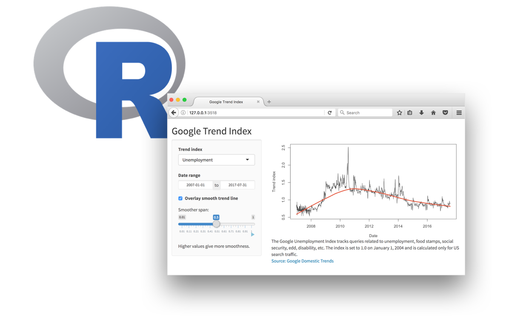
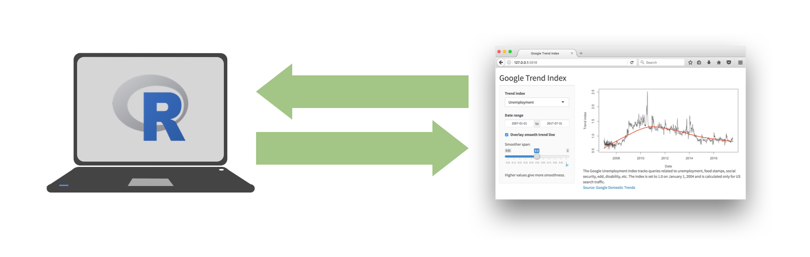
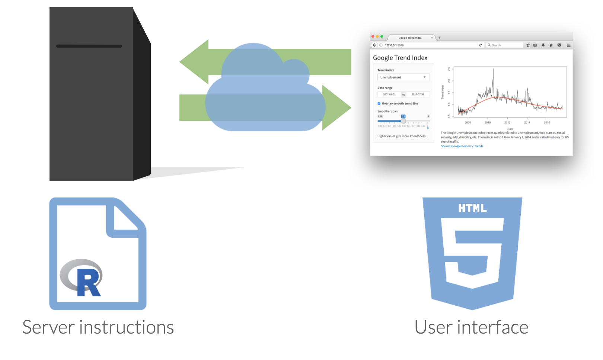

```{r setup, include=FALSE}
knitr::opts_chunk$set(echo = TRUE, message = FALSE, warning = FALSE)

library(countdown)
library(tidyverse)
library(lubridate)
library(palmerpenguins)
library(patchwork)
library(ggthemes)
library(nycflights23)
library(here)
library(httr2)
library(rvest)
slides_theme = theme_minimal(
  base_family = "Atkinson Hyperlegible",
  base_size = 16)

theme_set(slides_theme)
```


## Demo

```{r}
#| echo: false
#| fig-align: center
#| out-width: "100%"
knitr::include_app("https://gallery.shinyapps.io/goog-trend-index/", height = "650px")
```


# Shiny: High level view

## 
Every Shiny app has a webpage that the user visits, <br> and behind this webpage there is a computer that serves this webpage by running R.

```{r echo = FALSE, out.width = "80%"}

```

##  {.center}

When running your app locally, the computer serving your app is your computer.

```{r echo = FALSE, out.width = "100%"}

```

##  {.center}

When your app is deployed, the computer serving your app is a web server.

```{r echo = FALSE, out.width = "100%"}
knitr::include_graphics("../img/shiny-high-level-3.png")
```

##  {.center}

```{r echo = FALSE, out.width = "100%"}

```

## Shiny vs. plotly

- **Shiny** graphs need to be "connected" to RStudio or an Rstudio server

    + Why? Data sets are rewrangled and a new graphic is drawn
    
- **plotly** isn't changing the underlying data set/stats being displayed, can be displayed on webpage without an RStudio session

## Getting started

::: {.nonincremental}

Option 1: Embed a shiny plot/table in HTML docs

- Need add `runtime: shiny` to your YAML header

:::
. . . 

::: {.nonincremental}
Option 2: Can create an `app.R` file with a `ui()` and `server()` function 

- For template <br>`New Files > R Markdown > Shiny - New Files > Shiny Web App`
:::


## What's in an app?

::: columns
::: {.column width="50%"}
```{r eval = FALSE}
library(shiny)
ui <- fluidPage(
  inputs,
  outputs
)


server <- function(
    <reactive functions and code to render output>) {
  ...
}
`

shinyApp(
  ui = ui, 
  server = server
)
```
:::

::: {.column width="50%"}
-   **User interface** controls the layout and appearance of app

-   **Server function** contains instructions needed to build app
:::
:::


## Data: Ask a manager

Source: Ask a Manager Survey via [TidyTuesday](https://github.com/rfordatascience/tidytuesday/tree/master/data/2021/2021-05-18)

> This data does not reflect the general population; it reflects Ask a Manager readers who self-selected to respond, which is a very different group (as you can see just from the demographic breakdown below, which is very white and very female).

Some findings [here](https://www.askamanager.org/2021/05/some-findings-from-24000-peoples-salaries.html).

## Data: `manager-survey.csv`

```{r}
#| message: false
manager <- read_csv("https://stat220-s25.github.io/data/manager-survey.csv")
manager
```


## Ultimate goal

[https://minecr.shinyapps.io/manager-survey](https://minecr.shinyapps.io/manager-survey/)


# Your turn {.maize}

```{r}
#| echo: false

countdown::countdown(10)
```


## Final details

- Shiny apps need to be "connected" to RStudio or a remote RStudio server

- You can deploy shiny apps online
    + using Posit's cloud server (free/fee) - https://www.shinyapps.io/
    + creating a shiny server

