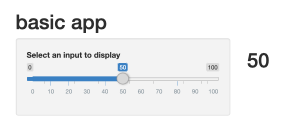
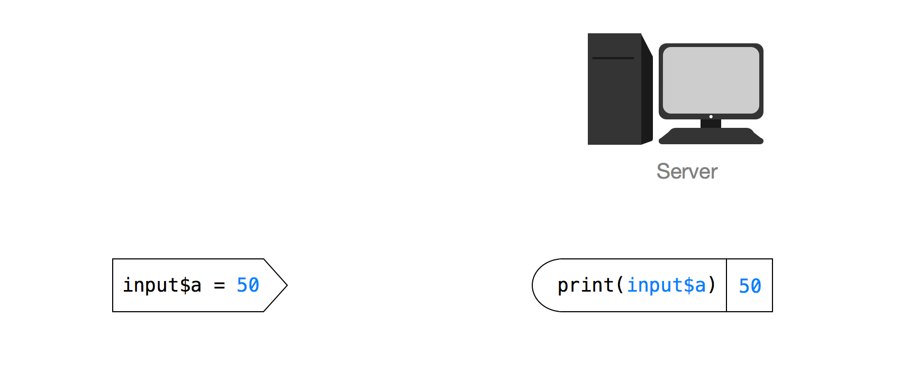
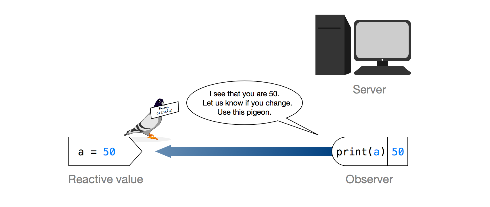
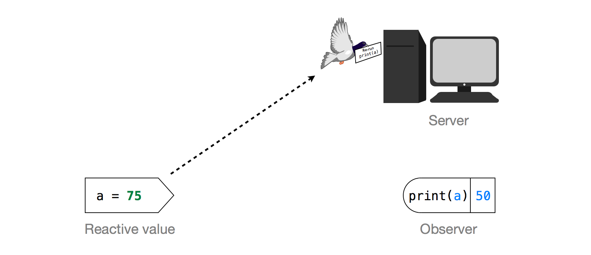
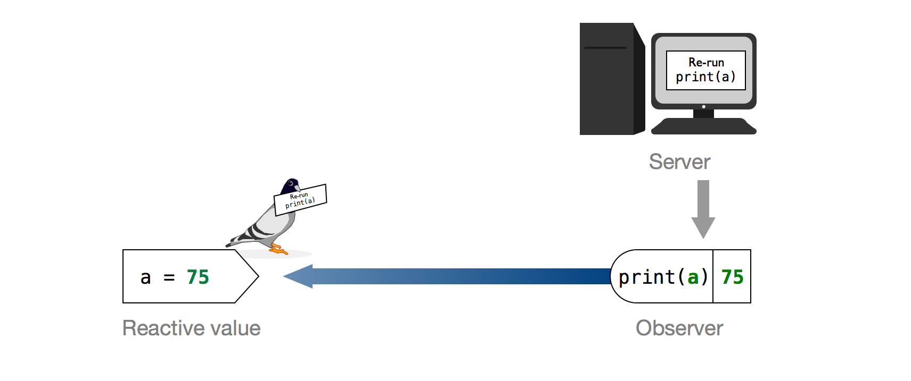
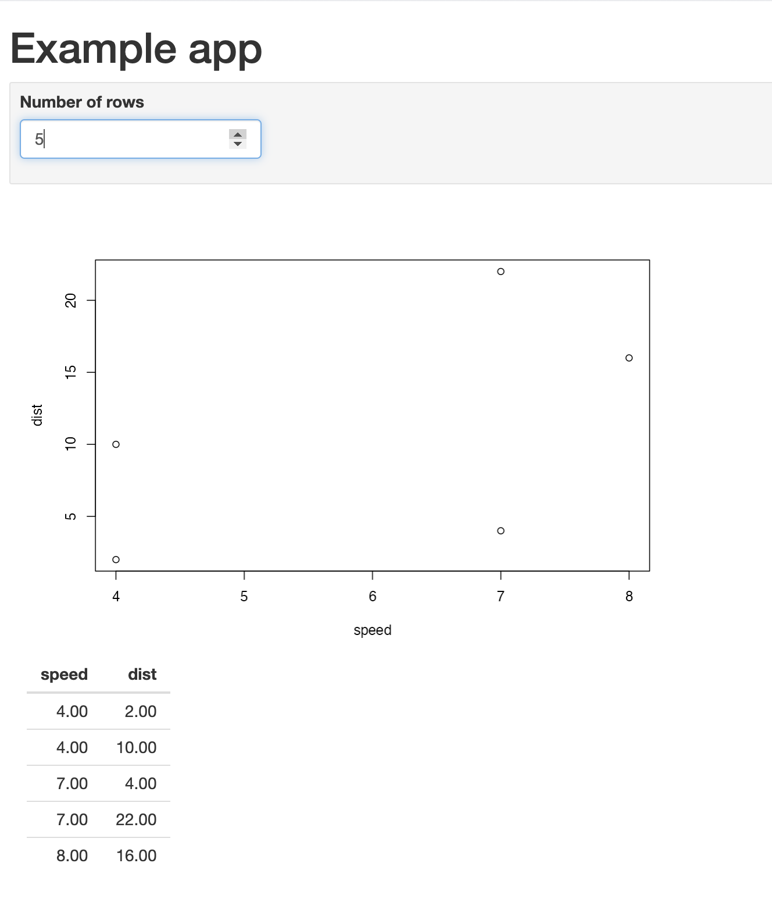

```{r setup, include=FALSE}
knitr::opts_chunk$set(echo = TRUE, message = FALSE, warning = FALSE)

library(countdown)
library(tidyverse)
library(lubridate)
library(palmerpenguins)
library(patchwork)
library(ggthemes)
library(nycflights23)
library(here)
library(httr2)
library(rvest)
slides_theme = theme_minimal(
  base_family = "Atkinson Hyperlegible",
  base_size = 16)

theme_set(slides_theme)
```


## Warm Up: on your own

::: {.task .nonincremental}
Start by opening `24-reactivity.R` 

1.  To begin, you need to understand what the Shiny app is doing. Run the Shiny app. What output changes when you change...

  a.  the number of bootstrap resamples?

  b.  the number of histogram bins?

  c.  the confidence level?

2.  Looking back at #1, are there any surprises? Does anything change/update unexpectedly? Does anything fail to update?
:::

```{r}
#| echo: false
countdown(3)
```

## Warm Up: in groups of ~3

::: {.task .nonincremental}
3.  Discuss your answers to Part 1 with your group and be ready to report back.

4.  Read through the code in the `renderPlot()` and `renderPrint()` reactive expressions. Note the key tasks executed within each.

5.  Based on your answers to #4, Is there any replication? That is, are any key tasks executed multiple times? Record your group's answers and be ready to report back.
:::

```{r}
#| echo: false
countdown(4)
```

# Reactivity {.maize}


## Very basic app

::: columns
::: {.column width="50%"}
```{r eval=FALSE}
# app.R
library(shiny)

ui <- fluidPage(
  headerPanel("basic app"),
  
  sidebarPanel(
    
    sliderInput("a", 
      label = "Select an input to display",
      min = 0, max = 100, value = 50)
  ),
      
  mainPanel(h1(textOutput("text")))
)

server <- function(input, output) {
    output$text <- renderText({
      print(input$a)
    })
}

shinyApp(ui = ui, server = server)
```
:::

::: {.column width="50%"}

:::
:::::

## Declarative programming

```{r eval=FALSE}
output$text <- renderText({
  print(input$a)
})
```

-  DOESN'T mean: print the value and send it to the browser

- DOES mean: this code is the recipe that should be used to print the output
    - if `input$a` changes, use this recipe

## Very basic app


```{r echo=FALSE}

```

::: aside
Image credit: https://shiny.rstudio.com/articles/understanding-reactivity.html
:::

## How does `print(input$a)` know when to change?

```{r echo=FALSE}

```
::: aside
Image credit: https://shiny.rstudio.com/articles/understanding-reactivity.html
:::


## Reactivity via carrier pigeon

```{r echo=FALSE}

```

::: aside
Image credit: https://shiny.rstudio.com/articles/understanding-reactivity.html
:::

## Reactivity via carrier pigeon

```{r echo=FALSE}

```

::: aside
Image credit: https://shiny.rstudio.com/articles/understanding-reactivity.html
:::

## Reactive expressions

- Two definitions:
    + Expression: Code that *produces a value*
    + Reactive: *Detects changes* in anything reactive it reads

- **Reactive expression:** only runs the first time it is called and then it caches its result until it needs to be updated

- create a reactive expression by wrapping a block of code in `reactive({...})`

- use a reactive expression by calling it like a function

## Example

::: panel-tabset

### screenshot

```{r}
#| echo: false

```

### ui

```{r eval=FALSE}
ui <- fluidPage(
  h1("Example app"), # Level-1 header
    inputPanel(
      numericInput("nrows", "Number of rows", 10)
    ),
    mainPanel(
      plotOutput("plot"),
      tableOutput("table")
    )
)
```

### server

```{r eval=FALSE}
server <- function(input, output, session) {
  output$plot <- renderPlot({
    plot(head(cars, input$nrows))
  })
  
  output$table <- renderTable({
    head(cars, input$nrows)
  })
}
```

:::

## Reactive expressions reduce duplication

To reduce duplication, we can create a *reactive expression* for the data selected

```{r eval=FALSE}
server <- function(input, output, session) {
  # Creating a reactive expression for the data
  df <- reactive({
    head(cars, input$nrows)
  })
  
  output$plot <- renderPlot({
    plot(df()) # Now we have to call df() like a function
  })
  
  output$table <- renderTable({
    df()
  })
}
```

## Your turn

::: task
Complete tasks 6-9 in groups of ~3.
:::

```{r}
#| echo: false
countdown(10)
```


## Final details

- Shiny apps need to be "connected" to RStudio or a remote RStudio server

- You can deploy shiny apps online
    + using Posit's cloud server (free/fee) - https://www.shinyapps.io/
    + creating a shiny server

