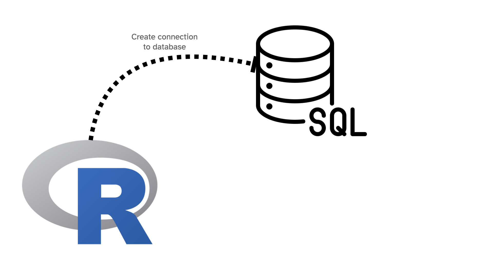
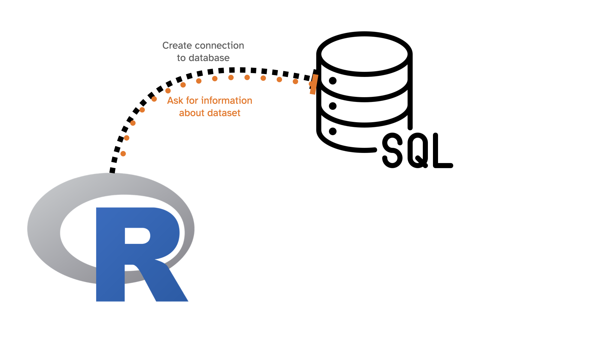
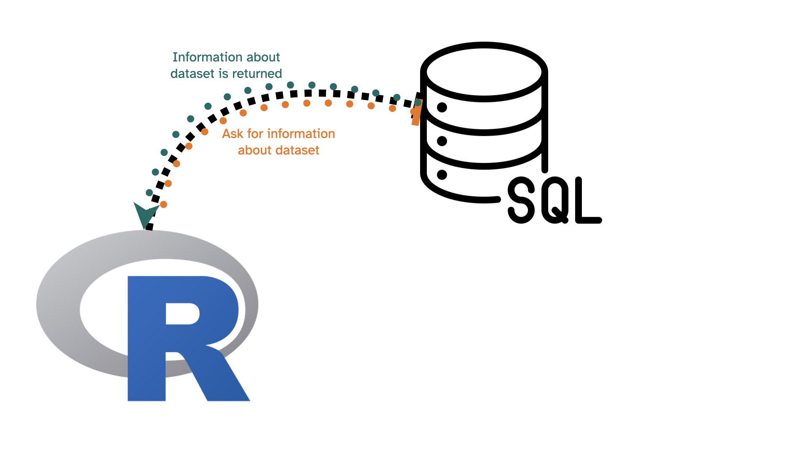

```{r setup, include=FALSE}
knitr::opts_chunk$set(echo = TRUE, message = FALSE, warning = FALSE)

library(countdown)
library(tidyverse)
library(lubridate)
library(palmerpenguins)
library(patchwork)
library(ggthemes)
library(nycflights23)
library(here)
library(httr2)
library(rvest)

slides_theme = theme_minimal(
  base_family = "Atkinson Hyperlegible",
  base_size = 16)

theme_set(slides_theme)
```


## Warm Up: on your own

::: {.task .nonincremental}
Using `nycflights23::flights`, answer the following using {dplyr} code

- How many flights flew to MSP from JFK in 2023?
- What was the average flight delay for MSP flights in Sept 2023?
- What percentage of MSP flights in 2023 were delayed by 15 minutes or more?
:::

```{r}
#| echo: false
countdown(3)
```

## `nycflights23::flights` is a subset of all flights data


```{r}
nycflights23::flights %>%
  select(year) %>%
  distinct()
```
. . . 

```{r}
nycflights23::flights %>% 
  summarize(n = n())
```

. . . 

```{r}
nycflights23::flights %>%
  select(origin) %>%
  distinct()
```


## We can also connect to a database containing more flights data:

```{r}
library(mdsr)
library(DBI)
db <- dbConnect_scidb("airlines")
```
```{r}
#| eval: false
flights <- tbl(db, "flights")
carriers <- tbl(db, "carriers")
airports <- tbl(db, "airports")

class(flights)
```
```
[1] "tbl_MariaDBConnection" "tbl_dbi"               "tbl_sql"              
[4] "tbl_lazy"              "tbl"      
```

## We can access information about `flights` with {dplyr} commands: {.smaller}

```{r}
#| eval: false
flights %>%
  select(year) %>%
  distinct()
```

```
# Source:   SQL [?? x 1]
# Database: mysql  [mdsr_public@mdsr.crcbo51tmesf.us-east-2.rds.amazonaws.com:3306/airlines]
   year
  <int>
1  2013
2  2014
3  2015
```
. . . 

```{r}
#| eval: false
flights %>% summarize(n = n())
```
```
# Source:   SQL [?? x 1]
# Database: mysql  [mdsr_public@mdsr.crcbo51tmesf.us-east-2.rds.amazonaws.com:3306/airlines]
         n
   <int64>
1 18008372
```
::: aside
*Warning:* slow! 
:::


## We can access information about `flights` with {dplyr} commands: {.smaller}

```{r}
#| eval: false
flights %>%
  select(origin) %>%
  distinct()
```
```
# Source:   SQL [?? x 1]
# Database: mysql  [mdsr_public@mdsr.crcbo51tmesf.us-east-2.rds.amazonaws.com:3306/airlines]
   origin
   <chr> 
 1 ABE   
 2 ABI   
 3 ABQ   
 4 ABR   
 5 ABY   
 6 ACK   
 7 ACT   
 8 ACV   
 9 ACY   
10 ADK   
# ℹ more rows
# ℹ Use `print(n = ...)` to see more rows
```

::: aside
*Warning:* slow! 
:::

## What is happening?



## What is happening?



## What is happening?



## If we want to load results into R's memory, use `collect()`

```{r}
#| eval: false
origins <- flights %>%
  select(origin) %>%
  distinct()

class(origins)
```

```
[1] "tbl_MariaDBConnection" "tbl_dbi"               "tbl_sql"              
[4] "tbl_lazy"              "tbl"   
```

```{r}
#| eval: false
origins_tbl <- collect(origins)
class(origins_tbl)
```

```
[1] "tbl_df"     "tbl"        "data.frame"
```

## Under the hood: 

```{r}
#| eval: false

flights %>%
  select(origin) %>%
  distinct()
```

is generating the following SQL code: 

```{r}
#| eval: false
<SQL>
SELECT DISTINCT `origin`
FROM `flights`
```

## SQL

SQL stands for **S**tructured **Q**uery **L**anguage and is a language for database management systems developed in the 1970's

- Up to this point, we've been working with *small* data
  - Can be saved on our personal computers
  - Can be loaded directly into R's memory
- Moving into *medium* data: 
  - Can be saved on our personal computers
  - **Can't** be loaded or worked with in R's memory
  
## SQL 

There are many "dialects" of SQL, but they're all very similar

  - Oracle/MySQL
  - Microsoft SQL Server
  - SQLite
  - MariaDB is a community version of MySQL
  
. . . 

The "dialect" we'll use is MySQL/MariaDB

## SQL

- Point of the next few days is to show you the basics and build a little bit of familiarity with the commands
- The good news: "thinking" in SQL is similar to "thinking" in {dplyr} (even though the syntax is different)

## SQL in R

To run SQL in R, use 

```{r}
#| eval: false
dbGetQuery(db, "<INSERT SQL QUERY HERE>")
```

. . . 

```{r}
dbGetQuery(db, 
"SELECT DISTINCT `origin`
FROM `flights`")
```

# A quick overview of SQL commands

## `SELECT` and `FROM`

are required for every query. The simplest query we can write is: 

```{r}
#| eval: false

SELECT * FROM flights;
```

. . . 

which means "select everything from the flights dataset". 

**DO NOT EXECUTE THIS QUERY!** This will cause all 169 million records to be dumped! This will not only crash your machine, but also tie up the server for everyone else. 

A safe version is: 

```{r}
#| eval: false

SELECT * FROM flights LIMIT 0,10;
```

## `LIMIT`

is similar to `head()` or `slice()`

```{r}
#| eval: false
dbGetQuery(db, 
"SELECT DISTINCT `origin`
FROM `flights`
LIMIT 0,5")
```
```
  origin
1    ABE
2    ABI
3    ABQ
4    ABR
5    ABY
```

## Create new variables with `SELECT` and `AS`

```{r}
#| eval: false

SELECT SUM(1) AS numFlights
FROM flights
```

```{r}
#| echo: false
#| eval: false
dbGetQuery(db, 
"SELECT SUM(1) AS numFlights
FROM flights")
```
```
  numFlights
1   18008372
```

## Grouped operations with `GROUP BY`

```{r}
#| eval: false

SELECT 
  origin, SUM(1) AS numFlights,
  AVG(arr_delay) AS avg_arr_delay
FROM flights
GROUP BY origin
LIMIT 0, 6;
```

```{r}
#| echo: false
#| eval: false
dbGetQuery(db, 
"SELECT 
  origin, SUM(1) AS numFlights,
  AVG(arr_delay) AS avg_arr_delay
FROM flights
GROUP BY origin
LIMIT 0, 6;")
```
```
  origin numFlights avg_arr_delay
1    ABE       7251        5.5627
2    ABI       8116        6.3329
3    ABQ      74195        5.8051
4    ABR       2239        1.3198
5    ABY       3002        5.2652
6    ACK       1295        7.6131
```

## Order output with `ORDER BY`

Similar to `arrange()` in {dplyr}

```{r}
#| eval: false

SELECT 
  origin, SUM(1) AS numFlights,
  AVG(arr_delay) AS avg_arr_delay
FROM flights
GROUP BY origin
ORDER BY avg_arr_delay DESC
LIMIT 0, 6;
```

```{r}
#| echo: false
#| eval: false
dbGetQuery(db, 
"SELECT 
  origin, SUM(1) AS numFlights,
  AVG(arr_delay) AS avg_arr_delay
FROM flights
GROUP BY origin
ORDER BY avg_arr_delay DESC
LIMIT 0, 6;")
```
```
  origin numFlights avg_arr_delay
1    PPG        334       33.6946
2    STC        550       22.8691
3    OTH       1262       20.5713
4    FOE        449       19.7127
5    CEC       2143       18.4951
6    ILG       1155       16.5394
```

## Filter output with `WHERE`

```{r}
#| eval: false

SELECT 
  origin, SUM(1) AS numFlights,
  AVG(arr_delay) AS avg_arr_delay
FROM flights
WHERE dest = 'MSP'
  AND numFlights > 365 * 2
GROUP BY origin
ORDER BY avg_arr_delay DESC
LIMIT 0, 6;
```

```{r}
#| echo: false
#| eval: false
dbGetQuery(db, 
"SELECT 
  origin, SUM(1) AS numFlights,
  AVG(arr_delay) AS avg_arr_delay
FROM flights
WHERE dest = 'MSP'
  AND numFlights > 365 * 2
GROUP BY origin
ORDER BY avg_arr_delay DESC
LIMIT 0, 6;")
```

```
  origin numFlights avg_arr_delay
1    ASE         43       28.0930
2    HRL        131       27.0687
3    ORF        483       17.8240
4    EGE         31       17.4516
5    TTN        290       17.1552
6    ORD      18382       12.7469
```

## Filter output on multiple conditions

```{r}
#| eval: false

SELECT 
  origin, SUM(1) AS numFlights,
  AVG(arr_delay) AS avg_arr_delay
FROM flights
WHERE dest = 'MSP'
  AND numFlights > 365 * 2
GROUP BY origin
ORDER BY avg_arr_delay DESC
LIMIT 0, 6;
```

```{r}
#| echo: false
#| eval: false
dbGetQuery(db, 
"SELECT 
  origin, SUM(1) AS numFlights,
  AVG(arr_delay) AS avg_arr_delay
FROM flights
WHERE dest = 'MSP'
  AND numFlights > 365 * 2
GROUP BY origin
ORDER BY avg_arr_delay DESC
LIMIT 0, 6;")
```

```
Error: Unknown column 'numFlights' in 'WHERE' [1054]
```

Doesn't work, since `numFlights` is a column we created in `SELECT`

## Filter output with `HAVING`

If we want to filter based on a column we created, put it in the `HAVING` clause instead

```{r}
#| eval: false

SELECT 
  origin, SUM(1) AS numFlights,
  AVG(arr_delay) AS avg_arr_delay
FROM flights
WHERE dest = 'MSP'
GROUP BY origin
HAVING numFlights > 365 * 2
ORDER BY avg_arr_delay DESC
LIMIT 0, 6;
```

```{r}
#| echo: false
#| eval: false
dbGetQuery(db, 
"SELECT 
  origin, SUM(1) AS numFlights,
  AVG(arr_delay) AS avg_arr_delay
FROM flights
WHERE dest = 'MSP'
GROUP BY origin
HAVING numFlights > 365 * 2
ORDER BY avg_arr_delay DESC
LIMIT 0, 6;")
```

```
  origin numFlights avg_arr_delay
1    ORD      18382       12.7469
2    MDW       9510        9.6110
3    DEN      17054        9.0643
4    CID       2106        8.2042
5    RIC       1009        7.8840
6    DFW       8404        7.2574
```

## SQL commands must be written in a specific order: 

1. `SELECT`
2. `FROM`
3. `JOIN` (next class)
4. `WHERE`
5. `GROUP BY`
6. `HAVING`
7. `ORDER BY`
8. `LIMIT`

## Your turn

Try the exercises in the `25-databases` activity. We'll start Friday off by talking about them
