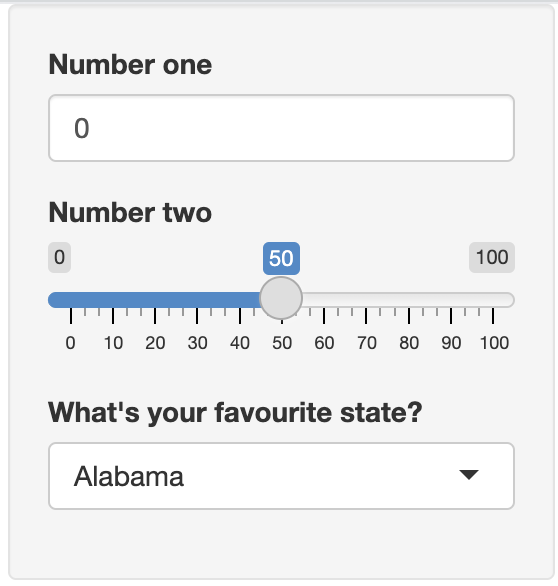
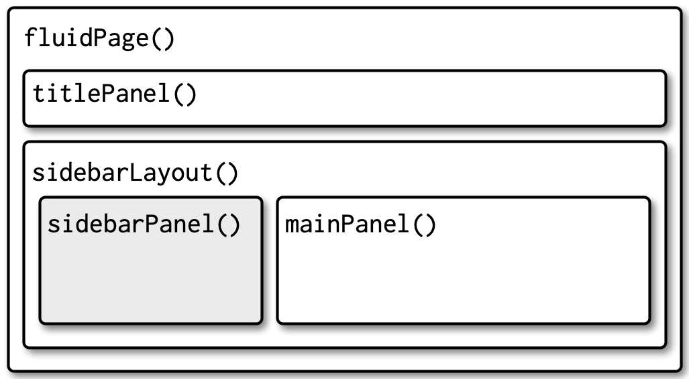
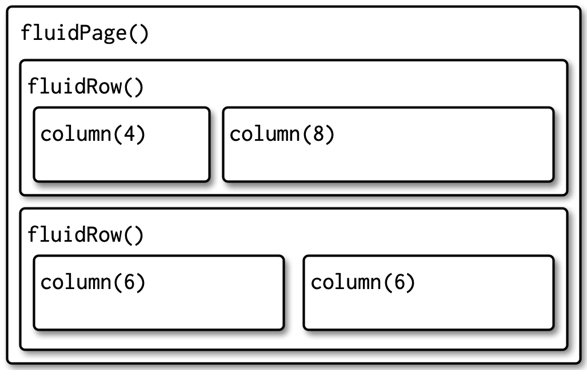
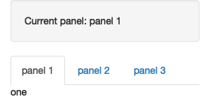
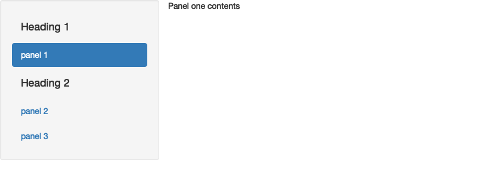
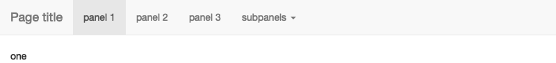
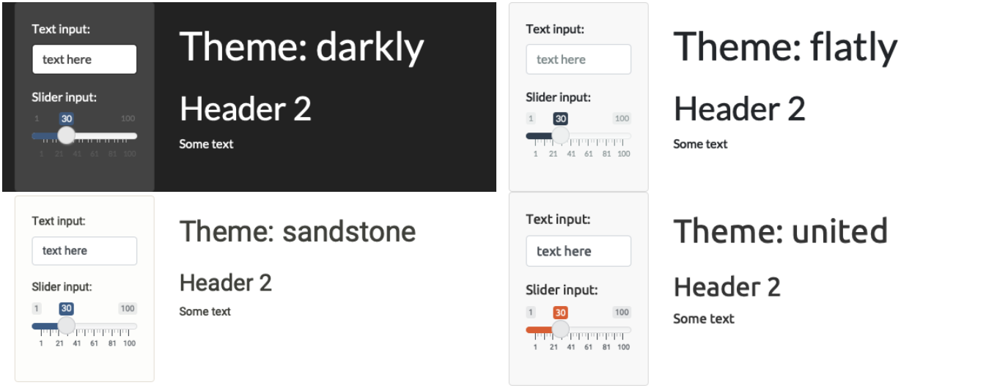
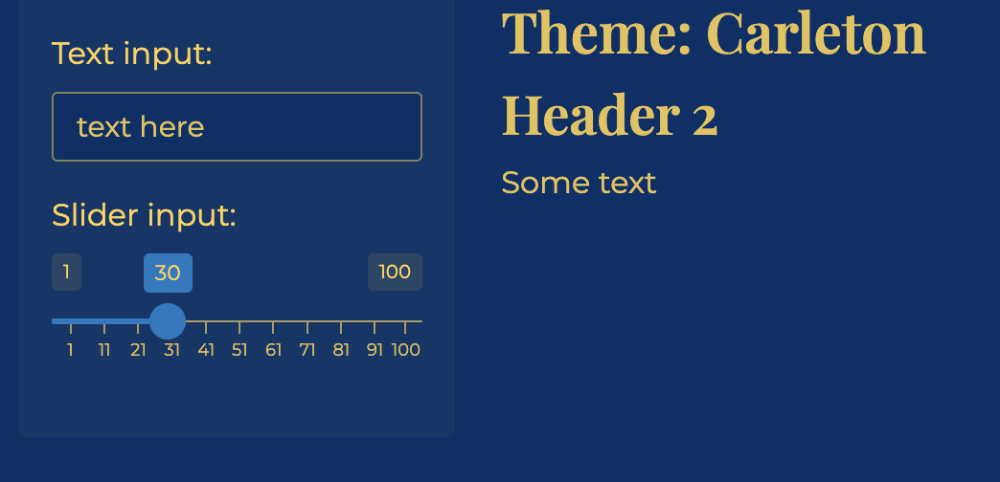
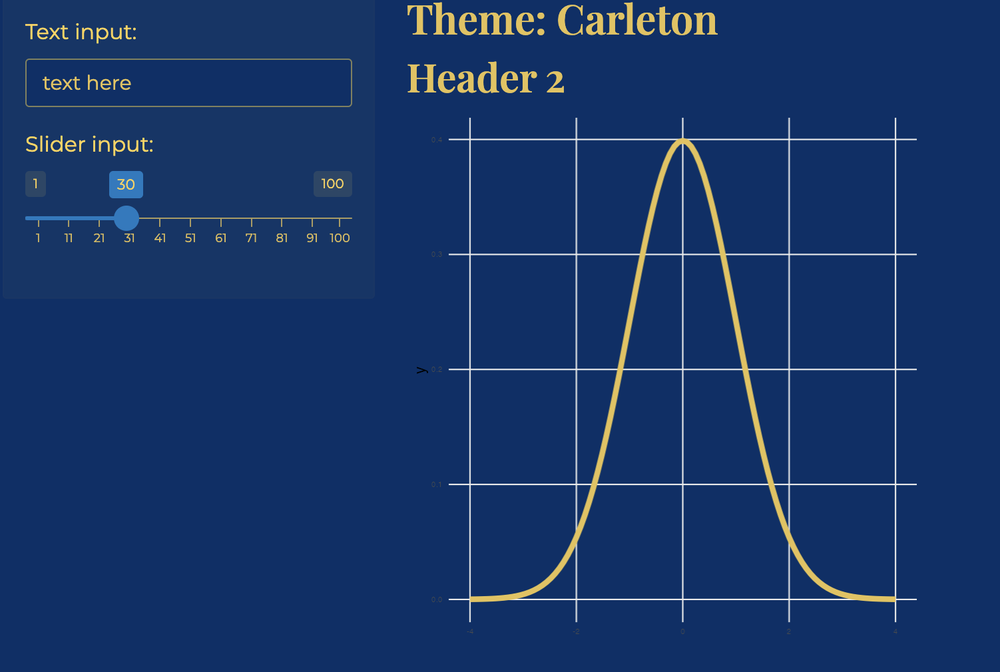
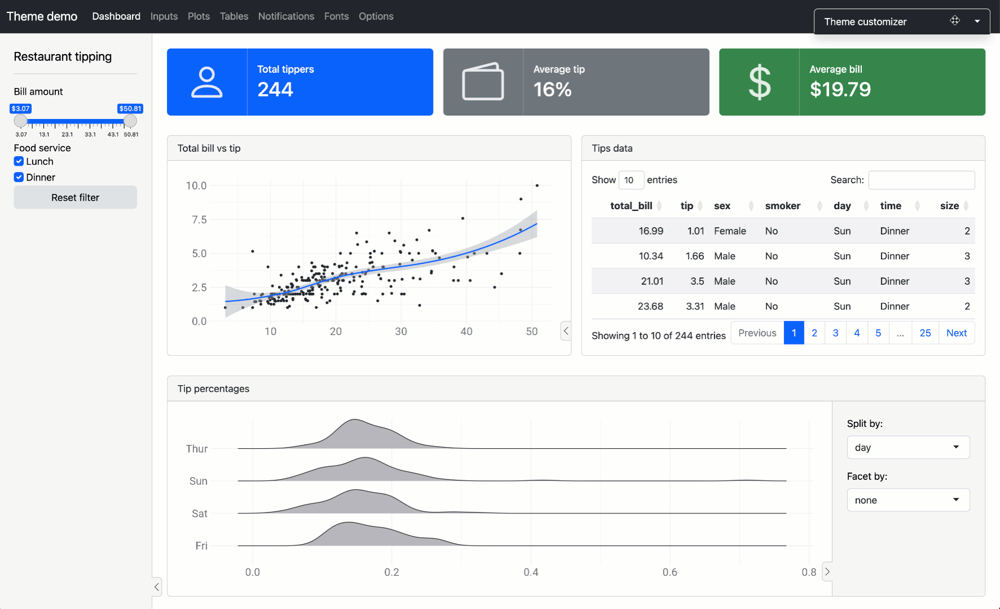

```{r setup, include=FALSE}
knitr::opts_chunk$set(echo = TRUE, message = FALSE, warning = FALSE)

library(countdown)
library(tidyverse)
library(lubridate)
library(palmerpenguins)
library(patchwork)
library(ggthemes)
library(nycflights23)
library(here)
library(httr2)
library(rvest)

slides_theme = theme_minimal(
  base_family = "Atkinson Hyperlegible",
  base_size = 16)

theme_set(slides_theme)
```

## Warm up{.smaller}

::: {.task .nonincremental}
Open the following shinyapps and explore a little bit. 

+ [Data Wrangling](https://psu-eberly.shinyapps.io/data_wrangling/)
+ [Biodiversity in NPS](https://abenedetti.shinyapps.io/bioNPS/)
+ [Hex Memory Game](https://dreamrs.shinyapps.io/memory-hex/)
+ [Lake Profile Dashboard](https://gallery.shinyapps.io/lake-profile-dashboard/)
+ [Classification Trees](https://asluby.shinyapps.io/GSS_classification/)

With the folks around you, discuss: 

1. Did any apps stand out as enjoyable or useful? 
2. What features or design choices make an app stand out? 
3. Are there any small tweaks you could make to make them more usable?
:::

```{r}
#| echo: false

countdown::countdown(6)
```

# AskAManager app 

<https://minecr.shinyapps.io/manager-survey/>

## Your turn

I've posted a new version of the app at <https://stat220-s25.github.io/files/25-starter-app.R>

::: {.task .nonincremental}
- Move the initial data preparation code to an R **script** called `data-prep.R`
- Write the cleaned dataset to a CSV or .Rds file
    + `write_rds(manager_survey, "manager-survey/data/manager-survey.rds")`
- In the `app.R` file, load the data with `read_csv`
    + `manager_survey <- read_rds("data/manager-survey.rds")`
:::

```{r}
#| echo: false
countdown::countdown(3)
```
 
## Shiny inputs

:::: {.columns}

::: {.column width="50%"}
```{r}
#| eval: false

xxxxInput("id", 
          "Label", 
          value,
          choices)
```
:::

::: {.column width="50%"}
- `"id"` is how you refer to the input in the server function (`input$id`)
- `"Label"` is how the input is labeled in the app
- `value` refers to the default value (not all inputs have this option)
- `choices` refers to the possible options that are listed (not all inputs have this option)
:::

::::


## Shiny inputs

:::: {.columns}

::: {.column width="60%"}

```{r}
#| eval: false
ui <- fluidPage(
  numericInput("num", "Number one", value = 0, min = 0, max = 100),
  sliderInput("num2", "Number two", value = 50, min = 0, max = 100),
  selectInput("state", "What's your favourite state?", state.name)
)
```

:::

::: {.column width="40%"}

:::
::::

## Your turn

::: {.task .nonincremental}
- Add a `sliderInput` to the appropriate tab panel
```{r}
#| eval: false
sliderInput(
  inputId = "ylim",
  label = _______ ,
  min = 0,
  value = c(0, 1000000),
  max = __________,
  width = "100%"
)
```
- Edit your ggplot code for the individual salary plot to display only the data points that are within these slider values
:::

```{r}
#| echo: false
countdown::countdown(4)
```

# Layouts {.maize}

## Page with sidebar

:::: {.columns}

::: {.column width="40%"}
```{r}
#| eval: false

fluidPage(
  titlePanel(
    # app title/description
  ),
  sidebarLayout(
    sidebarPanel(
      # inputs
    ),
    mainPanel(
      # outputs
    )
  )
)
```
:::


::: {.column width="60%"}

:::
::::

## Multi-row

:::: {.columns}

::: {.column width="40%"}
```{r}
#| eval: false

fluidPage(
  fluidRow(
    column(4, 
      ...
    ),
    column(8, 
      ...
    )
  ),
  fluidRow(
    column(6, 
      ...
    ),
    column(6, 
      ...
    )
  )
)
```
:::


::: {.column width="60%"}

:::
::::

## Multi-page: Tabsets

:::: {.columns}

::: {.column width="60%"}
```{r}
#| eval: false

ui <- fluidPage(
  sidebarLayout(
    sidebarPanel(
      textOutput("panel")
    ),
    mainPanel(
      tabsetPanel(
        id = "tabset",
        tabPanel("panel 1", "one"),
        tabPanel("panel 2", "two"),
        tabPanel("panel 3", "three")
      )
    )
  )
)
server <- function(input, output, session) {
  output$panel <- renderText({
    paste("Current panel: ", input$tabset)
  })
}
```
:::


::: {.column width="40%"}

:::
::::


## Multi-page: nav list

:::: {.columns}

::: {.column width="50%"}
```{r}
#| eval: false

ui <- fluidPage(
  navlistPanel(
    id = "tabset",
    "Heading 1",
    tabPanel("panel 1", "Panel one contents"),
    "Heading 2",
    tabPanel("panel 2", "Panel two contents"),
    tabPanel("panel 3", "Panel three contents")
  )
)
```
:::


::: {.column width="50%"}

:::
::::


## Multi-page: nav bar

:::: {.columns}

::: {.column width="50%"}
```{r}
#| eval: false

ui <- navbarPage(
  "Page title",   
  tabPanel("panel 1", "one"),
  tabPanel("panel 2", "two"),
  tabPanel("panel 3", "three"),
  navbarMenu("subpanels", 
    tabPanel("panel 4a", "four-a"),
    tabPanel("panel 4b", "four-b"),
    tabPanel("panel 4c", "four-c")
  )
)
```
:::


::: {.column width="50%"}

:::
::::

# Theming {.maize}

## Theming: built-in themes

```{r}
#| eval: false


fluidPage(
  theme = bslib::bs_theme(...)
)
```



## Theming: customize {.nostretch}

```{r}
#| eval: false

fluidPage(
  theme = bslib::bs_theme(
    bg = "#003069", 
    fg = "#ffd24f", 
    base_font = "Montserrat",
    heading_font = "Playfair Display SemiBold"
)
```

{width="50%" fig-align="center"}


## Plot theming {.nostretch}

```{r}
#| eval: false
#| code-line-number: 2

server <- function(input, output, session) {
  thematic::thematic_shiny()
  
  output$distPlot <- renderPlot({
    ggplot(...)
  })
}
```


{width="50%" fig-align="center"}

## {.nostretch}

Add `theme = bslib::bs_theme()` to your `ui()` function, and `bslib::bs_themer()` to your server function to try out different options interactively



## Your turn

::: {.task .nonincremental}
- Add a custom theme to the AskAManager app
- Update the ggplot themes to match
:::

```{r}
#| echo: false
countdown::countdown(4)
```

## Deploying an app {.smaller}

::: {.nonincremental}
- Shiny apps need to be "connected" to RStudio or a remote RStudio server

- You can deploy shiny apps online
    + using Posit's cloud server (free/fee) - https://www.shinyapps.io/
        - ["Getting started"](https://docs.posit.co/shinyapps.io/guide/getting_started/) guide will walk you through connecting RStudio to your shinyapps.io account
        - note: there is also now an option to deploy via Connect Cloud from your github. Feel free to try it!
    + creating a shiny server

- Your app and files should be in their own **folder** and the entire folder is what you "deploy". You do *not* want multiple `app.R` or `.Rmd` files in that folder! 
:::
