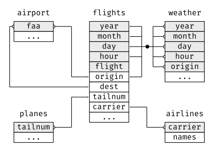

```{r setup, include=FALSE}
knitr::opts_chunk$set(echo = TRUE, message = FALSE, warning = FALSE)

library(countdown)
library(tidyverse)
library(lubridate)
library(palmerpenguins)
library(patchwork)
library(ggthemes)
library(nycflights23)
library(here)
library(httr2)
library(rvest)

slides_theme = theme_minimal(
  base_family = "Atkinson Hyperlegible",
  base_size = 16)

theme_set(slides_theme)
```

## Warm Up: on your own

::: {.task .nonincremental}
Using `nycflights23::flights`, answer the following using {dplyr} code

- How many flights are in this dataset?
- How many flights flew to MSP from JFK in 2023?
- What was the average flight delay for MSP flights in Sept 2023?
:::

```{r}
#| echo: false
countdown(3)
```

## `nycflights23::flights` is a subset of all flights data


```{r}
nycflights23::flights %>%
  select(year) %>%
  distinct()
```
. . . 

```{r}
nycflights23::flights %>% 
  summarize(n = n())
```

. . . 

```{r}
nycflights23::flights %>%
  select(origin) %>%
  distinct()
```


## We can also connect to a database containing more flights data:

```{r}
library(mdsr)
library(DBI)
db <- dbConnect_scidb("airlines")
```

```{r}
#| eval: false
flights <- tbl(db, "flights")
carriers <- tbl(db, "carriers")
airports <- tbl(db, "airports")

class(flights)
```
```
[1] "tbl_MariaDBConnection" "tbl_dbi"               "tbl_sql"              
[4] "tbl_lazy"              "tbl"      
```

## We can access information about `flights` with {dplyr} commands: {.smaller}

```{r}
#| eval: false
flights %>%
  select(year) %>%
  distinct()
```

```
# Source:   SQL [?? x 1]
# Database: mysql  [mdsr_public@mdsr.crcbo51tmesf.us-east-2.rds.amazonaws.com:3306/airlines]
   year
  <int>
1  2013
2  2014
3  2015
```
. . . 

```{r}
#| eval: false
flights %>% summarize(n = n())
```
```
# Source:   SQL [?? x 1]
# Database: mysql  [mdsr_public@mdsr.crcbo51tmesf.us-east-2.rds.amazonaws.com:3306/airlines]
         n
   <int64>
1 18008372
```
::: aside
*Warning:* slow! 
:::


## What is happening?


## What is happening?


## What is happening?


## Under the hood: 

```{r}
#| eval: false

flights %>%
  select(origin) %>%
  distinct()
```

is generating the following SQL code: 

```{r}
#| eval: false
<SQL>
SELECT DISTINCT `origin`
FROM `flights`
```

and sending the request to the SQL server where the data lives. The result then gets sent back to R

## SQL

SQL stands for **S**tructured **Q**uery **L**anguage and is a language for database management systems developed in the 1970's

- Up to this point, we've been working with *small* data
  - Can be saved on our personal computers
  - Can be loaded directly into R's memory
- Moving into *medium* data: 
  - Can be saved on our personal computers
  - **Can't** be loaded or worked with in R's memory

## SQL 

There are many "dialects" of SQL, but they're all very similar

  - Oracle/MySQL
  - Microsoft SQL Server
  - SQLite
  - MariaDB is a community version of MySQL
  
. . . 

The "dialect" we'll use is MySQL/MariaDB

## SQL

- LOTS of data science jobs expect some basic SQL knowledge
- Databases are a "safer" way to store data within an organization than passing around .csv files
- Point of the next few days is to show you the basics and build a little bit of familiarity with the commands
- The good news: "thinking" in SQL is similar to "thinking" in {dplyr} (even though the syntax is different)

## SQL in R

To run SQL in R, use 

```{r}
#| eval: false
dbGetQuery(db, "<INSERT SQL QUERY HERE>")
```

. . . 

```{r}
#| eval: false
dbGetQuery(db, 
"SELECT DISTINCT `origin`
FROM `flights`")
```

```
    origin
1      ABE
2      ABI
3      ABQ
4      ABR
5      ABY
6      ACK
7      ACT
8      ACV
9      ACY
10     ADK
11     ADQ
12     AEX
13     AGS
14     AKN
15     ALB
16     ALO
17     AMA
18     ANC
19     APN
20     ART
21     ASE
22     ATL
23     ATW
24     AUS
25     AVL
26     AVP
27     AZA
28     AZO
29     BDL
30     BET
31     BFL
32     BGM
33     BGR
34     BHM
35     BIL
36     BIS
37     BJI
38     BKG
39     BLI
40     BMI
41     BNA
42     BOI
43     BOS
44     BPT
45     BQK
46     BQN
47     BRD
48     BRO
49     BRW
50     BTM
51     BTR
52     BTV
53     BUF
54     BUR
55     BWI
56     BZN
57     CAE
58     CAK
59     CDC
60     CDV
61     CEC
62     CHA
63     CHO
64     CHS
65     CIC
66     CID
67     CIU
68     CLD
69     CLE
70     CLL
71     CLT
72     CMH
73     CMI
74     CMX
75     CNY
76     COD
77     COS
78     COU
79     CPR
80     CRP
81     CRW
82     CSG
83     CVG
84     CWA
85     CYS
86     DAB
87     DAL
88     DAY
89     DBQ
90     DCA
91     DEN
92     DFW
93     DHN
94     DIK
95     DLG
96     DLH
97     DRO
98     DRT
99     DSM
100    DTW
101    DVL
102    EAU
103    ECP
104    EGE
105    EKO
106    ELM
107    ELP
108    ERI
109    ESC
110    EUG
111    EVV
112    EWN
113    EWR
114    EYW
115    FAI
116    FAR
117    FAT
118    FAY
119    FCA
120    FLG
121    FLL
122    FNT
123    FOE
124    FSD
125    FSM
126    FWA
127    GCC
128    GCK
129    GEG
130    GFK
131    GGG
132    GJT
133    GNV
134    GPT
135    GRB
136    GRI
137    GRK
138    GRR
139    GSO
140    GSP
141    GST
142    GTF
143    GTR
144    GUC
145    GUM
146    HDN
147    HIB
148    HLN
149    HNL
150    HOB
151    HOU
152    HPN
153    HRL
154    HSV
155    HYA
156    HYS
157    IAD
158    IAG
159    IAH
160    ICT
161    IDA
162    ILG
163    ILM
164    IMT
165    IND
166    INL
167    IPL
168    ISN
169    ISP
170    ITH
171    ITO
172    IYK
173    JAC
174    JAN
175    JAX
176    JFK
177    JLN
178    JMS
179    JNU
180    KOA
181    KTN
182    LAN
183    LAR
184    LAS
185    LAW
186    LAX
187    LBB
188    LBE
189    LCH
190    LEX
191    LFT
192    LGA
193    LGB
194    LIH
195    LIT
196    LMT
197    LNK
198    LRD
199    LSE
200    LWS
201    MAF
202    MBS
203    MCI
204    MCN
205    MCO
206    MDT
207    MDW
208    MEI
209    MEM
210    MFE
211    MFR
212    MGM
213    MHK
214    MHT
215    MIA
216    MKE
217    MKG
218    MLB
219    MLI
220    MLU
221    MMH
222    MOB
223    MOD
224    MOT
225    MQT
226    MRY
227    MSN
228    MSO
229    MSP
230    MSY
231    MTJ
232    MVY
233    MYR
234    OAJ
235    OAK
236    OGG
237    OKC
238    OMA
239    OME
240    ONT
241    ORD
242    ORF
243    ORH
244    OTH
245    OTZ
246    PAH
247    PBG
248    PBI
249    PDX
250    PHF
251    PHL
252    PHX
253    PIA
254    PIB
255    PIH
256    PIT
257    PLN
258    PNS
259    PPG
260    PSC
261    PSE
262    PSG
263    PSP
264    PUB
265    PVD
266    PWM
267    RAP
268    RDD
269    RDM
270    RDU
271    RFD
272    RHI
273    RIC
274    RKS
275    RNO
276    ROA
277    ROC
278    ROW
279    RST
280    RSW
281    SAF
282    SAN
283    SAT
284    SAV
285    SBA
286    SBN
287    SBP
288    SCC
289    SCE
290    SDF
291    SEA
292    SFO
293    SGF
294    SGU
295    SHD
296    SHV
297    SIT
298    SJC
299    SJT
300    SJU
301    SLC
302    SMF
303    SMX
304    SNA
305    SPI
306    SPN
307    SPS
308    SRQ
309    STC
310    STL
311    STT
312    STX
313    SUN
314    SUX
315    SWF
316    SYR
317    TLH
318    TOL
319    TPA
320    TRI
321    TTN
322    TUL
323    TUS
324    TVC
325    TWF
326    TXK
327    TYR
328    TYS
329    UST
330    VEL
331    VLD
332    VPS
333    WRG
334    WYS
335    XNA
336    YAK
337    YUM
```


# A quick overview of SQL commands

## `SELECT` and `FROM`

are required for every query. The simplest query we can write is: 

```{r}
#| eval: false

SELECT * FROM flights;
```

which means "select everything from the flights dataset". 

. . . 

**DO NOT EXECUTE THIS QUERY!** This will cause all 169 million records to be dumped! This will not only crash your computer, but also tie up the server for everyone else. 

A safe version is: 

```{r}
#| eval: false

SELECT * FROM flights LIMIT 0,10;
```

## `LIMIT`

is similar to `head()` or `slice()`

```{r}
#| eval: false
dbGetQuery(db, 
"SELECT DISTINCT `origin`
FROM `flights`
LIMIT 0,5")
```
```
  origin
1    ABE
2    ABI
3    ABQ
4    ABR
5    ABY
```

## Your turn

::: {.task .nonincremental}
Run the following code to connect to the imdb database. This data lives in the basement of Bass Hall at Smith College. 

```{r}
#| eval: false
library(mdsr)
library(DBI)
db <- dbConnect_scidb(dbname = "imdb")
```

Check that your connection works by running the following "query"

```{r}
#| eval: false

db %>%
  dbGetQuery("SELECT * FROM kind_type
             LIMIT 0,10;")
```

What `kind_type` number corresponds to "movies"?
:::

```{r}
#| echo: false

countdown::countdown(1)
```

## `WHERE` is similar to `filter()`

::::: columns
::: {.column width="60%"}
```{r}
#| eval: false

db %>%
  dbGetQuery("SELECT *
              FROM title
              WHERE title = 'The Empire Strikes Back';")
```
```
        id                   title imdb_index kind_id production_year  
1   476823 The Empire Strikes Back       <NA>       7            1980      
2   461950 The Empire Strikes Back       <NA>       7            2015     
3   919851 The Empire Strikes Back       <NA>       7            2015    
4   924929 The Empire Strikes Back       <NA>       7            2017   
5  1751199 The Empire Strikes Back       <NA>       7            2003   
6  1890901 The Empire Strikes Back       <NA>       7            2016   
7  2530173 The Empire Strikes Back       <NA>       7            2005   
8  2780701 The Empire Strikes Back       <NA>       7            1986   
9  2916719 The Empire Strikes Back       <NA>       7            2012  
10 4346960 The Empire Strikes Back       <NA>       6            1992   
```
:::

::: {.column width="40%"}
{width="80%"}
:::

::::

## Restricting to `kind_id = 1`

```{r}
#| eval: false
db %>%
  dbGetQuery("SELECT *
              FROM title
              WHERE title = 'The Empire Strikes Back'
                AND kind_id = 1;")
```

```
 [1] id              title           imdb_index      kind_id         production_year imdb_id         phonetic_code  
 [8] episode_of_id   season_nr       episode_nr      series_years    md5sum         
<0 rows> (or 0-length row.names)
```

Now we get zero results! 

## Soften search so no longer need exact match with `LIKE`

- Similar to regex
- `%` is the "wildcard" character in SQL

. . . 
```{r}
#| eval: false
db %>%
  dbGetQuery("SELECT *
              FROM title
              WHERE title LIKE '%The Empire Strikes Back%'
                AND kind_id = 1;")
```
 
. . . 

```
       id                                          title imdb_index kind_id production_year imdb_id phonetic_code
1 4260164 Star Wars: Episode V - The Empire Strikes Back       <NA>       1            1980      NA         S3621
2 4346961       The Empire Strikes Back Part II (Parody)       <NA>       1            2016      NA         E5162
  episode_of_id season_nr episode_nr series_years                           md5sum
1            NA        NA         NA         <NA> 99c3b6266cd096147b1d7af2b8353edb
2            NA        NA         NA         <NA> 759372cfa023e3f7485dfe0db5bdc13d
```

## `ORDER BY` is like `arrange()` 

```{r}
#| eval: false
db %>%
  dbGetQuery("SELECT *
              FROM title
              WHERE title LIKE '%The Empire Strikes Back%'
                AND kind_id = 1
             ORDER BY production_year;")
```
```
       id                                          title imdb_index kind_id production_year imdb_id phonetic_code
1 4260164 Star Wars: Episode V - The Empire Strikes Back       <NA>       1            1980      NA         S3621
2 4346961       The Empire Strikes Back Part II (Parody)       <NA>       1            2016      NA         E5162
  episode_of_id season_nr episode_nr series_years                           md5sum
1            NA        NA         NA         <NA> 99c3b6266cd096147b1d7af2b8353edb
2            NA        NA         NA         <NA> 759372cfa023e3f7485dfe0db5bdc13d
```

## Your turn

::: {.task .nonincremental}
1.  Find your favorite movie in the `title` table
2. Find [Viola Davis](https://www.imdb.com/name/nm0205626/?ref_=nv_sr_1) in the `name` table 
3.  Make note of Viola Davis's `id` 
:::

*Note:* The first few rows/columns of the `name` table look like this: 

```
     id                        name imdb_index imdb_id gender name_pcode_cf
1   235 -Alverio, Esteban Rodriguez       <NA>      NA      m         A4162
2   921       Aaberge, Theodor Olai       <NA>      NA      m         A1623
3  1698                     Aarudra       <NA>      NA      m          A636
4  1189              Aaltonen, Miro       <NA>      NA      m         A4356
5  2755            Abbas, Mubasshir       <NA>      NA      m         A1251
6  2821             Abbasi, Kurosch       <NA>      NA      m         A1262
7   779            A., Narayana Rao       <NA>      NA      m         A5656
```

```{r}
#| echo: false
countdown(3)
```

## Extracting table info 

The following code chunk lists all of the tables available in the IMDB

```{r}
#| eval: false
table_names <- dbListTables(db)
table_names
```

```
 [1] "title"           "link_type"       "person_info"     "movie_info"     
 [5] "movie_companies" "complete_cast"   "movie_keyword"   "company_type"   
 [9] "keyword"         "role_type"       "movie_link"      "cast_info"      
[13] "company_name"    "kind_type"       "aka_title"       "char_name"      
[17] "name"            "info_type"       "comp_cast_type"  "aka_name"       
[21] "movie_info_idx" 
```

and we can pull out fields (columns) in each table with `dbListFields`

```{r}
#| eval: false
dbListFields(db, "title")
```
```
 [1] "id"              "title"           "imdb_index"      "kind_id"        
 [5] "production_year" "imdb_id"         "phonetic_code"   "episode_of_id"  
 [9] "season_nr"       "episode_nr"      "series_years"    "md5sum"  
 ```

## Your turn

::: {.task .nonincremental}
List the fields in the `name`, `cast_info`, and `char_name` tables. Do they have fields in common? How do you think these tables fit together?
:::

```{r}
#| echo: false
countdown(3)
```

## Finding cast info for *The Empire Strikes Back*

```{r}
#| eval: false


db %>%
  dbGetQuery("SELECT *
              FROM cast_info
              WHERE movie_id = 4260164;")
```

```
          id person_id movie_id person_role_id
1     456375     64737  4260164          77625
2     831054    110718  4260164          23193
3     988117    131244  4260164         149050
4    1321284    173608  4260164          23193
5    1838022    240742  4260164         366363
6    1918455    251152  4260164          23193
7    1918456    251152  4260164         380517
8    1918457    251152  4260164           3008
9    1918458    251152  4260164         380518
10   2421549    314562  4260164         470037
11   2460699    320252  4260164          74921
12   2470089    321439  4260164          23193
13   2552967    331521  4260164         492966
14   2577789    335003  4260164          77625
15   2577790    335003  4260164          23193
16   2782990    359535  4260164         528429
17   2823197    363347  4260164         532943
18   3198645    405084  4260164         586143
```

## Relational databases

Most databases contain multiple *tables* that are linked together via *keys* 


::::: columns
::: {.column width="50%"}
```{r}
nycflights23::flights %>%
  select(origin, dest, arr_delay, sched_arr_time)
```
:::

::: {.column width="50%"}
```{r}
nycflights23::airports %>%
  select(faa, name)
```
:::

:::::

## Relational databases

Most databases contain multiple *tables* that are linked together via *keys* 

::::: columns
::: {.column width="50%"}
```{r}
#| eval: false
survivoR::castaways
```
```{r}
#| echo: false
survivoR::castaways %>%
  select(season, castaway_id, castaway, city) 
```
:::

::: {.column width="50%"}
```{r}
#| eval: false
survivoR::confessionals
```
```{r}
#| echo: false
survivoR::confessionals %>%
  select(season, episode, castaway_id, count = confessional_count)  
```
:::

:::::

## These relationships are often summarized with a *schema*

- All *tables* are listed
- Any variables that are *shared* across tables are listed
- All *relationships* between variables are connected with a line
- Other variables may or may not be included

## Schema: nycflights23 tables

{.r-stretch}

## `JOIN`s in SQL

::::: columns
::: {.column width="50%"}
```{sql}
--| eval: false

SELECT *
FROM table1
JOIN table2 ON table1.key=table2.key
```
:::
::: {.column width="50%"}
- Select (everything) from first dataset
- Join second dataset
- On specified "keys" for each table
:::
:::::

## Joining `cast_info` with `name`

```{r}
#| eval: false

db %>%
  dbGetQuery("SELECT name.name, cast_info.role_id, cast_info.id
              FROM cast_info 
              JOIN name ON name.id = cast_info.person_id
              WHERE cast_info.movie_id = 4260164;")
```
```
                    name role_id       id
1          Anderson, Bob       1   456375
2           Austen, Alan       1   831054
3           Baker, Kenny       1   988117
4        Bear, Lightning       1  1321284
5             Boa, Bruce       1  1838022
6      Bonehill, Richard       1  1918455
7      Bonehill, Richard       1  1918456
8      Bonehill, Richard       1  1918457
9      Bonehill, Richard       1  1918458
10     Buchanan, Stephen       1  2421549
11       Bulloch, Jeremy       1  2460699
12           Bunn, Chris       1  2470089
13          Bush, Morris       1  2552967
14   Butterfield, Trevor       1  2577789
15   Butterfield, Trevor       1  2577790
16          Cannon, John       1  2782990
17           Capri, Mark       1  2823197
18       Chancer, Norman       1  3198645
19         Clarkin, Tony       1  3489450
20       Colley, Kenneth       1  3628448
21       Culver, Michael       1  4076672
22          Curry, Shaun       1  4111227
23      Daniels, Anthony       1  4258294
24           Dew, Martin       1  4746501
25        Diamond, Peter       1  4778785
26           Dicks, John       1  4805837
27          Dowdall, Jim       1  5027304
28         Duff, Norwich       1  5114468
29          Durrant, Ian       1  5187916
30          Durrant, Ian       1  5187917
31         Edmonds, Mike       1  5297030
32          Egeland, Tom       1  5329913
33          Fell, Stuart       1  5751358
34            Flood, Tom       1  6001245
35           Flyng, Alan       1  6017235
36        Ford, Harrison       1  6065250
37    Frandy, Michael A.       1  6166865
38       Ginter, Patrick       1  6788995
39        Glover, Julian       1  6846167
40        Guinness, Alec       1  7333662
41          Hamill, Mark       1  7553770
42          Harris, Alan       1  7693030
43          Harris, Alan       1  7693031
44          Harte, Jerry       1  7733886
45          Hassett, Ray       1  7774220
46         Henry, Walter       1  7970199
47          Hollis, John       1  8245152
48        Jerricho, Paul       1  8943973
49         Johns, Milton       1  9000588
50         Johnston, Joe       1  9049926
51     Jones, James Earl       1  9087548
52           Jones, Mark       1  9094827
53        Juritzen, Arve       1  9195011
54           Klein, Paul       1  9758928
55         Lawson, Denis       1 10426753
56           Liston, Ian       1 10815190
57       Maguire, Oliver       1 11299547
58  Malcolm, Christopher       1 11350613
59         Mayhew, Peter       1 11855787
60        McDiarmid, Ian       1 11959790
61         McDonald, Mac       1 11964406
62        McKenzie, Jack       1 12051853
63      McQuarrie, Ralph       1 12114884
64           Meek, Steve       1 12158323
65           Meek, Steve       1 12158324
66           Meek, Steve       1 12158325
67           Meek, Steve       1 12158326
68     Morrison, Temuera       1 12827085
69          Morse, Ralph       1 12837775
70          Morse, Ralph       1 12837776
71          Morse, Ralph       1 12837777
72          Morton, John       1 12847511
73     Nelson, C. Andrew       1 13236741
74     Oldfield, Richard       1 13706977
75             Oz, Frank       1 13904681
76        Parsons, Chris       1 14107068
77        Parsons, Chris       1 14107069
78        Parsons, Chris       1 14107070
79       Pierre, Quentin       1 14511803
80         Prowse, David       1 14856580
81          Purvis, Jack       1 14907129
82    Ratzenberger, John       1 15151143
83         Revill, Clive       1 15334726
84       Richards, Terry       1 15421244
85        Robinson, Doug       1 15607513
86            Roy, Peter       1 15920888
87     Santiago, Michael       1 16288621
88         Scobey, Robin       1 16597889
89       Sheard, Michael       1 16850620
90       Sidoli, Richard       1 16976970
91           Smart, Tony       1 17181679
92          Swaden, Alan       1 17898412
93       Tucker, Burnell       1 18654677
94             Webb, Des       1 19549833
95          Weed, Harold       1 19569076
96   Williams, Billy Dee       1 19816424
97       Williams, Treat       1 19861318
98       Wingreen, Jason       1 19932982
99    Burleigh, Mercedes       2 22065151
100      Eaton, Marjorie       2 23714606
101   English, Stephanie       2 23827497
102       Fisher, Carrie       2 24118291
103   Hillkurtz, Tiffany       2 25440840
104        Hudson, Susie       2 25611329
105       Kahn, Brigitte       2 26067669
106        Munroe, Cathy       2 28489278
107        Munroe, Cathy       2 28489279
108        Turk, Marolyn       2 32005767
109           Bloom, Jim       3 33810516
110 Kazanjian, Howard G.       3 36687048
111          Kurtz, Gary       3 36955895
112        Lucas, George       3 37346243
113       McCallum, Rick       3 37635440
114        Watts, Robert       3 40487470
115      Brackett, Leigh       4 41424051
116     Kasdan, Lawrence       4 43147420
117        Lucas, George       4 43587592
118    Suschitzky, Peter       5 47281720
119       Williams, John       6 48776706
120          Mollo, John       7 49123496
121      Kershner, Irvin       8 50730448
122    Christopher, T.M.       9 52721735
123         Hirsch, Paul       9 53207706
124        Lucas, George       9 53493513
125        Lucas, Marcia       9 53493810
126         Alsup, Bunny      10 54581789
127         Arnold, Alan      10 54699066
128  Barclay, David Alan      10 54843188
129            Bay, Jane      10 54914313
130         Butcher, Ron      10 55393183
131     Calcutt, Stephen      10 55429175
132           Carey, Des      10 55494970
133            Coke, Liz      10 55764944
134            Cook, Ron      10 55826031
135       Dearlove, Jack      10 56110777
136      Farrar, Kathryn      10 56531540
137             Fox, Tim      10 56721146
138      Ginter, Patrick      10 56962987
139      Ginter, Patrick      10 56962988
140          Gordon, Ken      10 57051018
141      Harley, Barbara      10 57287646
142         Harris, Alan      10 57296475
143        Harris, James      10 57299166
144         Herman, Miki      10 57407191
145     Larkins, Michael      10 58210103
146           Laws, Nick      10 58240124
147         Mann, Pamela      10 58639136
148       Marshall, Mark      10 58700660
149          Meek, Steve      10 58918051
150       Midener, Wendy      10 58996308
151        Miller, Craig      10 59013965
152         Morton, John      10 59167531
153      Mullen, Kathryn      10 59199054
154       Parsons, Chris      10 59587881
155          Phipps, Ron      10 59733436
156        Rawlings, Kay      10 59969850
157            Roy, Deep      10 60259469
158         Shaw, Debbie      10 60582998
159  Wessler, Charles B.      10 61582649
160        Wing, Kristen      10 61692701
161          Wolff, Marc      10 61718635
162     Reynolds, Norman      11 62275936
```

# Interlude: SQL in RMarkdown

## Your turn

::: {.task .nonincremental}
1. Find all the rows in `cast_info` that correspond to Viola Davis as an actress

2. Add the names of the characters she played by `JOIN`ing the `char_name` table
:::

```{r}
#| echo: false
countdown(5)
```

## SQL commands must be written in a specific order: 

::: nonincremental

1. `SELECT`
2. `FROM`
3. `JOIN` 
4. `WHERE`
5. `GROUP BY`
6. `HAVING`
7. `ORDER BY`
8. `LIMIT`

:::


## Your turn

::: {.task .nonincremental}
Find Viola Davis’s full filmography, in chronological order. Include each movie’s `title`, `production_year`, and the `name` of the character that she played.
:::

```{r}
#| echo: false


dbDisconnect(db)
```
